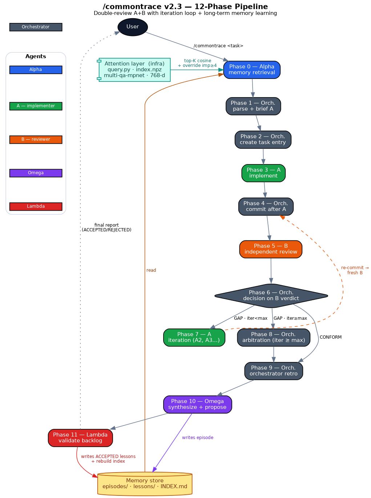
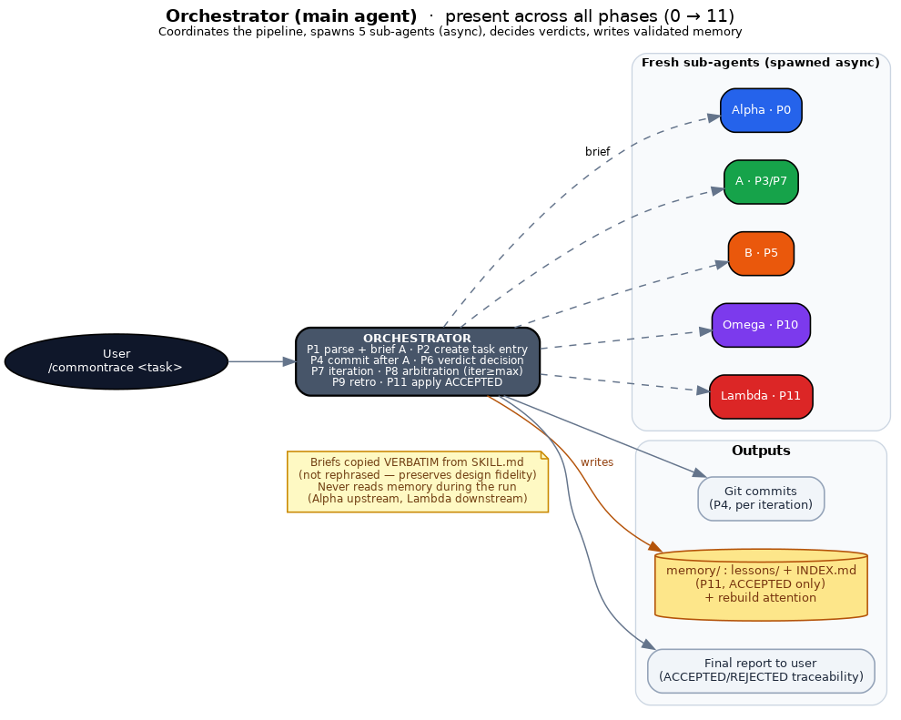
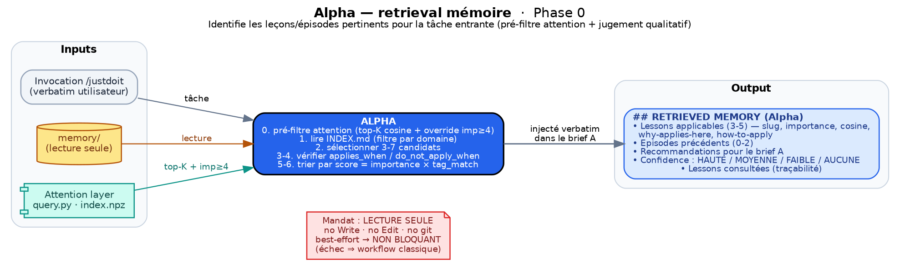
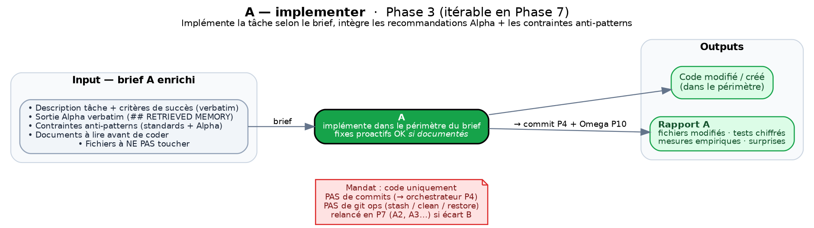
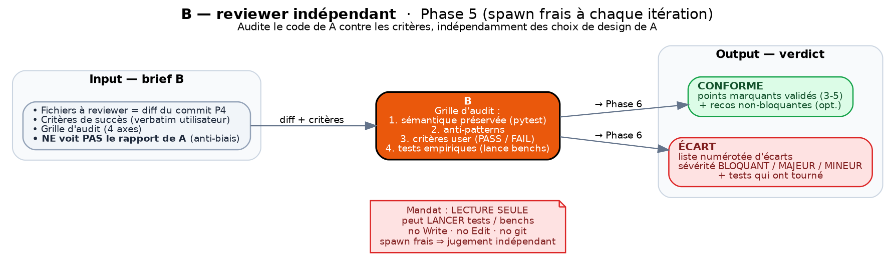
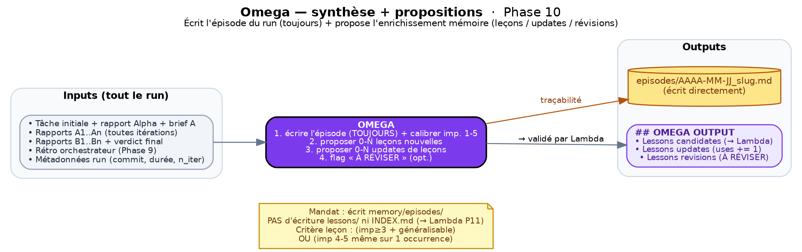
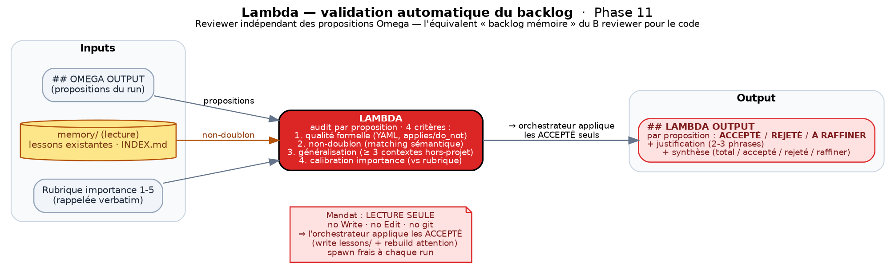
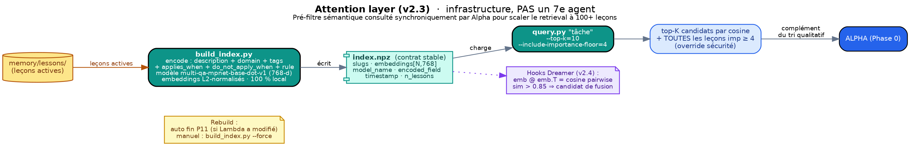

# /commontrace — Agent Memory Project Documentation

> Version: v2.3 (+ companion skill `/dreamer` v0.1 implemented 2026-05-27 — see §6.4)
> Date: 2026-05-27 (state updated post-runs module-a)
> Status: post-bootstrap — 15 episodes (5 meta-skill + 10 module-a), 33 active lessons as of 2026-05-28, mechanism empirically validated end-to-end (first cross-run hit from fresh memory P2.2→P2.3, first preventive application of a meta-lesson on Task #4, architectural verdict P2.5bis REPORT justified by multi-strategy convergence)

This document describes the long-term agent memory project as instantiated in the `/commontrace` skill. It is intended for operators and for future agents that will pick up the project. It is descriptive, not prescriptive: it records what exists, how it works, and what has been empirically observed after 15 production runs (5 meta-skill `/commontrace` and `/dreamer` self-modifying runs + 10 module-a runs as the first non-meta usage).

---

## 1. Vision

### 1.1 Problem Addressed

An LLM agent restarts from scratch at each session. Even when it has already encountered a similar situation, made a mistake, or found a best practice, none of that experience is available in the next turn. The only levers currently available to persist knowledge between sessions are:

- A project-level `CLAUDE.md` — static instructions, hand-written, with no learning dynamic. Manual maintenance, quickly obsolete on large projects.
- A user memory (`memory/MEMORY.md` under the agent platform's project config) — hand-written by the user, already a manual form of long-term learning. It is precisely this manual mechanism that the project aims to partially automate, without replacing it.
- Offline fine-tuning — not available in a short feedback loop, requires infrastructure, not suited to the personal use of a developer who wants to iterate within hours.
- RAG injection over a documentation base — useful for stable facts (API docs, historical code) but does not capture procedural lessons of the type "what I learned by doing" (meta-knowledge).

The agent memory project aims for a **third path between these options**: a short-loop long-term learning mechanism, where the agent itself extracts procedural lessons from its past runs, retrieves them when relevant in a future run, and applies them without manual intervention. Validation remains human to prevent pollution by LLM hallucination, but the proposal (Omega), the contextual selection (Alpha), and the application (injection into A's brief) are automated.

Since v2.2, this is a **fully automated** learning loop: validation of Omega proposals is delegated to Lambda, an independent reviewer sub-agent (equivalent to the B reviewer for code), which audits each proposal against formal quality criteria, non-duplication, generalization, and importance calibration. The orchestrator applies ACCEPTED proposals without a human in the loop — see Phase 11. A posteriori audit by the user (reading INDEX.md, DOCUMENTATION.md, or a future benchmark) remains possible but is outside the workflow.

### 1.2 Experimentation Ground: `/commontrace`

`/commontrace` is a double-review skill (sub-agent A implementer + independent sub-agent B reviewer + iteration loop max 3) for risky architectural tasks: refactor, CUDA port, critical bug fix, API redesign. Its v1 workflow (before this extension) already included well-isolated phases — delegate to A, judge via B, iterate or decide — making it a natural ground for inserting a memory: there are already precise moments where a past recommendation could apply (A's brief) and precise moments where one could capitalize on what just happened (after B's verdict).

v2 (2026-05-26) adds two agents around this core:
- **Alpha** upstream (Phase 0) — memory retrieval before delegating to A. Reads the memory base and identifies the relevant lessons/episodes for the incoming task. Injects the result verbatim into A's brief.
- **Omega** downstream (Phase 10) — synthesis + lesson proposals after B's verdict. Systematically writes the run's episode (mandatory traceability) and proposes 0-N candidate lessons or updates to existing lessons, submitted to automatic Lambda validation in Phase 11 (v2.2 — replaces the user validation of v2–v2.1).

v2.1 (2026-05-27) adds the notion of a **scalar importance 1-5** on episodes and lessons, calibrated by Omega according to an explicit rubric (5=showstopper, 4=critical, 3=useful, 2=minor, 1=anecdotal) and used by Alpha as a priority signal in retrieval (`score = importance × tag_match`, with a safety rule "always consider if importance ≥ 4"). Direct inspiration from Park et al. 2023 (memory stream with scalar score), simplified from 1-10 to 1-5 for easier calibration across agents.

The choice to instantiate this mechanism in `/commontrace` rather than at the project-level config or in a new skill dedicated to memory rests on three elements: (1) `/commontrace` already delegates to sub-agents, so adding Alpha and Omega does not change the primary execution mode, (2) each run produces an episode with a clear verdict (CONFORM/ARBITRATION/ABANDON) — data ready to be capitalized, (3) the skill is used for structuring tasks, so the captured lessons have a higher probability of being useful in future runs (vs trivial anecdotes from a fast R&D workflow).

### 1.3 Link with Bibliographic Research

The mechanism draws inspiration from several recent works:

| Work | Contribution adopted here |
|---|---|
| Park et al. 2023, *Generative Agents: Interactive Simulacra of Human Behavior* (arXiv:2304.03442) | Memory stream with scalar score (importance) — they use 1-10, we choose 1-5 for simpler calibration |
| Evo-Memory (arXiv:2511.20857) | Streaming format for episodes, memory that evolves over time |
| AgentErrorBench (arXiv:2509.25370) | Agent error taxonomy — reference for future benchmark |
| MemBench (arXiv:2506.21605), MemoryAgentBench (arXiv:2507.05257), ERL (arXiv:2603.24639) | Partial agent memory benchmarks (none simultaneously covers lesson quality + contextual retrieval + isomorphic situation transfer + realistic temporality) |

None of these benchmarks cover the combination we aim to measure here: `lesson_quality` (% validated proposals), `implicit_retrieval` (% retrieved lessons that actually helped), `transfer_gap` (% cross-project hits). See section 8 for the planned benchmark.

### 1.4 Link with CommonTrace Platform

The `/commontrace` v2 mechanism is an **experimentation ground for the CommonTrace platform** — a fleet-wide agent learning protocol whose objective is to evaluate long-term agent learning: extract NL lessons from past experiences, store them, retrieve them, and apply them in similar situations.

`/commontrace` v2 provides CommonTrace with: a validated episode/lesson format in practice, usage counters (uses, last_hit), an implicit metric (`lessons_hit` ⊂ `lessons_retrieved_by_alpha`), and empirical feedback on the relevance of contextual retrieval by tags + applies_when. What `/commontrace` v2 does not yet provide: a dedicated benchmark (cf. section 8), quantitative quality measurement, cross-project calibration (all current episodes have `project: <your-project>`).

**Additional contribution via the companion skill `/dreamer` (v0.1, 2026-05-27)** — see §6.4: autonomous agent that implements three articulated roles beyond the `/commontrace` short loop — (1) classic memory consolidation Park 2023 style (archive/fuse/reformulate lessons via cosine similarity on the attention layer), (2) empirical author on the project code under tracked Git commits (writes ad-hoc test scripts, modifies code and docs after user validation), (3) strategic arbiter vs specifications (detects over-complexification, rabbit holes, drifts vs initial objectives and suggests course corrections to the human). For CommonTrace, Dreamer provides the "periodic consolidation + methodological audit + strategic course correction" counterpart that complements the "short-loop learning" counterpart of `/commontrace` v2 — the biological analogy being paradoxical sleep (passive consolidation) augmented with active empirical validation capacity.

### 1.5 Link with <your-project>

`/commontrace` v2 directly serves the `<your-project>` R&D: it is in this project that the sub-agents live (module-c v2, module-b, module-a, module-d...) which provided the material for the 7 seed lessons and will provide the material for the next ones. The `project:` field in the episode frontmatter will later allow filtering or weighting cross-project, but in practice the v2.1 corpus is mono-project.

---

## 2. Architecture: the 6 Agents (+ attention layer as infrastructure, + companion skill `/dreamer`)

The `/commontrace` v2.3 pipeline involves 6 agents. An orchestrator (main agent) coordinates; 5 sub-agents (Alpha, A, B, Omega, Lambda) are each a fresh sub-agent spawned asynchronously. Each has an autonomous brief and a strict scope — the briefs are copied verbatim from `SKILL.md`, not reformulated by the orchestrator (preserves fidelity to the canonical design).

Added in v2.3 is a **semantic attention layer** (infrastructure, NOT a 7th agent) under `memory/attention/`: a numpy index of local embeddings (model `multi-qa-mpnet-base-dot-v1`) queried by Alpha via `query.py` as a Phase 0 pre-filter. This layer has no mandate of its own, no brief, no autonomy — it is an index called synchronously by Alpha to scale retrieval to 100+ lessons. Technical details in §4.6.

Added in parallel is a **companion skill `/dreamer` v0.1** (2026-05-27) under `$COMMONTRACE_ROOT/../dreamer/`: an autonomous agent that consumes the memory base and attention layer of `/commontrace` (without modifying `/commontrace` itself — Dreamer is a separate skill invocable via `/dreamer <project>`). The Dreamer sub-agent is spawned in Phase 1 of a session for an exhaustive autonomous reading (specs + code + docs + memory + state of the art if relevant), then the orchestrator dialogues with the user in open chat (not via a structured prompt) on the proposals section by section. For memory base modifications, Dreamer goes through Lambda Phase 11 `/commontrace` (existing mechanism, not reinvented). For code/doc modifications, Dreamer applies under tracked Git commits `[Dreamer] <summary>` after user validation. Full details in §6.4.

The sub-agents run **in background** (asynchronously) and the orchestrator waits for the completion notification. No polling, no custom timeout — the agent platform's harness manages the lifecycle. This discipline avoids token-expensive wait loops and guarantees clean execution.

Each sub-agent is **spawned fresh for each need**: a fresh sub-agent spawned asynchronously at each cycle (notably B at each iteration) to guarantee independence. Sending a message to an existing sub-agent / reusing an existing one is NOT recommended — it loses the B↔A independence that is precisely what the double-review pattern seeks to preserve.



*Figure — Overview: the flow of 12 phases, the 6 agents (colored), the attention layer (infra), and the memory base. The A↔B loop (Phase 6 → 7 → 4) iterates until CONFORM or `max_iterations`.*

### 2.1 Orchestrator (Main Agent)



| Mission | Coordinate the pipeline, parse the invocation, launch the sub-agents (Alpha, A, B, Omega, Lambda), make Phase 6/8 decisions, write memory in Phase 11 after ACCEPTED Lambda verdicts |
| --- | --- |
| Inputs | `/commontrace <task>` invocation verbatim from user |
| Outputs | Task tracker, A/B/Alpha/Omega/Lambda briefs, commits, final user report (including ACCEPTED/REJECTED/NEEDS REFINEMENT traceability from Lambda) |
| Files touched | `memory/episodes/` (read-only in Phase 10 — Omega writes), `memory/lessons/` (write in Phase 11 after ACCEPTED Lambda verdict), `memory/INDEX.md` (edit in Phase 11), project code (commits) |
| Workflow position | Present across all phases (0 to 11) |

The orchestrator never touches memory for reading during a run — Alpha handles that upstream and Lambda downstream. It edits memory in Phase 11, only on proposals marked ACCEPTED by Lambda. 100% automated workflow: no user dependency on memory backlog validation.

### 2.2 Alpha — Memory Retrieval (Phase 0)



| Mission | Read `memory/` and identify the relevant lessons and episodes for the incoming task. Return a structured report that will be injected verbatim into A's brief |
| --- | --- |
| Inputs | `/commontrace` invocation verbatim + read access to `memory/` |
| Outputs | `## RETRIEVED MEMORY (Alpha)` block with applicable Lessons sorted by `importance × tag_match` score, Previous episodes, Recommendations for A's brief, Confidence (HIGH/MEDIUM/LOW/NONE), Lessons consulted (traceability) |
| Files touched | None in write — Alpha is strictly read-only (no Write, no Edit, no git) |
| Workflow position | Phase 0 (before everything). Skippable via `--skip-alpha`. If `--alpha-only`, runs alone and the pipeline stops after displaying the report |

Alpha workflow: read `memory/INDEX.md` to pre-filter by domain, select 3-7 candidates by title/tags, read each candidate (frontmatter + body), verify `applies_when`/`do_not_apply_when` against the incoming task, sort by `score = importance × tag_match` descending, always consider lessons with `importance >= 4` even if `tag_match == 0` (safety).

**Alpha output format**: `## RETRIEVED MEMORY (Alpha)` block structured with fixed sections (Applicable lessons 3-5 max, Previous episodes 0-2, Recommendations for A's brief, Confidence HIGH/MEDIUM/LOW/NONE, Lessons consulted for traceability). Each listed lesson includes: slug, importance, rule in 1 sentence, "Why this applies here" (1 sentence anchored in the incoming task, not generic), "How to apply" (concrete action in the code to produce). Final recommendations are structured as "To add in the Anti-pattern constraints section" and "To add in the Documents to read section".

Failure or NONE confidence = NON-BLOCKING. The orchestrator continues with an explicit signal in A's brief: `"## RETRIEVED MEMORY (Alpha)\nno memory used — task in uncharted territory"`. No retry, no escalation — Alpha is best-effort.

### 2.3 A — Implementer (Phase 3, iterable)



| Mission | Implement the task according to the brief, integrating Alpha recommendations and anti-pattern constraints. Produce a structured final report |
| --- | --- |
| Inputs | Enriched A brief (task description + success criteria + Alpha output verbatim + anti-pattern constraints + docs to read + files NOT to touch) |
| Outputs | Modified/created code + final report (modified files, tests, measurements, surprises) |
| Files touched | Project code (free modifications within the brief's scope). NO commits (the orchestrator handles these in Phase 4) |
| Workflow position | Phase 3, relaunched in Phase 7 (A2, A3...) if B flags a GAP with it < max |

A may perform proactive fixes in passing (pre-existing regressions, detected non-blocking anti-patterns) provided they are documented in the report (cf. RETEX 7.2). A never performs git operations (stash/clean/restore) — risk of code loss.

**Standard anti-pattern constraints (A brief template)**: no alias @property / back-compat (strict rename if refactoring), no magic number without empirical justification, no mock / separate simulation, no `/tmp/` output (use `results/<run_name>/`), no avoidable Python loop if vectorizable, no tests skip / xfail to mask a bug, project semantics preserved (existing tests must pass). Additional anti-patterns recommended by Alpha are appended to the list.

**A report format**: expected structure indicated in the brief (modified files, tests that ran with numerical results, empirical measurements when relevant, surprises encountered). Serves as input for Phase 4 commit and for Omega Phase 10.

### 2.4 B — Independent Reviewer (Phase 5, iterable)



| Mission | Audit the code produced by A against the success criteria, independently of A's design choices. Issue a CONFORM or GAP verdict |
| --- | --- |
| Inputs | B brief (strict mandate, files to review = diff from Phase 4 commit, user success criteria verbatim, audit grid) |
| Outputs | CONFORM verdict (validated key points + optional non-blocking recommendations) or GAP (numbered list of gaps with BLOCKING/MAJOR/MINOR severity + tests that ran) |
| Files touched | None in write (read-only). B can RUN tests/benchmarks for empirical validation but does not modify code and does not perform git operations |
| Workflow position | Phase 5, spawned fresh at each iteration (preserves judgment independence) |

B does not see A's report — it judges based on the delivered code against the criteria. The B brief "does NOT reveal A's design choices" to avoid confirmation bias.

**B audit grid (template)**:
- Semantics preserved (CRITICAL): do existing tests pass? Run pytest and confirm. Project semantics: verify by diff reading + execution.
- Anti-patterns: alias @property present? Magic number without justification? `/tmp/` output? Avoidable Python loop? Tests skip / xfail?
- User criteria: for each criterion, PASS / FAIL with precise citation.
- Empirical tests: run the relevant commands (pytest, bench, smoke), report numerical results.

**B verdict format**: structured block with Decision (CONFORM or GAP), Validated key points (3-5 if CONFORM), Optional non-blocking recommendations (if CONFORM), Numbered list of gaps (if GAP, format "[section] [file:line] [requirement] [observed] [correction]") with BLOCKING/MAJOR/MINOR severity, Tests that ran (commands + results).

**Spawned fresh at each iteration**: if A2 produces a new delivery after iteration, it is a new B2 spawned fresh (not the same B that would have seen A1). Preserves independent judgment — avoids the "I already said it was fine" bias.

### 2.5 Omega — Synthesis + Proposals (Phase 10)



| Mission | (1) Systematically write the run's episode (traceability), calibrate its importance 1-5 according to the rubric. (2) Propose 0-N new candidate lessons. (3) Propose 0-N updates to existing lessons. (4) Optionally flag "NEEDS REVISION" a retrieved lesson that turned out to be non-applicable |
| --- | --- |
| Inputs | Initial task + Alpha report + A brief + A1..An reports + B1..Bn reports + final verdict + orchestrator retro Phase 9 + run metadata |
| Outputs | `memory/episodes/YYYY-MM-DD_slug.md` file created + `## OMEGA OUTPUT` block with candidate lessons, lesson updates, lesson revisions |
| Files touched | `memory/episodes/` (write authorized). NO writing in `memory/lessons/` nor in `memory/INDEX.md` — these files go through Phase 11 validation |
| Workflow position | Phase 10. Skippable via `--skip-omega` (skips 9+10+11 together) |

Omega criterion for proposing a lesson: (A) source episode importance ≥ 3 AND generalizable beyond the project, OR (B) importance 4-5 even on a single occurrence (showstopper / critical deserves immediate capture). Replaces the former "≥ 2 episodes show it" criterion which filtered out rare showstoppers too aggressively.

The importance of a candidate lesson is derived from its `source_episodes` (max or average), adjustable ±1 by Omega at proposal time (justify the adjustment in the proposal).

**Omega output format**: `## OMEGA OUTPUT` block structured with:
- Episode written (path, status, importance + rationale)
- Candidate lessons (to be validated by Lambda BEFORE write): for each proposal, suggested slug + Rule + Why + How to apply + applies_when + do_not_apply_when + Importance + rationale + Justification "why new vs existing"
- Lesson updates (existing ones to increment): list `[existing lesson_slug] : +1 uses, append source_episode YYYY-MM-DD_slug`
- Lesson revisions (existing ones to flag): list `[existing lesson_slug] : NEEDS REVISION — concrete reason`
- Section "No new lesson?" if nothing notable, with explanation

If Omega proposes no new lesson, it must state this frankly and explain why (e.g. "Trivial run with no transferable learning, episode archived for traceability"). No forced proposal to "fill" the output.

### 2.6 Lambda — Automatic Backlog Validation (Phase 11)



| Mission | Audit each Omega proposal (new lessons + updates + revisions) according to 4 criteria (formal quality, non-duplication, generalization, importance calibration) and render an ACCEPTED / REJECTED / NEEDS REFINEMENT verdict per proposal. Independent reviewer of Omega's choices — memory backlog equivalent of the B reviewer for code |
| --- | --- |
| Inputs | Complete Omega report (`## OMEGA OUTPUT` block) + read access to `memory/` (existing lessons, INDEX.md, recent episodes) + importance rubric (recalled verbatim in the Lambda brief) |
| Outputs | `## LAMBDA OUTPUT` block with decisions per proposal (ACCEPTED/REJECTED/NEEDS REFINEMENT + 2-3 sentence justification) + summary (total, ACCEPTED, REJECTED, NEEDS REFINEMENT) |
| Files touched | None in write — Lambda is strictly read-only (no Write, no Edit, no git). It is the orchestrator that applies ACCEPTED verdicts |
| Workflow position | Phase 11 (after Omega). Coupled with `--skip-omega` (skipped together with Omega + Phase 9). Spawned fresh at each run |

Lambda workflow:
1. Read `memory/` (INDEX.md, lessons in the relevant domain) to verify non-duplication.
2. For each NEW LESSON proposed: verify formal quality (concrete applies_when, explicit do_not_apply_when, importance + rationale, valid YAML), non-duplication (semantic matching on Rule + applies_when), generalization (≥ 3 imaginable contexts beyond the project), importance calibration (defensible against the 1-5 rubric; A/B gap ≤ ±1 acceptable).
3. For each proposed UPDATE: coherence (source_episode not already present, last_hit ≤ today's date, uses coherent) + justification (lesson_hit confirmed in report).
4. For each proposed REVISION: concretely documented reason (citation from A/B report or orchestrator retro).
5. Issue verdict per proposal + summary.

**Lambda output format**: `## LAMBDA OUTPUT` block structured with:
- `### Decisions per proposal`: for each proposal (new lesson / update / revision), Decision (ACCEPTED | REJECTED | NEEDS REFINEMENT) + Justification (2-3 sentences). For NEEDS REFINEMENT: specific fields to correct.
- `### Summary`: total proposals, ACCEPTED N, REJECTED N (synthetic reasons), NEEDS REFINEMENT N.

Lambda does NOT have permission to write to `memory/`. Lesson files are written by the orchestrator AFTER an ACCEPTED Lambda verdict. REJECTED and NEEDS REFINEMENT are logged in the final user report for traceability (not applied).

**Spawned fresh at each run**: Lambda is spawned fresh at each Phase 11, just as B is spawned fresh at each iteration. Preserves judgment independence relative to the Omega choices of the same run.

---

## 3. Complete Workflow (12 phases)

The complete pipeline, phase by phase. Each phase indicates its main input, its output, the responsible agent, and the applicable `--skip-*` flags. Numbering goes from 0 to 11 (12 phases total).

### 3.1 Overview (table)

| Phase | Name | Agent | Input | Output | Skippable via |
|---|---|---|---|---|---|
| 0 | Alpha retrieval | Alpha | Invocation verbatim | `## RETRIEVED MEMORY (Alpha)` report | `--skip-alpha`, `--alpha-only` (run alone) |
| 1 | Parse + complete | Orchestrator | User invocation | Enriched A brief (task, criteria, constraints) | — |
| 2 | Create task tracker entry | Orchestrator | Parsed task | Task tracker entry in_progress | — |
| 3 | A implementer | A | A brief (incl. Alpha) | Modified code + A report | — |
| 4 | Commit after A | Orchestrator | A report | Intermediate git commit | `skip-commit-after-a` (inline) |
| 5 | B reviewer | B | B brief + commit diff | CONFORM or GAP verdict | — |
| 6 | Verdict decision | Orchestrator | B verdict | Branch: Phase 9 (CONFORM), Phase 7 (it<max), Phase 8 (it≥max) | — |
| 7 | A iteration | A (A2, A3...) | Enriched A brief + B gaps verbatim | Updated code + A2/A3 report | `no-loop` (inline) |
| 8 | Orchestrator arbitration | Orchestrator | Persistent gaps after max_iterations | Residual fix or user question | — |
| 9 | Orchestrator retro | Orchestrator | A/B reports + verdict | Retro block 3 questions (what worked, what surprised, Alpha usefulness) | `--skip-omega` (coupled 9+10+11) |
| 10 | Omega synthesis | Omega | Task + Alpha + A + B + verdict + retro | Episode written + lesson proposals | `--skip-omega` |
| 11 | Lambda validation | Lambda + Orchestrator | Omega proposals | ACCEPTED/REJECTED/NEEDS REFINEMENT verdicts per proposal + lesson files created/updated (ACCEPTED only) + INDEX.md updated + `lessons_validated_by_lambda` filled | `--skip-omega` |

### 3.2 Details on Key Phases

**Phase 0 (Alpha retrieval)**: runs by default at the start of a run. Autonomous brief copiable verbatim from SKILL.md. Alpha workflow enriched in v2.3 with a semantic attention pre-filter at step 0:

0. **Attention pre-filter (v2.3)**: Alpha launches `commontrace query "[verbatim invocation]" --top-k 10 --include-importance-floor 4` which returns ~10 candidates by cosine similarity + all lessons with `importance >= 4` (safety override). The cosine score is a complement to the qualitative sorting, not a replacement.
1. Read `memory/INDEX.md` to verify the relevance of pre-filter candidates and supplement by domain if needed.
2. Select 3-7 candidates — priority to the top-K cosine from step 0, supplemented by `importance >= 4` candidates not covered (quality > quantity).
3. Read each candidate (frontmatter + body).
4. Verify `applies_when` and `do_not_apply_when` against the incoming task.
5. Retain only those that pass the semantic filter.
6. Sort by `score = importance × tag_match` descending.
7. Apply the importance safety rule (always consider if ≥ 4 even without tag match — the `--include-importance-floor=4` override in the pre-filter already guarantees their presence among candidates).
8. Synthesize in the standard output format (`cosine: 0.XX` field added to each lesson line, `N/A` if surfaced only by override).

Failure or NONE confidence = NON-BLOCKING. If Alpha fails (timeout, error), or if the attention pre-filter fails (`query.py` unavailable, index.npz missing), the orchestrator continues without blocking — the absence of the attention layer simply causes Alpha to fall back to the classic workflow (steps 1-8).

**Phase 4 (commit after A)**: justified by a lived incident — a sub-agent B0a v3 from module-b had run `git clean` which erased `cuda_v3/*.py`. The immediate commit after A guarantees that code is saved before B touches the repo (B is read-only by mandate, but an inadvertent git mishap can still occur). The commit must include: initial task, A verdict (synthetic report), passing tests, current iteration (if > 1). Silent skip if user-level skill outside a repo (cf. RETEX 7.6).

**Phase 7 (iteration)**: generates a new A brief (A2, A3...) with the original brief + an additional section "B gaps from previous iteration to fix" (numbered list verbatim from B, severity preserved). Spawned fresh at each iteration — no reuse of the previous sub-agent (preserves independence). Loop returns to Phase 4 (immediate commit) → Phase 5 (new B spawned fresh) → Phase 6 (verdict).

**Phase 8 (orchestrator arbitration)**: if after 3 iterations there are still GAPs, the orchestrator reads the persistent gaps identified by B, does a targeted code reading (Read on concerned files), and decides:
- Either fixes the residual gaps itself (if minor) then commits
- Or presents to the user: "After 3 A+B iterations, residual gaps: [list]. Recommendation: [option A / option B / abandon]."

Update task tracker entry status=completed with note "orchestrator arbitration". Continue to Phase 9.

**Phase 9 (orchestrator retro)**: captures 30 seconds of meta-reflection on the run that just ended, to feed Omega with a qualitative signal (orchestrator impression, surprises, actual usefulness of Alpha) that A and B reports do not contain. Produced by the orchestrator itself by default (self-reflection on output). For sensitive runs (very ambiguous tasks, persistent A↔B conflicts, user present), may prompt the user for confirmation/correction (max 3 questions). Exact retro block: 3 questions (what worked well / what surprised me / Alpha useful YES/PARTIALLY/NO).

**Phase 10 (Omega)**: runs in background with an autonomous brief (copied verbatim from SKILL.md). Receives as input: initial task verbatim, Alpha report, initial A brief, A1..An reports (all iterations), B1..Bn reports, final verdict, orchestrator retro, run metadata (project, commit_sha, duration_minutes, n_iterations). Triple mission:
1. Write the episode `memory/episodes/YYYY-MM-DD_slug.md` (ALWAYS, mandatory traceability) with importance calibration + rationale.
2. Propose 0-N new candidate lessons (according to criterion A or B, cf. §4.4).
3. Propose 0-N updates to existing lessons (`uses += 1`, `last_hit = today`, append `source_episodes`).
4. Optionally flag "NEEDS REVISION" if a lesson retrieved by Alpha turned out to be non-applicable.

Omega does NOT have permission to write to `memory/lessons/`. Lesson files are written by the orchestrator AFTER an ACCEPTED Lambda verdict (Phase 11).

**Phase 11 (automatic Lambda validation, v2.2)**: memory is never enriched without an ACCEPTED verdict from an independent reviewer of Omega's choices. 100% automated workflow:
1. The orchestrator launches Lambda in background (brief verbatim from SKILL.md, injection of Omega output + read access to `memory/`).
2. Lambda audits each proposal according to 4 criteria (formal quality, non-duplication, generalization, importance calibration for new lessons; coherence + lesson_hit for updates; documented reason for revisions) and returns an ACCEPTED / REJECTED / NEEDS REFINEMENT verdict per proposal.
3. The orchestrator applies ACCEPTED verdicts:
   - For each NEW LESSON ACCEPTED: creates `memory/lessons/lesson_<slug>.md` with strict YAML frontmatter, initial fields `uses: 0`, `last_hit: NEVER`, `source_episodes: [current episode]`, `status: active`, `importance_history: []`.
   - For each UPDATE ACCEPTED: updates the existing lesson's frontmatter (`uses += 1`, `last_hit = today`, append current episode).
   - For each REVISION ACCEPTED: changes `status: active → review`, appends `## Revision note` comment in the body with Lambda justification.
   - Updates `memory/INDEX.md`: adds new lessons in their respective domain sections; reflects updates (uses, last_hit) and revisions (status).
   - Updates the current episode's frontmatter: fills `lessons_validated_by_lambda` with the effective list of ACCEPTED and applied slugs.
4. Logs REJECTED and NEEDS REFINEMENT in the final user report for traceability (the user can decide to rework them manually). No memory write for these proposals.

No user dependency: an agent can execute `/commontrace` end-to-end without human presence in the loop. Lambda validation provides the safeguard against LLM hallucination pollution (automated equivalent of the former user validation).

### 3.3 Optional Inline Parameters

The user can specify in the invocation:

| Flag | Effect |
|---|---|
| `max_iterations=N` | Override default 3 |
| `tests=path/to/tests` | Override default full project |
| `skip-commit-after-a` | Skip Phase 4 (use if conflicting with other workflows) |
| `no-loop` | 1 A+B cycle without loop |
| `--skip-alpha` | Skip Phase 0 memory retrieval |
| `--skip-omega` | Skip Phases 9 + 10 + 11 — no mini-retro, no Omega, no memory write |
| `--alpha-only` | Run Alpha alone, display its report and stop — useful for testing retrieval |

Backward compatibility: all historical invocations continue to work. Alpha/Omega phases are enabled by default but skippable.

---

## 4. Structured Memory Base

### 4.1 File Tree

```
$COMMONTRACE_ROOT/
├── SKILL.md                          # canonical workflow source
├── DOCUMENTATION.md                  # this document
└── memory/
    ├── INDEX.md                      # hierarchical index by domain
    ├── episodes/
    │   ├── README.md
    │   ├── episode_template.md
    │   └── YYYY-MM-DD_<slug>.md      # one file per run (Omega Phase 10)
    └── lessons/
        ├── README.md
        ├── lesson_template.md
        └── lesson_<slug>.md          # one file per lesson (orchestrator Phase 11)
```

State as of 2026-05-28: **15 episodes, 33 active lessons**.

Episodes by class:
- **Meta-skill (5)**: `2026-05-26_create-commontrace-v2.md`, `2026-05-27_extend-commontrace-importance.md`, `2026-05-27_formalize-lambda.md`, `2026-05-27_add-attention-layer.md` (v2 → v2.1 → v2.2 → v2.3), `2026-05-27_create-dreamer-skill.md` (creation of the companion skill `/dreamer` v0.1).
- **module-a (10)**: `2026-05-27_module-a-v04-pipeline-multi-tf.md`, `2026-05-27_module-a-v04-g2-eventref-tf-qualifiable.md`, `2026-05-27_module-a-v04-g3-nested-outer-level-persistent.md`, `2026-05-27_module-a-task4-setup-12-runnable-g4-candidate.md`, `2026-05-27_module-a-p22-calibration-k-coefficients.md`, `2026-05-27_module-a-p23-context-modulators-fix-collision.md`, `2026-05-27_module-a-p24-sharpness-magnitude-discovery.md`, `2026-05-27_module-a-p25-dimensionless-weights-magnitude-regularization.md` — `2026-05-28_module-a-v1-m1-spec-events.md`, `2026-05-28_module-a-v1-m2-events-engine.md` — first real use of the skill outside meta on a real project (empirical calibration + multi-TF DSL refactor, then structural V0→V1 event-driven overhaul).

Active lessons by domain (33, excluding template): **13 subagents**, **8 refactor**, **6 testing**, **4 other**, **1 git-safety**, **1 cuda-gpu** (0 performance). Exhaustive list by file with usage/importance in §9.

Top usage (`uses` actual from frontmatters): `serialize_subagents_same_files` (subagents, uses=7), `semantic_check_not_just_syntactic` (refactor, uses=7), `no_tmp_results` (other, uses=5), `subagent_double_review_pattern` (subagents, uses=5), `orchestrator_fix_residual_post_b` (subagents, uses=5). The top 5 accounts for 29 hits — Alpha retrieval remains strongly non-uniform: a few cross-cutting methodological invariants carry most of the value.

### 4.2 Episode Format (YAML frontmatter)

Strict frontmatter, parsable by `yaml.safe_load`:

| Field | Type | Required | Semantics |
|---|---|---|---|
| `name` | string | yes | `YYYY-MM-DD_<slug>`, identical to filename without `.md` |
| `description` | string | yes | 1-line run summary |
| `task_invocation` | string | yes | Verbatim of the `/commontrace ...` invocation |
| `tags` | list[string] | yes | Free tags for future Alpha pre-filtering (e.g. `[cuda, refactor]`) |
| `project` | string | yes | Project detected from cwd (e.g. `<your-project>`) — used for `transfer_gap` metric |
| `verdict` | enum | yes | `CONFORM` \| `ARBITRATION` \| `ABANDON` |
| `importance` | int | yes | Integer 1-5 according to rubric (cf. §4.4) |
| `importance_rationale` | string | yes | 1-sentence concrete justification for the score |
| `n_iterations` | int | yes | Number of A+B iterations performed |
| `commit_sha` | string | yes | SHA of the final commit (or `N/A` if Phase 4 inapplicable) |
| `duration_minutes` | int | yes | Total run duration |
| `lessons_retrieved_by_alpha` | list[string] | yes | Slugs of lessons formally selected by Alpha in its report ("Applicable lessons" block). Does NOT include counter-examples mentioned in "Mandate reminder". |
| `lessons_hit` | list[string] | yes | Slugs of lessons that actually helped (according to A/B reports + orchestrator retro). **NOT bounded by `retrieved`**: may include background-active lessons (counter-examples, implicit methodological rules, exceptions). The benchmark calculates two complementary ratios: **strict** (hit ∩ retrieved / retrieved = Alpha retrieval precision) and **permissive** (hit / retrieved = application richness, can be > 100%). |
| `lessons_proposed_by_omega` | list[string] | yes | Slugs of new lessons proposed by Omega (before Lambda validation) |
| `lessons_validated_by_lambda` | list[string] | yes | Slugs effectively validated by Lambda in Phase 11 and applied by the orchestrator — filled AFTER the fact. Renamed in v2.2 from `lessons_validated_by_user`. |

Body sections: `## What happened` (5-10 factual lines), `## What surprised me` (verbatim retro Phase 9), `## What worked well` (0-N items), `## What worked less well` (0-N items).

### 4.3 Lesson Format (YAML frontmatter)

| Field | Type | Required | Semantics |
|---|---|---|---|
| `name` | string | yes | Unique slug (e.g. `lesson_subagent_double_review_pattern`) |
| `description` | string | yes | 1-line summary — used by Alpha for semantic filtering |
| `tags` | list[string] | yes | Free tags for matching with incoming task keywords |
| `domain` | enum | yes | `git-safety` \| `cuda-gpu` \| `refactor` \| `testing` \| `subagents` \| `performance` \| `other` |
| `importance` | int | yes | Integer 1-5 according to rubric (single source of truth; INDEX.md reflects this value) |
| `importance_rationale` | string | yes | 1-sentence concrete justification |
| `importance_history` | list[dict] | yes | Log of changes `[{date, old, new, reason}]` — initialized `[]` |
| `applies_when` | string | yes | Precise semantic activation condition — Alpha uses it to decide whether to apply |
| `do_not_apply_when` | string | yes | Explicit counter-condition — prevents over-generalization |
| `uses` | int | yes | Usage counter (incremented in Phase 11) |
| `last_hit` | string | yes | `YYYY-MM-DD` of last hit, or `NEVER` |
| `source_episodes` | list[string] | yes | Slugs of episodes that contributed to this lesson |
| `status` | enum | yes | `active` \| `review` (flagged) \| `archived` (manually) |

Body sections: `## Rule` (1 actionable sentence), `## Why` (source observation/incident anchored in a real project), `## How to apply` (when to invoke, how to use in an A or B brief), `## Counter-examples` (cases where the rule does NOT apply).

### 4.4 Importance Rubric (scalar 1-5)

Verbatim rubric (extracted from `SKILL.md`):

```
Importance 5 (showstopper) : without this lesson, the entire task class fails
                              or causes data loss / security issue.
Importance 4 (critical)    : ignoring this lesson → high probability of major
                              rework or subtle hard-to-detect bug.
Importance 3 (useful)       : the lesson avoids a common anti-pattern or
                              methodological trap. Saves significant time.
Importance 2 (minor)        : valid lesson but limited impact, applicable to
                              a specific sub-case.
Importance 1 (anecdotal)   : interesting observation but barely actionable
                              → prefer documenting as an episode note.
```

The 1-sentence concrete rationale is MANDATORY and must be actionable (not "important because useful" but "Without this rule, silent overwrite by parallel sub-agents").

**How Alpha uses it**:
- Sort retained lessons by `score = importance × tag_match` descending.
- `tag_match` = number of lesson tags present in the incoming task keywords (simple proxy, integer ≥ 0).
- **Importance safety**: any lesson with `importance >= 4` is considered even if `tag_match == 0`, because it represents a potentially cross-cutting critical/showstopper risk. Mention "high importance, applicability to be validated" in the Alpha report.

**How Omega calibrates it**:
- On the episode: Omega calibrates importance + rationale at write time (Phase 10), according to the rubric applied to what happened in this run.
- On candidate lessons: importance derived from `source_episodes` (max or average of source importances), adjustable ±1 by Omega at proposal time (with justification for the adjustment).
- Criterion for proposing a new lesson: (A) source episode importance ≥ 3 AND generalizable, OR (B) importance 4-5 even on a single occurrence. Replaces the former "≥ 2 episodes show it" criterion which filtered out rare showstoppers too aggressively.

**Mandatory 1-sentence justification**: the rationale is what makes the calibration auditable and allows detection of calibration drift between runs or between agents (cf. RETEX 7.3). Without a rationale, importance becomes an arbitrary number.

**Inspiration**: Park et al. 2023 *Generative Agents* (arXiv:2304.03442, memory stream with scalar score 1-10). We choose 1-5 for simpler calibration — 5 discriminated levels suffice and limit dispersion between agents.

### 4.5 Hierarchical Index by Domain

`memory/INDEX.md` is sectioned by domain, not flat. Seven domains:

- `git-safety` — git operations, commit, recovery, stash/clean/reset
- `cuda-gpu` — CUDA kernels, full-GPU, host syncs, atomics, determinism
- `refactor` — architectural refactor, strict rename, copy vs reimplement
- `testing` — existing tests, pytest, empirical parity, skip/xfail
- `subagents` — sub-agent patterns, double-review, parallelization, independence
- `performance` — bench, measurement, sustained, compute/memory isolation
- `other` — miscellaneous (reports, output paths, transparency, etc.)

**Why hierarchical vs flat**: facilitates Alpha pre-filtering — instead of reading 7+ frontmatters to decide which ones to dig into, Alpha reads the INDEX.md section for the domain relevant to the task then digs into 3-5 candidates max. Coupled in v2.3 with the semantic attention pre-filter (cf. §4.6), the hierarchical INDEX remains useful for human audit and maintenance (domain grouping), while the attention layer provides the top-K selection by semantic similarity. The two mechanisms are complementary: INDEX = structure, attention = semantics.

**INDEX.md line format**:
```
- [slug](relative/path/to/file.md) — rule in 1 sentence | tags: [a,b,c] | importance: N | uses: N | last_hit: YYYY-MM-DD or NEVER
```

Single source of truth = the `lesson_<slug>.md` file itself; INDEX.md reflects it. Maintaining coherence is the responsibility of the orchestrator (Phase 11) and the user (manual edit if needed).

### 4.6 Semantic Attention (v2.3)

v2.3 addition: a semantic attention layer based on local embeddings allows Alpha (Phase 0) to scale to 100+ lessons without degrading retrieval quality or latency. Pure infrastructure (NOT an agent), queried synchronously by Alpha via `query.py`.



#### Architecture

```
memory/attention/
├── README.md          # detailed documentation (role, Dreamer hooks, anti-patterns)
├── build_index.py     # encodes all active lessons, writes index.npz
├── query.py           # query top-K + importance ≥ 4 safety override
└── index.npz          # numpy index (generated, never manually edited)
```

#### Embedding Model

`multi-qa-mpnet-base-dot-v1` (sentence-transformers, ~420 MB, 768 dim). Chosen for:
- Optimized for Q&A retrieval (matching incoming task ↔ lesson description)
- **Strictly local** execution after initial download (cache under `~/.cache/huggingface/`) — no runtime API call, no telemetry
- L2-normalized embeddings (cosine == dot product = 1 scalar mat-mul for the query)

#### Text Encoded per Lesson

Concatenation of 6 fields with explicit separators:
```
Description: ... | Domain: ... | Tags: t1, t2, t3 | Applies when: ... | Do not apply when: ... | Rule: ...
```

The `Rule:` is extracted from the body (`## Rule` section up to the next `##`). Design choice: we encode the activation condition (`applies_when`/`do_not_apply_when`) alongside the rule, to align semantic matching with what Alpha verifies at step 4 (semantic filter).

#### `index.npz` Format

Stable contract (reused by Dreamer v2.4 hooks — cf. §6.4):

| Field           | Type              | Semantics                                       |
|-----------------|-------------------|-------------------------------------------------|
| `slugs`         | `np.ndarray[str]` | Lesson identifiers, ordered                     |
| `embeddings`    | `np.ndarray[N,D]` | L2-normalized embeddings (cosine = dot)         |
| `model_name`    | `str`             | `"multi-qa-mpnet-base-dot-v1"`                  |
| `encoded_field` | `str`             | Human-readable schema of encoded fields         |
| `timestamp`     | `str`             | ISO-8601 build time                             |
| `n_lessons`     | `int`             | Number of active lessons indexed                |

#### Importance ≥ 4 Safety Override

Locked design decision v2.3: any active lesson with `importance >= 4` is **always present** in the `query.py` output, even if absent from the top-K cosine results. Guarantees that a critical / showstopper lesson is never silently discarded by an orthogonal query. Floor configurable via `--include-importance-floor=N`.

#### Rebuild Trigger

- **Automatic (Phase 11)**: the orchestrator launches `build_index.py` at the end of Phase 11 if Lambda has applied at least one creation / update / revision. Skipped if nothing changed. Skipped jointly with `--skip-omega`.
- **Manual**: `python3 build_index.py --force` (systematic rebuild, useful after manual editing, archiving, merging). The `--force` mode ignores the freshness check (mtime).

#### Why numpy `.npz` and not FAISS / hnswlib / chroma

KISS principle:
- Current volume: 11 lessons. Target volume: 100-500 lessons. numpy `.npz` + scalar mat-mul suffices up to 10k+ lessons (1 ms latency).
- One fewer external dependency to maintain (FAISS and hnswlib have complex native compilations).
- Portable binary format, readable by any machine with numpy.
- For Dreamer v2.4 (cf. §6.4), pairwise cosine between existing lessons = 1 mat-mul (`emb @ emb.T`), trivial on 10k×10k.

The cost of the attention layer is ~1 sec per run (load model + encode query + mat-mul). Acceptable vs scalability gain (otherwise Alpha potentially reads 100+ frontmatters).

---

## 5. Lifecycle of a Lesson

A lesson is not a static object — it is born, lives, can be revised, and theoretically archived. Here is its journey.

### 5.1 Birth

Omega proposes a candidate lesson in Phase 10 if:
- The source episode has `importance ≥ 3` AND the lesson is generalizable beyond the project, OR
- The source episode has `importance 4-5` even on a single occurrence (showstopper / critical deserves immediate capture).

Omega does not create the file itself — it PROPOSES. The proposal format includes: suggested slug, Rule, Why, How to apply, applies_when, do_not_apply_when, Importance + rationale, Justification "why new vs existing".

### 5.2 Validation

Lambda decides automatically in Phase 11 (v2.2) via per-proposal verdict:
- **ACCEPTED**: orchestrator applies (lesson write / update / revision)
- **REJECTED**: not applied, reason logged in final report (traceability)
- **NEEDS REFINEMENT**: not applied, specific fields to correct logged (the user can rework manually)

Lambda criteria (4 for new lessons): formal quality (concrete applies_when + do_not_apply_when, importance + rationale, valid YAML), non-duplication (semantic matching in the domain), generalization (≥ 3 contexts beyond the project), importance calibration (defensible against the rubric). Coherence for updates, documented reason for revisions.

No user dependency: Lambda validates automatically at each run. The unvalidated backlog from v2.1 (before Lambda) is handled directly by Lambda upon its introduction.

### 5.3 Life

Once validated:
- The `lesson_<slug>.md` file exists in `memory/lessons/`
- The corresponding entry exists in `memory/INDEX.md` (domain section)
- Initial counters: `uses: 0`, `last_hit: NEVER`, `source_episodes: [creator_episode]`, `status: active`

At each future run:
- Alpha Phase 0 can retrieve it via the `importance × tag_match` score (and always consider if `importance >= 4`)
- If Alpha retains it, it is injected into A's brief
- If it actually helps (according to A/B reports + orchestrator retro), it appears in `lessons_hit` of the current episode
- Omega Phase 10 then proposes `UPDATE LESSON "lesson_xxx" : +1 uses`
- Lambda Phase 11 audits (coherence + confirmed lesson_hit) → if ACCEPTED, orchestrator increments `uses`, sets `last_hit = today`, appends current episode to `source_episodes`

### 5.4 Evolution

A lesson retrieved by Alpha that turned out to be non-applicable can be flagged by Omega: `REVISION LESSON "lesson_xxx" : NEEDS REVISION — reason`. After Lambda Phase 11 audit (verification that the reason is concretely documented), if ACCEPTED, the orchestrator changes `status: active → review` and appends `## Revision note` in the body with Lambda's justification. The user can then manually edit lessons in `review` status.

### 5.5 Possible Death

Mechanism not yet implemented: lessons never hit after N runs → archiving candidates (`status: active → archived` manually). In the current v2.2 state, an active lesson remains retrievable indefinitely, even if it has never helped. Cf. section 8 (Limitations) on temporal decay.

### 5.6 Concrete Example: `lesson_serialize_subagents_same_files`

To illustrate the complete lifecycle, here is the journey of a seed lesson across the first 12 runs (from the initial seed 2026-05-26 to the fourth hit at end of day 2026-05-27):

**Birth (initial seed, run 1, 2026-05-26)**: lesson created by the orchestrator during the initial setup of the memory base, based on a pre-existing documented incident in `feedback_parallel_subagents_file_overlap` (project MEMORY.md). Initial frontmatter:
- `importance: 5` (showstopper — the R1/R23 incident of 2026-05-20 actually caused a loss of modifications)
- `importance_rationale: "Without this rule, silent overwrite of code by the last sub-agent to finish (R1/R23 incident of 2026-05-20: R23 modifications lost, undetectable without downstream validation) — effective data loss."`
- `uses: 0`, `last_hit: NEVER`, `source_episodes: []`
- `domain: subagents`

**Life (run 2, 2026-05-27)**: Alpha retrieves it via high `tag_match` (the brief mentions "do not parallelize two sub-agents that touch the same SKILL.md"). Score = 5 × 3 = 15 (highest). Alpha places it first in its applicable list. Alpha recommendation for A's brief: "Make sure to serialize explicitly if A2 must modify SKILL.md after A1 — no parallelization". A respects the recommendation (1 single A at a time on SKILL.md). B notes "serialization correctly respected" in its CONFORM verdict. Orchestrator retro Phase 9 confirms "Alpha useful: YES — the serialization mention avoided a real risk on this run".

**Update proposal (run 2, Omega Phase 10)**: Omega proposes `UPDATE LESSON "lesson_serialize_subagents_same_files" : +1 uses (helped on this episode), append source_episode 2026-05-27_extend-commontrace-importance`.

**Lambda audit Phase 11 (post-v2.2)**: Lambda audits the proposed UPDATE. Criteria: source_episode 2026-05-27_extend-commontrace-importance not already present (OK, source_episodes was []), last_hit 2026-05-27 ≤ today (OK), lesson_hit confirmed in report (OK). Verdict ACCEPTED → orchestrator applies: `uses: 0 → 1`, `last_hit: NEVER → 2026-05-27`, `source_episodes: [] → [2026-05-27_extend-commontrace-importance]`.

**State after Phase 11 v2.2 (first hit)**: `uses: 1`, `last_hit: 2026-05-27`, `source_episodes: [2026-05-27_extend-commontrace-importance]`.

**State at end-of-day snapshot 2026-05-27 (after 12 runs)**: `uses: 4`, `last_hit: 2026-05-27`, `source_episodes` enriched with runs that actually used it (cf. `lessons_hit` field of meta episodes `extend-commontrace-importance`, `formalize-lambda`, `add-attention-layer`, and module-a runs `p22`, `v04-g2`, `v04-g3`). The automatic increment mechanism via Lambda works without human intervention between sessions — empirical confirmation over 3 additional hits in less than a day.

Over the same interval, other counters also moved (actual top 4 by `uses`): `lesson_semantic_check_not_just_syntactic` (uses=7, highest ratio in the corpus, created in p22 and used in 7 successive runs), `lesson_no_tmp_results` (uses=5), `lesson_subagent_double_review_pattern` (uses=4 like `serialize_subagents_same_files`). Conversely, 5 lessons remain at `uses=0` despite their `active` status (gp_gpu_non_deterministic, e2e_test_xfail, signal_absence_confirmed, triangulate_before_architectural_report) — future candidates for the decay/archiving mechanism not yet implemented (cf. §5.5 and §8.2).

This journey illustrates the resolution of v2.1's first flaw by v2.2:
- v2.1: the unvalidated backlog caused the perceived state (uses=0) to diverge from actual usage (already 1 empirical hit). Resolved in v2.2: Lambda automatically processes the backlog at each run.
- v2.1 and v2.2: the lesson, even when very important (5), will never automatically increase in importance with its accumulated hits — calibration remains fixed until human intervention. Cf. section 8 (Auto bump uses → importance not implemented).

---

## 6. Backward Compatibility and Future Evolutions

### 6.1 Backward Compatibility v2.1 → v2

For episodes/lessons written before the v2.1 importance addition (without `importance` field):
- **Alpha** treats the absence as `importance = 3` by default (median) and flags "to be calibrated" in the "Lessons consulted" block of its report.
- **Omega** flags "importance absent — to be calibrated" in its update proposals.
- No existing script breaks: the `importance`, `importance_rationale`, `importance_history` fields are additive.

Note: as of 2026-05-27, all seed lessons and the 2 episodes have already been calibrated at creation — the "to be calibrated" fallback mechanism is intended for future cases (manual editing, lesson imported from elsewhere).

### 6.2 Documented Evolutions Not Implemented in v2.1

Documented in `SKILL.md` section "Future evolutions (not implemented v2.1)" for reference — DO NOT implement without explicit user validation and without empirical grounding.

| Evolution | Description | Known risk |
|---|---|---|
| Temporal decay | Weight `importance` by `exp(-(today - last_hit) / tau)` to surface recently-hit lessons | May cause forgetting of rare but critical lessons |
| Separate recency | Maintain a `recency` field distinct from `importance` (Park et al. use this decomposition) | Requires empirical data on Alpha retrieval |
| Auto bump uses → importance | If a lesson exceeds N hits over M runs, auto-increment its importance | Risk of drift toward everything at importance 5 |
| Composite salience | `salience = α·importance + β·recency + γ·log(uses+1)` (Park et al. style) | Requires α/β/γ tuning |
| Multi-dimensional | Move from scalar to vector `importance = (severity, frequency, generalizability)` | Requires more sophisticated retrieval UI |

These evolutions are future avenues for the CommonTrace platform. In v2.3, we stay with scalar 1-5 + rationale, period.

### 6.3 Backward Compatibility v2.2 → v2.3 (attention layer)

The attention layer is **purely additive**: no modification of existing formats, no frontmatter field modified, no existing script broken.

- **If `memory/attention/index.npz` is absent** (first deployment case, or manual deletion): Alpha falls back to the classic workflow steps 1-8 without error — the step 0 pre-filter signals the absence of the index in the report but does not block the run.
- **If `sentence-transformers` is unavailable** in the venv: `query.py` fails, Alpha continues with the classic workflow. The absence of the attention layer is non-blocking by design.
- **Stale index** (lesson created/modified outside the official workflow): `build_index.py` (without `--force`) detects freshness via mtime and rebuilds automatically. `--force` forces systematic rebuild.
- **Frontmatter unchanged**: no new mandatory field in lessons. The content encoded by `build_index.py` is derived from existing fields (description, domain, tags, applies_when, do_not_apply_when, rule).
- **INDEX.md unchanged**: no section or format modified.
- **Old invocations** continue to work identically. The attention layer is enabled by default but transparent — the user only sees an additional `cosine: 0.XX` score in Alpha's output.

### 6.4 Companion Skill `/dreamer` (v0.1 — IMPLEMENTED 2026-05-27)

The `index.npz` format (cf. §4.6) was designed as a stable reusable contract. This stability is now leveraged by the companion skill **`/dreamer` v0.1** (under `$COMMONTRACE_ROOT/../dreamer/`), implemented on 2026-05-27. Dreamer does not modify `/commontrace` (separate skill) — it **consumes** the memory, the attention layer, and Lambda.

#### Three Articulated Roles

1. **Classic memory consolidation** (inherited from Park et al. 2023, MemGPT): archive/fuse/reformulate/recalibrate lessons. Uses the pairwise cosine snippet below to detect fusion candidates (similarity > 0.85). Proposals submitted to Lambda Phase 11 `/commontrace` (existing mechanism, **not reinvented**).

2. **Empirical author**: writes ad-hoc test scripts in `recherche/<project>/dreamer_workspace/<YYYY-MM-DD_session_id>/experiments/`, modifies project code and docs — under tracked and documented Git commits. Non-negotiable hard prerequisites:
   - (a) specifications document present in `recherche/<project>/docs/` (without specs → Dreamer refuses)
   - (b) `git status --porcelain` empty before Dreamer (refusal otherwise)
   - (c) clean Dreamer commit in format `[Dreamer] <summary>` + documented body (modifications, reason, experiments performed, session log link) + `Co-Authored-By: Dreamer Agent`
   - Dreamer commits locally only, no push (the human decides).

3. **Strategic arbiter**: course-corrects the project relative to the original specifications. Identifies drifts (over-complexification, rabbit hole, drift vs specs) and suggests decisions to the human. Tone: **benevolent outside perspective** that questions and proposes, does not impose. Formulation pattern: "We did X. It's useful for Y from the specs. But it could have been achieved via simpler Z. Do you want to reconsider?"

#### Architecture Decisions (locked by user 2026-05-27)

- **Materialization B**: dedicated Dreamer sub-agent spawned in Phase 1 (exhaustive autonomous reading) + orchestrator that receives the synthesis in Phases 2+ and dialogues with the user in **open chat** (NOT via a structured prompt — direct message discussion, in accordance with the user's preference to freely edit responses).
- **1 Dreamer per project**: filters by `project:` on lessons/episodes. Dreamer sessions for module-a, Dreamer for `/commontrace`, etc. are distinct and accumulate their own history.
- **`dreamer_workspace/<session>/` committed in the repo** (not `.gitignore`): sourceable history for future Dreamers (consistent with `lesson_document_contract_for_future_consumers`).
- **Manual trigger V1**: `/dreamer <project>`. Auto on threshold (5 `/commontrace` runs since last Dreamer) documented as future V2, not implemented.
- **No a priori limit on Dreamer commit size**: if the user validates an important refactor after dialogue, it's OK (trivially revertable via `git revert` if drift).
- **No formal B reviewer** for Dreamer code/doc modifications: the interactive section-by-section user dialogue PLAYS the role of B reviewer (human validation is the review). Lambda audits memory proposals (existing Phase 11 mechanism, unchanged).
- **Exclusivity lock**: 1 single active Dreamer per project (marker `dreamer_workspace/<session>/IN_PROGRESS`, deleted at the end), refusal if `/commontrace` is active on the repo (best-effort detection V1).
- **Git discipline of the Dreamer sub-agent** (read-only on git, inherited from `lesson_brief_b_strict_no_git_ops`): FORBIDDEN `git stash`, `git checkout --`, `git reset --hard`, `git clean` (even to compare baseline). ALLOWED `git status`, `git log`, `git show`, `git diff` (read-only). The `git add` + `git commit` are done by the orchestrator after user validation, never by the Dreamer sub-agent directly.
- **Reuse of existing infra**: attention layer (`commontrace/reference/query.py`, driven by `commontrace query`) consumed for semantic pre-filter + fusion detection; Lambda Phase 11 `/commontrace` consumed for memory proposal audit. Dreamer reinvents none of these mechanics.
- **Phase 1 reading sources**: specs (`recherche/<project>/docs/`), complete code, project docs, `/commontrace` memory base filtered by `project:<project>`, user memory under the agent platform's project config, web search / web fetch capabilities if relevant, recent benchmark.

#### Snippet Reused by Dreamer for Fusion Candidate Detection (role 1)

```python
import numpy as np
data = np.load("memory/attention/index.npz", allow_pickle=False)
emb = data["embeddings"]                    # already L2-normalized
slugs = data["slugs"]
sim_matrix = emb @ emb.T                    # pairwise cosine (N x N), trivial on 10k×10k
# Fusion candidates: empirical threshold ~0.85 (to be tuned on real corpus)
pairs = np.argwhere((sim_matrix > 0.85) & (sim_matrix < 1.0))
candidates = [(slugs[i], slugs[j], float(sim_matrix[i, j])) for i, j in pairs if i < j]
# Dreamer then proposes fusions to Lambda for Phase 11 /commontrace validation (existing mechanism)
```

#### Stable Contracts Guaranteed for Dreamer (additions OK, removals KO)

- `index.npz` remains accessible at `memory/attention/index.npz`
- Fields `slugs`, `embeddings`, `model_name`, `encoded_field`, `timestamp`, `n_lessons` preserved
- `embeddings` remains L2-normalized (cosine = dot product)
- `build_index.py --force` remains the manual rebuild invocation
- Lambda Phase 11 `/commontrace` remains the sole mechanism for auditing memory base modifications (Dreamer does not reimplement Lambda — it consumes the verdict)

#### `dreamer_workspace/<YYYY-MM-DD_session_id>/` Format (committed in the project repo)

```
dreamer_workspace/
└── 2026-05-27_session_001/
    ├── IN_PROGRESS              # exclusivity lock marker (deleted at the end)
    ├── SESSION.md               # 5-section synthesis + metadata + log
    ├── experiments/             # ad-hoc test scripts (user-validated before execution)
    │   └── test_hypothesis_X.py
    └── memory_proposals.md      # proposals submitted to Lambda + verdicts
```

#### `/dreamer <project>` Workflow (6 phases)

1. **Phase 0**: Trigger (manual `/dreamer <project>` V1, auto threshold V2 future).
2. **Phase 1**: Autonomous reading by Dreamer sub-agent (sources listed above).
3. **Phase 2**: 5-section synthesis (specs course correction, memory consolidation, hypotheses to test, strategic suggestions, code/doc modifications) written in `dreamer_workspace/<session>/SESSION.md`.
4. **Phase 3**: Orchestrator receives the synthesis + presents to the user in open chat (NOT via a structured prompt). Section-by-section dialogue.
5. **Phase 4**: Validated execution by section. Tests: Dreamer asks permission ("I'd like to run test X because Y, OK?"), user OK → executes. Memory base modifications: Lambda audits (Phase 11 `/commontrace`), orchestrator applies ACCEPTED. Code/doc modifications: orchestrator applies. Strategic suggestions: just documented in SESSION.md.
6. **Phase 5-6**: Git commit by the orchestrator after dialogue is complete. Archive session (delete IN_PROGRESS marker, finalize SESSION.md).

See also `$COMMONTRACE_ROOT/../dreamer/SKILL.md` (510 lines, canonical source of the skill with verbatim sub-agent brief) and `memory/attention/README.md` (`index.npz` contract on the consumed infrastructure side).

---

## 7. RETEX and Observations

This section records the empirical observations accumulated over the 12 runs performed as of 2026-05-27: RETEX 7.1-7.11 cover the bootstrap phase (the first 2 meta-runs + Lambda circularity); RETEX 7.12-7.18 cover the post-bootstrap phase (attention meta-run + 8 module-a runs = first non-meta usage). Format per RETEX: **Observation / Context / Implication**. The figures in this section reflect the 2026-05-27 snapshot (12 runs); the 3 following runs (`create-dreamer-skill`, `module-a-v1-m1`, `module-a-v1-m2`) are not yet retexed — updating the RETEX narrative = separate workstream.

### 7.1 First Real Alpha Test in Production (run 2, 2026-05-27)

**Observation**: Alpha returned `Confidence: HIGH` with 4 retrieved lessons, all useful in the final work.

**Context**: Run 2 (`2026-05-27_extend-commontrace-importance`), first real solicitation of Alpha in a /commontrace run (run 1 of 2026-05-26 had `lessons_retrieved_by_alpha: []` because the memory base did not yet exist). The 4 retrieved lessons:
- `lesson_serialize_subagents_same_files` — serialization respected (1 single A at a time on shared files)
- `lesson_subagent_double_review_pattern` — A+B pattern applied
- `lesson_show_changes_before_editing` — surfaced as a **counter-example** via EXCEPTION mode (/commontrace mandate lifts this rule, A can edit directly without validating at each step)
- `lesson_transparency_when_deviating` — applied by A who reported in its report the importance calibrations done by inference (without explicit live source)

**Implication**: The "implicit" contextual retrieval works. Alpha surfaced `lesson_show_changes_before_editing` as a counter-example without being explicitly asked to — i.e., it knew this lesson was relevant to mention even though the concrete action was to ignore it (because the /commontrace mandate lifts it by design). This is a first empirical validation of semantic retrieval beyond simple tag matching.

Alpha recommendations integrated into A's brief were concretely reflected in the final work: serialization respected, proactive YAML fix performed (cf. RETEX 7.2), inference transparency in the report. This is the basis for the `lesson_alpha_brief_quality_drives_a_quality` proposed by Omega run 2.

### 7.2 Bonus Fix by A (beneficial initiative, run 2)

**Observation**: A detected and corrected a pre-existing YAML regression (SKILL.md frontmatter description with unquoted `:`) that was not in the strict scope of the task.

**Context**: The regression had been introduced in run 1 (`2026-05-26_create-commontrace-v2`) — B run 1 had flagged it as "minor non-blocking" without correction. Run 2, A proactively fixed it while modifying SKILL.md to add importance scoring. B run 2 judged the fix "BENEFICIAL and LEGITIMATE" because it served criterion 8 (strict parsable YAML) and the marginal cost was nearly zero (A was already modifying the file).

**Implication**: Gives rise to the `lesson_fix_in_passing_when_documented_and_consistent` proposal by Omega run 2. The emergent rule: a proactive out-of-scope fix is legitimate if (a) the context makes it coherent with the task, (b) the marginal cost is low (A is already modifying the area), (c) it is documented in A's report for traceability.

### 7.3 Importance Calibration — Slight Disagreement Between A and B (run 2)

**Observation**: First case of evaluation disagreement between two independent agents on the calibration of a seed lesson. `lesson_subagent_double_review_pattern` calibrated by A at `importance: 4` ("major rework quasi-systematically observed without the pattern"), B would have put 5 ("backbone of the skill, showstopper of the entire class").

**Context**: Run 2, A calibrated the 7 seed lessons. B validated CONFORM on the first round with this disagreement noted as non-blocking. Both interpretations are defensible under the rubric: 4 (critical, major rework) and 5 (showstopper, without this lesson the entire class fails) legitimately coexist for this particular lesson — it is the backbone of the /commontrace skill, so 5 is defensible; but other similar skills could function without this pattern with a bit more effort, so 4 is also defensible.

**Implication**: The 1-5 rubric + mandatory 1-sentence justification suffices to obtain calibrations within a ±1 range between independent agents on the same item. No need for algorithmic reconciliation in V2.1 — this is an acceptable signal. But this kind of disagreement will recur and deserves to be tracked via the `importance_history` field for later audit (detecting systematic calibration drift between agents or over time).

### 7.4 Observed Pattern: Self-calibrated "Run Classes" (run 2, by Omega)

**Observation**: The first two episodes (`2026-05-26` and `2026-05-27`) are /commontrace meta-runs (skill modifying itself), both CONFORM, and both self-calibrate at `importance: 3`.

**Context**: Omega run 2 calibrated its own episode at 3 ("Second meta-run /commontrace v2 achieving CONFORM in 1 iteration: empirically validates Alpha in production but no showstopper and design proposals already locked upstream"). Omega run 1 (retroactively, frontmatter written at the same time as v2 creation) calibrated its episode at 3 ("First /commontrace v2 run on itself: reveals user-detectable scope creep + silent YAML regression + user-level skill outside git case; useful for calibrating Phase 11 and Phase 4 but not a showstopper").

**Implication**: Hypothesis — emergence of run classes (meta-skill, refactor, bugfix, CUDA port...) where each class could have a typical importance. Interesting data for the future benchmark (intra-class coherence measurement). To monitor on upcoming runs: if 5 successive runs of the same class all calibrate at the same importance, it reveals either (a) a stable and useful signal, or (b) an anchoring bias to correct.

### 7.5 Importance Distribution Biased Toward 3-5 (run 2)

**Observation**: Distribution observed on the 7 seed lessons: 1×5 / 3×4 / 3×3 / 0×2 / 0×1.

**Context**: During seed calibration (run 2), A announced "1×5 / 3×4 / 4×3" by approximate mental calculation (cf. last point of worked_less_well in episode 2), but B found "1×5 / 3×4 / 3×3" on verification — minor non-blocking divergence but a signal of lack of rigor on figures in the report. No lesson was calibrated 1 or 2.

**Implication**: Assumed cause — seeds were chosen from pre-existing user feedback, hence biased toward utility by construction (nothing anecdotal was seeded). Decision: no artificial invention of 1-2 to fill the gap — documented bias assumed. To monitor: if all future runs converge toward the same 3-5 distribution without ever generating 1-2, it reveals a structural bias to correct in retrieval (all lessons "are equivalent" in importance → importance is no longer a discriminating signal).

### 7.6 User-level Skill → Phase 4 Commit Skipped (legitimate case, run 1)

**Observation**: Phase 4 (immediate commit after A) did not happen during run 1.

**Context**: `$COMMONTRACE_ROOT/` is under the agent platform's skills directory which is not a git repo. The Phase 4 commit is technically inapplicable. Documented as `commit_sha: N/A` in episode 1. Run 2 has the same case.

**Implication**: Expected behavior for user-level skills (vs project-level which would be in a project repo). To formalize in `SKILL.md` as a legitimate case for Phase 4 silent skip. The code loss risk that Phase 4 protects against (lived `git clean` incident on module-b) does not exist here because B is read-only and does not touch the skills directory (no git op possible due to lack of repo).

### 7.7 Mid-flight Scope Correction (run 1)

**Observation**: A1 launched with a brief that incorrectly included a benchmark in scope. User detected the scope creep ~5 min after launch.

**Context**: Run 1, initial A1 brief integrated a Phase 12 benchmark into the skill's scope. User stopped A1 via task cancellation, the orchestrator manually cleaned up partial residues (`benchmark/` and `memory/benchmark_reports/`), then relaunched A2 with a corrected brief including explicit negative instructions ("NO benchmark/ creation", "NO Phase 12"). The "explicit negative instructions" turned out to be necessary — a simple "reduced scope" without explicit prohibition could have let A2 reintroduce the benchmark for consistency with the partial state left by A1.

**Implication**: Gives rise to the `lesson_mid_flight_scope_correction` proposal by Omega run 1 (pending validation). The session allowed correction without major loss, but the pattern "scope creep detected mid-flight → task stop + cleanup + relaunch with explicit prohibition" deserves to be capitalized. Note: A2 essentially worked by subtraction on the advanced state left by A1 (cf. RETEX 7.9), which accelerated but blurred the traceability of "who did what".

### 7.8 Phase 11 Systematically Skipped → Accumulating Memory Backlog

**Observation**: Over the 2 runs performed, Phase 11 (user validation) was systematically skipped. Consequence: 3 new proposed lessons + 4 pending updates, never validated.

**Context**: The user explicitly requested skipping Phase 11 to allow rapid bootstrapping of the memory base (otherwise each run consumes a round of user prompting). Pending proposals:
- Run 1: `lesson_mid_flight_scope_correction` (proposed, not validated)
- Run 2: `lesson_fix_in_passing_when_documented_and_consistent`, `lesson_alpha_brief_quality_drives_a_quality` (proposed, not validated) + 4 updates `uses += 1` on hit lessons (`lesson_serialize_subagents_same_files`, `lesson_subagent_double_review_pattern`, `lesson_show_changes_before_editing`, `lesson_transparency_when_deviating`)

**Implication**: The `uses` counters remain at 0 and `last_hit` at `NEVER`, while in reality 4 lessons have already been retrieved and useful at least once. The `implicit_retrieval` mechanism (benchmark metric) does not reflect actual usage. Motivation for the ongoing discussion (G.) on auto-validation of the backlog by a dedicated Lambda agent — which would go through pending proposals, verify the absence of duplicates and contradictions with existing lessons, and directly write the trivial elements (updates `uses += 1` are by construction non-controversial). User validation would remain mandatory for new lessons, but the update backlog would no longer accumulate.

### 7.9 A Working by Subtraction (run 1)

**Observation**: After stopping A1, A2 worked essentially by subtraction/modification on the partial state left by A1, rather than starting from scratch.

**Context**: A1 had already created a large part of the work before being stopped (SKILL.md drafted, INDEX.md, 7 seed lessons). A2 overwrote/modified what existed to bring it into conformity with the corrected brief. Side effect: trace "A1 created X, A2 modified to Y" difficult to reconstruct post-mortem, because the final files have the mixed signature of both.

**Implication**: This is an interesting edge effect — it accelerated the run (A2 didn't have to redo everything) but blurred traceability. Implicitly, it means the A+B pattern can tolerate a non-empty initial state as long as A and B eventually converge to conformance. Open question for the doctrine: should a complete reset be forced (rm -rf of residues before relaunching A2) or should the partial state be tolerated? Current arbitration = orchestrator manually cleans files manifestly out of scope (benchmark/), leaves in place what can serve A2.

### 7.10 The Mechanism Proves Empirically Useful from the 2nd Run

**Observation**: A quality Alpha report (concrete recommendations) directly influences the quality of A's work.

**Context**: Run 2, Alpha provided 4 lessons + 1 previous episode + concrete recommendations (serialization to respect, YAML vigilance based on the previous run's regression, inference transparency to report, direct editing mandate). A integrated these recommendations into its work (proactive YAML fix, transparency in report). B validated CONFORM on the first round.

**Implication**: This is the basis for the `lesson_alpha_brief_quality_drives_a_quality` proposed by Omega run 2. Empirical validation of the value of contextual retrieval from the 1st production test. The mechanism does not require a long bootstrapping period to show its value — as soon as there are a few calibrated lessons and a recent run provides a previous episode to invoke, Alpha brings an exploitable signal.

To qualify: N=1 on this finding, and the 2 runs are /commontrace meta-runs (skill modifying itself), so the seed calibration was already optimized for retrieval on this precise class of task. On a new-class run (e.g. CUDA port of a module not covered by current seeds), Alpha could return `Confidence: NONE` — this is the expected and non-blocking behavior.

### 7.11 Lambda Formalized v2.2 — Meta-circularity of the Introduction Run

**Observation**: The run that introduces Lambda into the skill is still validated in proxy mode by the orchestrator (Lambda is not in place at the time of its own creation), not by Lambda itself.

**Context**: v2.2 (2026-05-27) formalizes a Lambda sub-agent as an independent reviewer of the memory backlog for Phase 11, replacing the user validation of v2-v2.1. The /commontrace formalization run (3rd meta-run of the skill) follows the v2.2 doctrine in its rewriting of SKILL.md and documentation, but Phase 11 of this specific run cannot call Lambda because Lambda was just defined in this same run. Run validation = orchestrator in proxy mode (reads Omega proposals, manually applies Lambda criteria, applies ACCEPTED). First run with Lambda actually operational: run +1.

**Implication**: Meta-circularity inherent to any mechanism-introduction run — comparable to run 1 (2026-05-26) which created Alpha without being able to use it, and to run 2 (2026-05-27) which calibrated the importance rubric on its own seeds. Not a defect, just a characteristic of meta-bootstraps. To trace in the introduction run's episode for audit: `lessons_validated_by_lambda` field filled by the orchestrator in proxy, flagged in `worked_less_well`.

### 7.12 First Cross-run Hit of a Freshly Created Lesson (module-a P2.2 → P2.3)

**Observation**: A lesson born at run N (`lesson_kwargs_namespace_collision`, created in P2.2 opening the `k_OB` collision between pression.py and liquidite.py) was retrieved by Alpha at run N+1 (P2.3, ~3h later) and **directly applied** by A to structure the collision fix via domain prefix (`k_OB_pres` / `k_OB_liq`).

**Context**: Run P2.3 (`2026-05-27_module-a-p23-context-modulators-fix-collision.md`) is the 6th /commontrace run. Alpha surfaced 5 applicable lessons with HIGH confidence, including **2 freshly created in the preceding P2.2 run**: `lesson_kwargs_namespace_collision` (importance 3, created 3h earlier) and `lesson_scalar_invariant_metric_tautological` (importance 4, created 3h earlier — used to prohibit AUC in the P2.3 validation brief). All 5/5 surfaced lessons actually helped according to the final A report and orchestrator retro Phase 9. This is the first episode where the complete chain "Phase 10 Omega proposes → Phase 11 Lambda validates → Phase 0 Alpha retrieves at next run → Phase 3 A applies" works without human intervention between runs.

**Implication**: Empirical validation of the end-to-end long-term learning mechanism. The "creation → first effective use" latency is on the order of a few hours, not several days. The `implicit_retrieval` metric (retrieved lessons that actually helped) reaches 100% on this run (5/5). N=1, so to be confirmed on other run classes, but this is the first non-meta empirical proof that the learning loop produces value on tasks independent of each other. (The preceding run had validated retrieval on /commontrace meta-skill, hence same class; here we have two consecutive module-a runs on two distinct phases of the same project — less isomorphic.)

### 7.13 First **Preventive** Application of a Meta-lesson (module-a G3 → Task #4)

**Observation**: A meta-lesson created at run N (`lesson_amend_brief_a_when_lambda_signals_recurring_residual`, validated by Lambda at the G3 cycle) was applied **preventively** at run N+1 (Task #4) — meaning the orchestrator carried over the 7-check anti-cosmetic brief from A5 into the A6 brief without waiting for a new occurrence of the fix_residual pattern.

**Context**: G3 (`2026-05-27_module-a-v04-g3-nested-outer-level-persistent.md`) is the first V0.4 run without a cosmetic commit from forgetting after 2 preceding runs (pipeline-multi-tf, G2) where the fix_residual_post_b pattern had reproduced. Lambda from the G3 cycle noted that the reinforced 7-check A5 brief had broken the pattern. Omega proposed a meta-lesson capturing the amendment procedure. Lambda accepted. The orchestrator of the Task #4 run (`2026-05-27_module-a-task4-setup-12-runnable-g4-candidate.md`) then carried over the same A6 brief structure without waiting for a new residual. Result: 5th consecutive run without cosmetic commit (except one special case "placeholder SHA" impossible for A to avoid, cf. RETEX 7.18).

**Implication**: Long-term feedback loop functional end-to-end beyond simple "retrieve + apply reactively". The orchestrator can now use meta-lessons as **preventive procedural rules** — behavior modification before the bug reproduces. Scenario that fully validates the skill's learning layer (Park et al. 2023 memory stream → activatable procedural memory). Remains to measure over more runs whether this preventive discipline holds over time or erodes after several runs without reminder (possible proxy: number of runs between 2 hits of the same meta-lesson before it is applied preventively).

### 7.14 Architectural Verdict REPORT by Multi-strategy Convergence (module-a P2.5)

**Observation**: A heavy architectural decision (REPORT post-V0.6 of a continuous magnitude refactor, scope ~2-3 days) was decided empirically by the convergence of 3 independent regularization strategies toward the neutral baseline, which directly gave rise to `lesson_signal_absence_confirmed_by_regularization_convergence`.

**Context**: P2.5 (`2026-05-27_module-a-p25-dimensionless-weights-magnitude-regularization.md`) explored 3 magnitude regularization strategies: (a) clamp [low, high], (b) Bayesian shrinkage toward 1.0, (c) epsilon smoothing. Hyperparameter sweep on each. Result: **none** beats baseline `m=1.0`. The stronger the regularization, the more it converges MATHEMATICALLY toward `m=1.0`. Architectural conclusion: the 6-state business context provides no useful signal on magnitude at this granularity — not an extraction problem, it is a signal absence. The extracted generic lesson: "when N≥3 independent regularization strategies all converge toward neutral baseline, upstream signal is ABSENT → REPORT the associated refactor".

**Implication**: The `/commontrace` v2.3 mechanism also produces **methodological lessons about architectural decisions**, not just technical rules. This is a higher-level type of lesson, applicable to any context where a signal is explored via regularization (coefficient calibration, sparsification, dropout, etc.). Remains to see if it transfers to other problem classes (probably yes — convergence toward baseline is a generic mathematical signal).

### 7.15 Strongly Non-uniform `uses` Distribution — A Few Lessons Carry the Value

**Observation**: Over 26 active lessons and 12 runs performed, the top 4 by `uses` accounts for 20 hits (semantic_check_not_just_syntactic uses=7, no_tmp_results uses=5, serialize_subagents_same_files uses=4, subagent_double_review_pattern uses=4); 5 lessons are at `uses=0` after their creation (gp_gpu_non_deterministic, e2e_test_xfail, signal_absence_confirmed, triangulate_before_architectural_report, and template).

**Context**: Data extracted from each `lesson_*.md` frontmatter as of 2026-05-27 18h. The 5 never-hit lessons are all very recent (created in module-a P2.4+ runs) — it is too early to conclude they will never help. But the distribution already clearly shows that retrieval is dominated by a few **cross-cutting methodological invariants** (sub-agent serialization, output paths, scalar invariant metric, semantic paraphrase beyond syntactic grep) rather than by the phase-specific module-a lessons.

**Implication**: Consistent with the theoretical expectation of procedural memory: a few strong operational lessons are massively reused, many specialized lessons remain dormant awaiting the right context. Indirect validation of Alpha's `importance × tag_match` mechanism — the top-usage lessons all have `importance ≥ 4`. If the opposite were observed (importance 5 lessons never retrieved, importance 1 lessons dominant), there would be a calibration problem. For future benchmarks: plan a `usage_concentration` metric (e.g. Gini coefficient on `uses`) to measure whether the distribution remains healthy beyond 50+ runs.

### 7.16 Null Effect as a Legitimate Discovery (P2.3 + P2.5)

**Observation**: Two successive runs (P2.3 and P2.5) measured a "null effect" as the main result of their calibration — contextual multipliers |m_log| < 0.02 (P2.3), Sharpe delta +5.6e-5 on the joint Nelder-Mead maximization (P2.5). In both cases, B validated CONFORM because the initial A brief had explicitly anticipated "null effect = legitimate discovery" via the clause from `lesson_anticipate_null_effect_in_calibration_brief`.

**Context**: This lesson `anticipate_null_effect_in_calibration_brief` was created at P2.3 (Lambda accepted) precisely because at P2.3 the initial A brief had NOT anticipated that m_factors ~ 1.0 would be a legitimate result — A delivered and B interpreted, but the orchestrator realized it could have foreseen this branch upstream. Empirical validation at the next run: P2.5 applied the clause preventively (3 distinct tracks, each with its "null effect legitimate" clause) and achieved CONFORM on the first round.

**Implication**: Pattern identical to RETEX 7.13 (preventive application) but on a lesson created 1 run earlier, not 2. Confirms that the "creation → immediate preventive application at next run" dynamic can be established very quickly when the orchestrator captures a precise procedural lesson (A's brief must anticipate such-and-such branch). This is a particularly valuable type of lesson because it modifies the quality of the **initial proposal** and not just the quality of the review.

### 7.17 STRICT GIT Discipline Effectively Respected by B (P2.5 vs P2.4)

**Observation**: `lesson_brief_b_strict_no_git_ops` created at P2.4 (following a case where B had nearly done a `git stash` to compare baseline) was applied preventively to the B5 brief of run P2.5. Result: 1st successful application, B5 strictly respected the discipline (used `git show`, `git diff`, `git log -p` read-only to compare baseline, no stash/checkout/reset).

**Context**: At P2.4, B had been tempted to do `git stash` to compare its output vs baseline (real risk of losing modifications if A2 was relaunched in the meantime). Detected in time, lesson created. P2.5 saw the explicit B brief "FORBIDDEN: git stash/pop/checkout/reset/clean; ALLOWED: git show/diff/log -p read-only". B5 respected to the letter — B report confirms "baseline verification via git show 0e4baac:weights.py vs HEAD, no stash used".

**Implication**: Reinforces the pattern observed in 7.13 and 7.16 — the orchestrator can systematize prevention of the bug class via the B brief (not just A). The B brief itself becomes a learning object. Future candidate: capture in each run's Omega brief a section "B brief discipline respected YES/PARTIALLY/NO" to measure this dimension at scale.

### 7.18 Placeholder SHA — Irreducible fix_residual Pattern (Task #4)

**Observation**: Despite the break-pattern of cosmetic post-B commits (5 consecutive runs without, G3-Task#4 included), the cosmetic commit `a74c142` (placeholder SHA `<SHA Task #4>` line 498 ROADMAP) remained necessary at Task #4 because A cannot know its own SHA pre-commit. This is NOT the avoidable-residual pattern targeted by `lesson_orchestrator_fix_residual_post_b`, it is a different and structurally unavoidable sub-pattern in A's brief.

**Context**: Task #4 (`2026-05-27_module-a-task4-setup-12-runnable-g4-candidate.md`) inserted a ROADMAP reference text that must cite the SHA of the Task #4 commit itself. A does not know its own SHA before the orchestrator commits it in Phase 4 → placeholder `<SHA Task #4>` left deliberately. The orchestrator had to produce a 2nd commit `a74c142` to substitute the placeholder with the real SHA. B noted "fix_residual pattern STRUCTURALLY broken for the original pattern (obsolete textual residues / incorrect counts); special case placeholder SHA legitimate, out of scope of existing lesson".

**Implication**: Not all "anti-pattern" lessons can be universalized. Certain technical patterns are irreducible (a commit cannot cite its own SHA in the diff that composes it). To keep in mind when calibrating the importance of any "residual discipline" lesson — do not slip on the unavoidable sub-pattern. Candidate for a negative note in the `do_not_apply_when` of `lesson_orchestrator_fix_residual_post_b` at a future revision: "do_not_apply_when: the residual is a placeholder whose value is only knowable after commit (e.g. SHA self-reference)".

---

## 8. Limitations and Future Work

This section lists the known limitations of v2.3 and the documented avenues for future work. It is factual, not prescriptive: none of these evolutions should be implemented without explicit user validation and without empirical grounding.

Note v2.3: the scalability of Alpha retrieval to 100+ lessons (contextual limit, linear frontmatter reading, saturation at growing volume) is no longer a limitation since the introduction of the attention layer (cf. §4.6 and §6.3) — Alpha now uses a cosine semantic pre-filter on local embeddings that scales to 10k+ lessons with no quality or latency degradation.

Note v0.1 `/dreamer` (2026-05-27): several limitations historically listed below (periodic memory base consolidation not implemented, cross-lesson audit absent, strategic course correction vs specifications missing) are now **addressed by the companion skill `/dreamer`** (cf. §6.4) — Dreamer proposes fusions/archives/reformulations of lessons to Lambda Phase 11, and raises strategic questions to the human. The `/commontrace`-internal limitations (temporal decay §8.2, auto bump uses→importance §8.3) remain relevant: Dreamer can detect and **propose** these updates, but does not implement an automatic importance evolution mechanism — it proposes, Lambda audits, the orchestrator applies.

### 8.1 Benchmark Not Yet Implemented

No benchmark script currently measures the target metrics:
- `lesson_quality` — % of Omega proposals marked ACCEPTED by Lambda (signal of proposal quality + Omega/Lambda alignment)
- `implicit_retrieval` — % of lessons retrieved by Alpha that actually helped according to `lessons_hit` (signal of retrieval precision)
- `transfer_gap` — % of cross-project hits (lesson seeded on project X that helps on project Y), measure of generalization capacity

Recommendation from the research: build a dedicated benchmark (~50 trios situation-failure / lesson / isomorphic-future-situation) reusing the Evo-Memory streaming format + AgentErrorBench error taxonomy. ~3-5 days of annotation. To do as a separate step.

### 8.2 Temporal Decay Not Implemented

An active lesson remains retrievable indefinitely, even if it has never helped. The `decay = importance × exp(-(today - last_hit) / tau)` mechanism would surface recently useful lessons and relegate old ones — but would risk forgetting rare but critical lessons (importance 5 on a showstopper that only occurs every 6 months). Likely need for coupling with a separate `recency` factor. To discuss when we have more empirical data on Alpha retrieval.

### 8.3 Automatic Bump uses → importance Not Implemented

If a lesson exceeds N hits over M runs, one could auto-increment its importance (strong empirical signal of utility). In v2.3, empirical proof of recurrence does not increase importance automatically — it is calibrated manually by Omega at creation time, and only the user can modify it via manual editing or revision (status `review` validated by Lambda).

Known risk: drift toward everything at importance 5 if N is poorly calibrated (all useful lessons end up showstopper, importance loses its discriminating power).

### 8.4 Multi-project: transfer_gap Partially Measurable

All episodes have `project: <your-project>` as of 2026-05-27 — no cross-repo yet. So the transfer_gap *stricto sensu* (lesson seeded on project X that helps on project Y) is not measurable.

**Partially observable proxy**: 2 run classes coexist in the current corpus — /commontrace meta-skill (4 runs on the skill itself) and module-a (8 runs on the multi-TF DSL and empirical calibration of the event-driven engine). Lessons seeded on the meta-skill class (e.g. `lesson_serialize_subagents_same_files`, `lesson_subagent_double_review_pattern`) were retrieved and useful on module-a runs — indirect proof of an intra-project transfer between very different task classes (modifying a skill YAML file ≠ calibrating 60 Bayesian contextual multipliers). The top-4 usage (cf. §4.1 and RETEX 7.15) is dominated by cross-cutting methodological invariants that pass both classes.

**Natural evolution**: use `/commontrace` on a truly different project (different repo, different stack) to generate episodes with a distinct `project:`, and then measure the true transfer_gap. Estimate: ~5-10 runs on a 2nd project needed for an exploitable signal.

### 8.5 Inter-agent Calibration: No Reconciliation Mechanism

Cf. RETEX 7.3 — A and B can diverge on a lesson's importance. In v2.3, Lambda can flag a gap ≥ 2 as NEEDS REFINEMENT (cf. "importance calibration" criterion of the Lambda brief), but no algorithmic mechanism for automatic reconciliation. The rubric + mandatory rationale suffices to contain the gap within ±1 in practice, which is considered acceptable.

### 8.6 Phase 4 Inapplicable for User-level Skill

Cf. RETEX 7.6 — the skills directory is not a git repo, Phase 4 (commit after A) is silently skipped. Legitimate behavior but to formalize in SKILL.md as an expected case for user-level skills (vs project-level in a repo).

### 8.7 Importance Distribution Biased Toward 3-5

Cf. RETEX 7.5 — no cases at the low end of the scale (1-2) in the seeds. If future runs all converge toward the same distribution without ever generating 1-2, it reveals a structural bias to correct. Possible mitigation: force Omega to propose at least one "episode observation note" at importance 1-2 per run, even if not transformable into a lesson (the rationale would then be "not actionable but documentable"). Not implemented in v2.3.

---

## 9. File Index

| Path | Role |
|---|---|
| `$COMMONTRACE_ROOT/SKILL.md` | Canonical workflow source (v2.3). Read by the orchestrator, Alpha, Omega, Lambda; not modified during a run |
| `$COMMONTRACE_ROOT/DOCUMENTATION.md` | This document |
| `memory/INDEX.md` | Hierarchical domain index of lessons + episodes. Edited by the orchestrator in Phase 11 |
| `memory/attention/README.md` | Attention layer documentation (v2.3) — role, index.npz format, contract consumed by /dreamer v0.1 |
| `$COMMONTRACE_ROOT/../dreamer/SKILL.md` | Companion skill Dreamer (v0.1, 2026-05-27) — canonical source of the 6-phase Dreamer workflow, verbatim sub-agent brief, SESSION.md format, Git discipline, exclusivity lock |
| `$COMMONTRACE_ROOT/../dreamer/README.md` | Short overview of the /dreamer skill |
| `recherche/<project>/dreamer_workspace/<session>/` | Dreamer workspace per session (committed in the project repo) — SESSION.md, experiments/, memory_proposals.md |
| `commontrace/reference/build_index.py` | Encodes all active lessons → `index.npz`; run via `commontrace index` (v2.3) |
| `commontrace/reference/query.py` | Query top-K + importance ≥ 4 safety override; run via `commontrace query` (v2.3) |
| `memory/attention/index.npz` | Numpy embeddings index (v2.3, generated, never manually edited) |
| `memory/lessons/README.md` | Lesson format documentation + write/update/revision workflow |
| `memory/lessons/lesson_template.md` | Empty template for creating a new lesson |

### Active Lessons as of 2026-05-28 (33 files, excluding template)

Sorted by descending usage (`uses` according to frontmatter), then by importance. Usage column format = `uses=N / importance=M / domain`.

| File | Synthetic rule | usage / importance / domain |
|---|---|---|
| `lesson_serialize_subagents_same_files.md` | NEVER parallelize 2 sub-agents that edit the same files (silent overwrite) | 7 / 5 / subagents |
| `lesson_semantic_check_not_just_syntactic.md` | For renaming / cross-cutting deprecation refactor, verify semantics (paraphrases, synonyms) in addition to syntactic grep | 7 / 4 / refactor |
| `lesson_no_tmp_results.md` | Never write artifacts in `/tmp`, use `{module}/results/{run_name}/` | 5 / 4 / other |
| `lesson_subagent_double_review_pattern.md` | For architectural code via sub-agents, A implementer + independent B reviewer + max 3 iteration loop | 5 / 4 / subagents |
| `lesson_orchestrator_fix_residual_post_b.md` | When B returns CONFORM but flags 1-3 minor textual residuals, the orchestrator fixes in Phase 8-equivalent arbitration | 5 / 2 / subagents |
| `lesson_alpha_brief_quality_drives_a_quality.md` | Alpha brief must produce CONCRETE and ACTIONABLE recommendations specific to the task | 4 / 3 / subagents |
| `lesson_audit_cascade_may_reveal_noop_scope.md` | Before refactor "add dimension X to pipeline", Step 0 cascade audit on existing infra — may reveal no-op case | 3 / 4 / refactor |
| `lesson_no_subagents_for_archi_code_except_double_review.md` | Architectural code in main session by default; sub-agents OK if double-review enabled | 3 / 4 / subagents |
| `lesson_scalar_invariant_metric_tautological.md` | To validate a calibrated coefficient/scaling, do NOT use a metric invariant to positive scalar (AUC, Spearman) | 3 / 4 / testing |
| `lesson_anticipate_null_effect_in_calibration_brief.md` | Before brief for conditional modulator calibration, include clauses "null effect = legitimate discovery" + "verify stratification" | 3 / 3 / subagents |
| `lesson_brief_b_strict_no_git_ops.md` | B reviewer brief must explicitly forbid git stash/pop/checkout/reset/clean; read-only only | 3 / 3 / subagents |
| `lesson_explicit_self_audit_when_criteria_count_high.md` | When an A brief contains ≥ 10 measurable criteria, require an EXPLICIT item-by-item self-evaluation in A's report | 3 / 3 / subagents |
| `lesson_fix_in_passing_when_documented_and_consistent.md` | When A detects a previously documented defect AND marginal cost/explicit criterion, fix in passing + trace in report | 3 / 3 / other |
| `lesson_signal_mirror_contract_in_brief.md` | If 2 modules have a strict mirror via comment and one is in A brief exclusions, explicitly lift the exception | 3 / 3 / subagents |
| `lesson_prefer_scalar_over_binary.md` | Systematically prefer scalar quantities over binary ones (sign, thresholds) — carries more information | 2 / 4 / testing |
| `lesson_document_contract_for_future_consumers.md` | When reusable infra delivered without final consumer, document contract (format, signature) with verbatim example | 2 / 3 / other |
| `lesson_locate_dichotomy_at_emission_not_scorer.md` | Before refactor "preserve magnitude end-to-end", audit cascade from the output to find the FIRST dichotomy | 2 / 3 / refactor |
| `lesson_show_changes_before_editing.md` | Before Edit/Write on existing code, describe the change and wait for validation (except new files / /commontrace mandate) | 2 / 3 / refactor |
| `lesson_transparency_when_deviating.md` | When deviating from an announced procedure, admit it post-action and offer review opportunity | 2 / 3 / other |
| `lesson_amend_brief_a_when_lambda_signals_recurring_residual.md` | Lambda flags recurring anti-pattern > 3 times → orchestrator amends next run's A brief (preventive) | 1 / 4 / subagents |
| `lesson_regularize_ratio_calibration_near_zero.md` | Calibration via ratio of empirical means → plan regularization (clamp/shrinkage/smoothing) | 1 / 4 / testing |
| `lesson_companion_skill_consumes_dont_extend.md` | New behavior (distinct scope/triggers) reusing existing skill infra → create a companion skill, not extend | 1 / 3 / subagents |
| `lesson_filesystem_ground_truth_before_referential_table.md` | Any referential doc→paths/code table must be verified against the real filesystem (ls/grep) before being written | 1 / 3 / refactor |
| `lesson_kwargs_namespace_collision.md` | Avoid same kwarg name in 2 semantically distinct modules (prefix or sub-namespace) | 1 / 3 / refactor |
| `lesson_mid_flight_scope_correction.md` | If scope creep detected while A is running, stop task + clean residues + relaunch A2 with corrected brief | 1 / 3 / subagents |
| `lesson_mtime_not_semantic_in_scope_criteria.md` | Out-of-scope criteria based on mtime/filesystem state = false positives; use a semantic criterion | 1 / 3 / testing |
| `lesson_verify_secondary_facts_before_brief_injection.md` | The orchestrator must empirically verify (pytest/ls/git show/grep) any secondary fact injected into a sub-agent brief | 1 / 3 / subagents |
| `lesson_e2e_test_xfail_when_dependency_bugs_identified.md` | E2E test reveals target does not occur + audit identifies latent out-of-scope bugs → `pytest.mark.xfail(strict=False, reason=...)` | 0 / 3 / testing |
| `lesson_explicit_file_granularity_in_git_add_to_prevent_session_leak.md` | `git add <directory>` can leak untracked files from other sessions; prefer explicit file granularity | 0 / 3 / git-safety |
| `lesson_gp_gpu_non_deterministic.md` | GP-GPU module-c v2/module-b not run-to-run bit-exact even with fixed seed (atomics); compare aggregated metrics + same-set | 0 / 3 / cuda-gpu |
| `lesson_perf_critical_cli_flag_default_on.md` | Any CLI flag whose OFF is noticeably slower (--gpu, --parallel, --cache) must be enabled by default | 0 / 3 / refactor |
| `lesson_signal_absence_confirmed_by_regularization_convergence.md` | When N≥3 distinct regularization strategies all converge toward neutral baseline, upstream signal is ABSENT → REPORT | 0 / 3 / testing |
| `lesson_triangulate_before_architectural_report.md` | Before REPORT vs PROCEED decision on refactor ≥ 1d scope, require ≥ 3 convergent independent empirical experiments | 0 / 3 / refactor |

| `memory/episodes/README.md` | Episode format documentation + write workflow |
| `memory/episodes/episode_template.md` | Empty template for creating a new episode |

### Episodes as of 2026-05-28 (15 files)

Meta-skill (5) — each run modifies the `/commontrace` or `/dreamer` skill itself:

| File | Description / version | verdict / importance |
|---|---|---|
| `2026-05-26_create-commontrace-v2.md` | Creation v2 (Alpha + Omega + memory base) | CONFORM / 3 |
| `2026-05-27_extend-commontrace-importance.md` | Addition of scalar importance 1-5 (v2.1) | CONFORM / 3 |
| `2026-05-27_formalize-lambda.md` | Lambda Phase 11 formalization, 100% auto (v2.2) | CONFORM / 4 |
| `2026-05-27_add-attention-layer.md` | Semantic attention layer multi-qa-mpnet (v2.3) | CONFORM / 4 |
| `2026-05-27_create-dreamer-skill.md` | Creation of the companion skill `/dreamer` v0.1 (3 roles: consolidation + empirical author + arbiter) | CONFORM / 4 |

module-a (10) — first real use of the skill outside meta on a real project:

| File | Description | verdict / importance |
|---|---|---|
| `2026-05-27_module-a-v04-pipeline-multi-tf.md` | Multi-TF pipeline V0.4 — Step 0 cascade audit reveals no-op scope | CONFORM / 3 |
| `2026-05-27_module-a-v04-g2-eventref-tf-qualifiable.md` | EventRef.tf qualifiable, FULL BOUNDED cascade audit, multi-TF resolved at leaf level | CONFORM / 3 |
| `2026-05-27_module-a-v04-g3-nested-outer-level-persistent.md` | NESTED.outer accepts persistent level — 1st V0.4 run WITHOUT cosmetic commit (reinforced 7-check A brief) | CONFORM / 4 |
| `2026-05-27_module-a-task4-setup-12-runnable-g4-candidate.md` | Setup 12 business runnable + E2E acceptance V0.4 — 1st **preventive** application of meta-lesson | CONFORM / 4 |
| `2026-05-27_module-a-p22-calibration-k-coefficients.md` | Empirical calibration of ~50 K_* coefficients via stratified likelihood ratios | CONFORM / 3 |
| `2026-05-27_module-a-p23-context-modulators-fix-collision.md` | Calibration of 60 contextual multipliers + kwargs collision fix — 1st cross-run hit of fresh memory | CONFORM / 3 |
| `2026-05-27_module-a-p24-sharpness-magnitude-discovery.md` | Discovery magnitude vs binary ~242× stronger but OOS ratio explodes without regularization | CONFORM / 4 |
| `2026-05-27_module-a-p25-dimensionless-weights-magnitude-regularization.md` | 3-track calibration — architectural verdict P2.5bis REPORT by multi-strategy convergence | CONFORM / 4 |
| `2026-05-28_module-a-v1-m1-spec-events.md` | M1 module-a V1 — specification of the L3-L4 overhaul toward the event-driven engine | CONFORM / 4 |
| `2026-05-28_module-a-v1-m2-events-engine.md` | M2 module-a V1 — EventEngine V1 (skeleton + effective to_event_format) + 33 git mv V0→v0_legacy | CONFORM / 4 |

### External Links

| Path | Role |
|---|---|
| `https://github.com/denemlabs/commontrace-v2` | CommonTrace repository — /commontrace v2 is the protocol's reference implementation |
