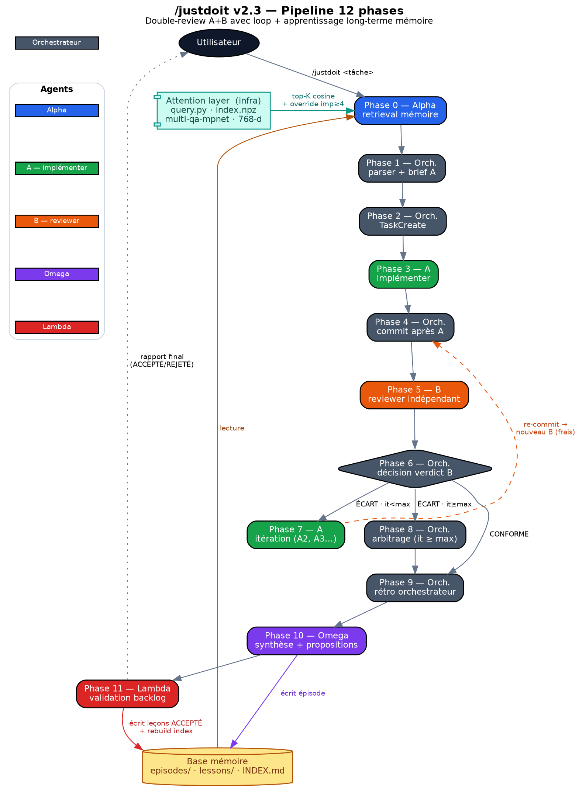
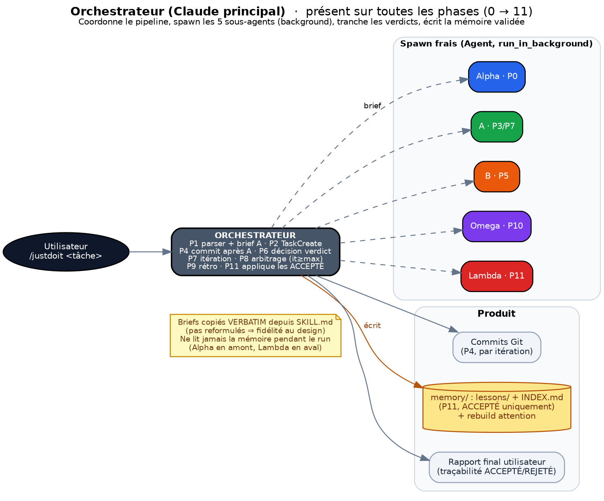

# /justdoit — Documentation du projet de mémoire des agents

> Version : v2.3 (+ skill compagnon `/dreamer` v0.1 implémenté 2026-05-27 — voir §6.4)
> Date : 2026-05-27 (état mis à jour post-runs module-a)
> Statut : post-amorçage — 15 épisodes (5 méta-skill + 10 module-a), 33 leçons actives au 2026-05-28, mécanisme validé empiriquement bout-en-bout (premier hit cross-run de mémoire fraîche P2.2→P2.3, première application préventive d'une leçon méta sur Task #4, verdict architectural P2.5bis REPORT justifié par convergence multi-stratégies)

Ce document décrit le projet de mémoire long-terme des agents tel qu'instancié dans le skill `/justdoit`. Il s'adresse à G. (utilisateur principal) et aux futurs Claude qui reprendront le projet. Il est descriptif, pas prescriptif : il consigne ce qui existe, comment ça fonctionne, et ce qui a été observé empiriquement après 15 runs en production (5 méta-skill `/justdoit` et `/dreamer` se modifiant eux-mêmes + 10 runs module-a en première utilisation hors-meta).

---

## 1. Vision

### 1.1 Problème adressé

Un agent LLM redémarre de zéro à chaque session. Même quand il a déjà rencontré une situation similaire, fait une erreur, ou trouvé une bonne pratique, rien de ce vécu n'est mobilisable au tour suivant. Les seuls leviers disponibles aujourd'hui pour faire persister du savoir entre sessions sont :

- Un `CLAUDE.md` projet — instructions statiques, écrites à la main, sans dynamique d'apprentissage. Maintenance manuelle, vite obsolète sur grand projet.
- Une mémoire utilisateur (`memory/MEMORY.md` sous `~/.claude/projects/...`) — écrite à la main par l'utilisateur, déjà une forme manuelle d'apprentissage long-terme. C'est précisément ce mécanisme manuel que le projet vise à automatiser partiellement, sans le remplacer.
- Du fine-tuning offline — pas disponible en boucle courte, demande infrastructure, pas adapté à l'usage personnel d'un dev qui veut itérer en quelques heures.
- L'injection RAG sur une base documentaire — utile pour faits stables (docs API, code historique) mais ne capture pas les leçons procédurales du type "ce que j'ai appris en faisant" (méta-connaissance).

Le projet de mémoire des agents vise un **troisième chemin entre ces options** : un mécanisme d'apprentissage long-terme en boucle courte, où l'agent extrait lui-même les leçons procédurales de ses runs passés, les retrouve quand pertinent dans un run futur, et les applique sans intervention manuelle. La validation reste humaine pour éviter la pollution par hallucination LLM, mais la proposition (Omega), la sélection contextuelle (Alpha) et l'application (injection dans brief A) sont automatisées.

Depuis v2.2, c'est une boucle d'apprentissage **entièrement automatisée** : la validation des propositions Omega est déléguée à Lambda, un sous-agent reviewer indépendant (équivalent du B reviewer pour le code), qui audit chaque proposition contre des critères de qualité formelle, non-doublon, généralisation et calibration importance. L'orchestrateur applique les ACCEPTÉ sans humain dans la boucle — voir Phase 11. L'audit a posteriori par l'utilisateur (lecture INDEX.md, DOCUMENTATION.md, ou benchmark futur) reste possible mais hors workflow.

### 1.2 Terrain d'expérimentation : `/justdoit`

`/justdoit` est un skill double-review (sous-agent A implementer + sous-agent B reviewer indépendant + boucle d'itération max 3) pour les tâches architecturales risquées : refactor, port CUDA, fix bug critique, redesign d'API. Son workflow v1 (avant cette extension) incluait déjà des phases bien isolées — déléguer à A, juger via B, itérer ou trancher — qui en font un terrain naturel pour insérer une mémoire : on a déjà des moments précis où une recommandation passée pourrait s'appliquer (brief A) et des moments précis où on pourrait capitaliser sur ce qui vient de se passer (après verdict B).

La v2 (2026-05-26) ajoute deux agents autour de ce noyau :
- **Alpha** en amont (Phase 0) — retrieval mémoire avant de déléguer à A. Lit la base mémoire et identifie les lessons/episodes pertinents pour la tâche entrante. Injecte le résultat verbatim dans le brief A.
- **Omega** en aval (Phase 10) — synthèse + propositions de leçons après le verdict B. Écrit systématiquement l'épisode du run (traçabilité obligatoire) et propose 0-N leçons candidates ou updates de leçons existantes, soumises à validation Lambda automatique en Phase 11 (v2.2 — remplace la validation user de v2-v2.1).

La v2.1 (2026-05-27) ajoute la notion d'**importance scalaire 1-5** sur les épisodes et leçons, calibrée par Omega selon une rubrique explicite (5=showstopper, 4=critique, 3=utile, 2=mineur, 1=anecdotique) et utilisée par Alpha comme signal de priorité dans le retrieval (`score = importance × tag_match`, avec sécurité "toujours considérer si importance ≥ 4"). Inspiration directe de Park et al. 2023 (memory stream avec score scalaire), simplifiée de 1-10 à 1-5 pour calibration plus simple entre agents.

Le choix d'instancier ce mécanisme dans `/justdoit` plutôt qu'au niveau du `CLAUDE.md` projet ou d'un skill nouveau dédié à la mémoire repose sur trois éléments : (1) `/justdoit` est déjà délégué à des sous-agents, donc l'ajout d'Alpha et Omega ne change pas le mode d'exécution principal, (2) chaque run produit un épisode avec verdict clair (CONFORME/ARBITRAGE/ABANDON) — donnée prête à être capitalisée, (3) le skill est utilisé pour des tâches structurantes, donc les leçons capturées ont une probabilité plus élevée d'être utiles dans les runs futurs (vs anecdotes triviales d'un workflow R&D rapide).

### 1.3 Lien avec la recherche bibliographique

Le mécanisme s'inspire de plusieurs travaux récents :

| Travail | Apport repris ici |
|---|---|
| Park et al. 2023, *Generative Agents: Interactive Simulacra of Human Behavior* (arXiv:2304.03442) | Memory stream avec score scalaire (importance) — eux utilisent 1-10, on choisit 1-5 pour calibration plus simple |
| Evo-Memory (arXiv:2511.20857) | Format streaming d'épisodes, mémoire qui évolue dans le temps |
| AgentErrorBench (arXiv:2509.25370) | Taxonomie d'erreurs d'agents — référence pour benchmark futur |
| MemBench (arXiv:2506.21605), MemoryAgentBench (arXiv:2507.05257), ERL (arXiv:2603.24639) | Benchmarks partiels de mémoire d'agents (aucun ne couvre simultanément qualité de leçon + retrieval contextuel + transfert situation isomorphe + temporalité réaliste) |

Aucun de ces benchmarks ne couvre la combinaison qu'on vise à mesurer ici : `lesson_quality` (% propositions validées), `implicit_retrieval` (% lessons retrouvées qui ont effectivement aidé), `transfer_gap` (% hits cross-projet). Voir section 8 pour le benchmark prévu.

### 1.4 Lien avec Thomas AI

Le mécanisme `/justdoit` v2 est un **terrain d'expérimentation pour le projet Thomas AI** (cf. `project_thomas_ai_long_term_learning.md`). Thomas AI est un projet émergent (discussion S. + G., 2026-05-26) dont l'objectif est d'évaluer l'apprentissage long-terme des agents : extraire des leçons NL d'expériences passées, les stocker, les retrouver et les appliquer dans des situations similaires. Le cas d'usage initialement évoqué était "éviter de se refaire scammer" — un contexte différent de la R&D code, ce qui en fait précisément un bon banc d'essai pour vérifier la généralisation.

`/justdoit` v2 fournit à Thomas AI : un format épisode/leçon validé en pratique, des compteurs d'usage (uses, last_hit), une métrique implicite (`lessons_hit` ⊂ `lessons_retrieved_by_alpha`), et un retour empirique sur la pertinence du retrieval contextuel par tags + applies_when. Ce que `/justdoit` v2 ne fournit pas encore : le benchmark dédié (cf. section 8), la mesure quantitative de qualité, la calibration cross-projet (tous les épisodes actuels ont `project: project-x`).

**Apport additionnel via le skill compagnon `/dreamer` (v0.1, 2026-05-27)** — voir §6.4 : agent autonome qui implémente trois rôles articulés au-delà de la boucle courte `/justdoit` — (1) consolidation mémoire classique style Park 2023 (archive/fuse/reformulate de leçons via similarité cosine sur attention layer), (2) auteur empirique sur le code projet sous commits Git tracés (écrit des scripts de test ad-hoc, modifie code et doc après validation user), (3) arbitre stratégique vs cahier des charges (détecte surcomplexification, trous de lapin, dérives vs objectifs initiaux et suggère des recadrages à l'humain). Pour Thomas AI, Dreamer fournit le pendant "consolidation périodique + audit méthodologique + recadrage stratégique" qui complète le pendant "boucle courte d'apprentissage" de `/justdoit` v2 — l'analogie biologique étant le sommeil paradoxal (consolidation passive) augmenté de la capacité de validation empirique active.

### 1.5 Lien avec project-x

`/justdoit` v2 sert directement la R&D `project-x` : c'est dans ce projet que vivent les sous-agents (module-c v2, module-b, module-a, module-d...) qui ont fourni la matière des 7 leçons seed et qui fourniront la matière des prochaines. Le `project:` field dans le frontmatter épisode permettra plus tard de filtrer ou pondérer cross-projet, mais en pratique le corpus de v2.1 est mono-projet.

---

## 2. Architecture : les 6 agents (+ attention layer en infrastructure, + skill compagnon `/dreamer`)

Le pipeline `/justdoit` v2.3 met en jeu 6 agents. Un orchestrateur (Claude principal) coordonne ; 5 sous-agents (Alpha, A, B, Omega, Lambda) sont spawn frais via `Agent` (subagent_type=general-purpose, run_in_background=true). Chacun a un brief autonome et un périmètre strict — les briefs sont copiés verbatim depuis `SKILL.md`, pas reformulés par l'orchestrateur (préserve la fidélité au design canonique).

S'ajoute en v2.3 une **couche d'attention sémantique** (infrastructure, PAS un 7e agent) sous `memory/attention/` : un index numpy d'embeddings locaux (modèle `multi-qa-mpnet-base-dot-v1`) consulté par Alpha via `query.py` en pré-filtre Phase 0. Cette couche n'a pas de mandat propre, pas de brief, pas d'autonomie — c'est un index appelé synchroniquement par Alpha pour scaler le retrieval à 100+ leçons. Détails techniques en §4.6.

S'ajoute en parallèle un **skill compagnon `/dreamer` v0.1** (2026-05-27) sous `~/.claude/skills/dreamer/` : agent autonome qui consomme la base mémoire et l'attention layer de `/justdoit` (sans modifier `/justdoit` lui-même — Dreamer est un skill séparé invocable via `/dreamer <projet>`). Le sous-agent Dreamer est spawn en Phase 1 d'une session pour une lecture exhaustive autonome (CDC + code + doc + mémoire + état de l'art si pertinent), puis l'orchestrateur Claude dialogue avec l'utilisateur en chat ouvert (pas AskUserQuestion) sur les propositions section par section. Pour les modifications de base mémoire, Dreamer passe par Lambda Phase 11 `/justdoit` (mécanisme existant, pas réinventé). Pour les modifications code/doc, Dreamer applique sous commits Git tracés `[Dreamer] <résumé>` après validation user. Détails complets en §6.4.

Les sous-agents tournent **en background** (`run_in_background=true`) et l'orchestrateur attend la notification de complétion. Pas de polling, pas de timeout custom — c'est la harness Claude Code qui gère le cycle de vie. Cette discipline évite les boucles d'attente coûteuses en tokens et garantit une exécution propre.

Chaque sous-agent est **spawn frais à chaque besoin** : nouveau Agent à chaque cycle (notamment B à chaque itération) pour garantir l'indépendance. SendMessage / réutilisation d'un Agent existant n'est PAS recommandé — perd l'indépendance B↔A qui est précisément ce que le pattern double-review cherche à préserver.



*Figure — Vue d'ensemble : le flot des 12 phases, les 6 agents (couleur), l'attention layer (infra) et la base mémoire. La boucle A↔B (Phase 6 → 7 → 4) itère jusqu'à CONFORME ou `max_iterations`.*

### 2.1 Orchestrateur (Claude principal)



| Mission | Coordonner le pipeline, parser l'invocation, lancer les sous-agents (Alpha, A, B, Omega, Lambda), prendre les décisions Phase 6/8, écrire la mémoire en Phase 11 après verdicts Lambda ACCEPTÉ |
| --- | --- |
| Inputs | Invocation `/justdoit <tâche>` verbatim utilisateur |
| Outputs | TaskList, briefs A/B/Alpha/Omega/Lambda, commits, rapport final user (incluant traçabilité ACCEPTÉ/REJETÉ/À RAFFINER de Lambda) |
| Fichiers touchés | `memory/episodes/` (lecture seule en Phase 10 — Omega écrit), `memory/lessons/` (écriture Phase 11 après verdict Lambda ACCEPTÉ), `memory/INDEX.md` (édition Phase 11), code projet (commits) |
| Position workflow | Présent sur toutes les phases (0 à 11) |

L'orchestrateur ne touche jamais à la mémoire en lecture pendant un run — c'est Alpha qui s'en charge en amont et Lambda en aval. Il édite la mémoire en Phase 11, uniquement sur les propositions marquées ACCEPTÉ par Lambda. Workflow 100% automatisé : pas de dépendance utilisateur sur la validation backlog mémoire.

### 2.2 Alpha — retrieval mémoire (Phase 0)


| Mission | Lire `memory/` et identifier les lessons et episodes pertinents pour la tâche entrante. Retourner un rapport structuré qui sera injecté verbatim dans le brief A |
| --- | --- |
| Inputs | Invocation `/justdoit` verbatim + accès lecture à `memory/` |
| Outputs | Bloc `## RETRIEVED MEMORY (Alpha)` avec Lessons applicables triées par score `importance × tag_match`, Episodes précédents, Recommandations pour le brief A, Confidence (HAUTE/MOYENNE/FAIBLE/AUCUNE), Lessons consultées (traçabilité) |
| Fichiers touchés | Aucun en écriture — Alpha est strictement en lecture seule (pas de Write, pas de Edit, pas de git) |
| Position workflow | Phase 0 (avant tout). Skippable via `--skip-alpha`. Si `--alpha-only`, tourne seul et le pipeline s'arrête après affichage du rapport |

Workflow Alpha : lire `memory/INDEX.md` pour pré-filtrer par domaine, sélectionner 3-7 candidats par titre/tags, lire chaque candidat (frontmatter + corps), vérifier `applies_when`/`do_not_apply_when` contre la tâche entrante, trier par `score = importance × tag_match` décroissant, considérer toujours les leçons `importance >= 4` même si `tag_match == 0` (sécurité).

**Format de sortie Alpha** : bloc `## RETRIEVED MEMORY (Alpha)` structuré avec sections fixes (Lessons applicables 3-5 max, Episodes précédents 0-2, Recommandations pour le brief A, Confidence HAUTE/MOYENNE/FAIBLE/AUCUNE, Lessons consultées pour traçabilité). Chaque lesson listée inclut : slug, importance, rule en 1 phrase, "Why this applies here" (1 phrase ancrée dans la tâche entrante, pas générique), "How to apply" (action concrète dans le code à produire). Les recommandations finales sont structurées en "À ajouter dans la section Contraintes anti-patterns" et "À ajouter dans la section Documents à lire".

Échec ou confidence AUCUNE = NON BLOQUANT. L'orchestrateur continue avec un signal explicite dans le brief A : `"## RETRIEVED MEMORY (Alpha)\nno memory used — tâche en territoire neuf"`. Pas de retry, pas d'escalade — Alpha est best-effort.

### 2.3 A — implementer (Phase 3, itérable)


| Mission | Implémenter la tâche selon le brief, en intégrant les recommandations Alpha et les contraintes anti-patterns. Produire un rapport final structuré |
| --- | --- |
| Inputs | Brief A enrichi (description tâche + critères de succès + sortie Alpha verbatim + contraintes anti-patterns + docs à lire + fichiers à NE PAS toucher) |
| Outputs | Code modifié/créé + rapport final (fichiers modifiés, tests, mesures, surprises) |
| Fichiers touchés | Code projet (modifications libres dans le périmètre du brief). PAS de commits (l'orchestrateur s'en charge en Phase 4) |
| Position workflow | Phase 3, relancé en Phase 7 (A2, A3...) si écart B avec it < max |

A peut effectuer des fixes proactifs en passant (régressions pré-existantes, anti-patterns détectés non bloquants) à condition de les documenter dans le rapport (cf. RETEX 7.2). A ne fait jamais de git operations (stash/clean/restore) — risque de perte de code.

**Contraintes anti-patterns standards (template brief A)** : pas de @property d'alias / back-compat (strict rename si refactor), pas de magic number sans justification empirique, pas de mock / simulation séparée, pas de output `/tmp/` (utiliser `results/<run_name>/`), pas de Python loop évitable si vectorisable, pas de tests skip / xfail pour masquer un bug, sémantique projet préservée (tests existants doivent passer). Anti-patterns additionnels recommandés par Alpha sont ajoutés à la liste.

**Format rapport A** : structure attendue indiquée dans le brief (fichiers modifiés, tests qui ont tourné avec résultats chiffrés, mesures empiriques quand pertinent, surprises rencontrées). Sert d'input au commit Phase 4 et à Omega Phase 10.

### 2.4 B — reviewer indépendant (Phase 5, itérable)


| Mission | Auditer le code produit par A contre les critères de succès, indépendamment des choix de design de A. Émettre verdict CONFORME ou ÉCART |
| --- | --- |
| Inputs | Brief B (mandat strict, fichiers à reviewer = diff du commit Phase 4, critères de succès verbatim user, grille d'audit) |
| Outputs | Verdict CONFORME (points marquants validés + recommandations non-bloquantes optionnelles) ou ÉCART (liste numérotée d'écarts avec sévérité BLOQUANT/MAJEUR/MINEUR + tests qui ont tourné) |
| Fichiers touchés | Aucun en écriture (lecture seule). B peut LANCER des tests/benchs pour validation empirique mais ne modifie pas de code et ne fait pas de git operations |
| Position workflow | Phase 5, spawn frais à chaque itération (preserve l'indépendance de jugement) |

B ne voit pas le rapport de A — il juge sur le code livré contre les critères. Le brief B "ne révèle PAS les choix de design d'A" pour éviter le biais de confirmation.

**Grille d'audit B (template)** :
- Sémantique préservée (CRITIQUE) : tests existants passent ? Lance pytest et confirme. Sémantique projet : vérifier par lecture diff + exécution.
- Anti-patterns : @property d'alias présent ? Magic number sans justification ? Output `/tmp/` ? Python loop évitable ? Tests skip / xfail ?
- Critères user : pour chaque critère, PASS / FAIL avec citation précise.
- Tests empiriques : lance les commandes pertinentes (pytest, bench, smoke), reporte les résultats chiffrés.

**Format verdict B** : bloc structuré avec Décision (CONFORME ou ÉCART), Points marquants validés (3-5 si CONFORME), Recommandations non-bloquantes optionnelles (si CONFORME), Liste numérotée d'écarts (si ÉCART, format "[section] [fichier:ligne] [exigence] [observé] [correction]") avec sévérité BLOQUANT/MAJEUR/MINEUR, Tests qui ont tourné (commandes + résultats).

**Spawn frais à chaque itération** : si A2 produit une nouvelle livraison après itération, c'est un nouveau B2 spawn frais (pas le même B qui aurait vu A1). Préserve le jugement indépendant — évite le biais "j'ai déjà dit que c'était bien".

### 2.5 Omega — synthèse + propositions (Phase 10)


| Mission | (1) Écrire systématiquement l'épisode du run (traçabilité), calibrer son importance 1-5 selon la rubrique. (2) Proposer 0-N leçons candidates nouvelles. (3) Proposer 0-N updates de leçons existantes. (4) Optionnellement flagger "À RÉVISER" une leçon retrieve qui s'est révélée non applicable |
| --- | --- |
| Inputs | Tâche initiale + rapport Alpha + brief A + rapports A1..An + rapports B1..Bn + verdict final + rétro orchestrateur Phase 9 + métadonnées run |
| Outputs | Fichier `memory/episodes/YYYY-MM-DD_slug.md` créé + bloc `## OMEGA OUTPUT` avec lessons candidates, lessons updates, lessons revisions |
| Fichiers touchés | `memory/episodes/` (écriture autorisée). PAS d'écriture dans `memory/lessons/` ni dans `memory/INDEX.md` — ces fichiers passent par la validation Phase 11 |
| Position workflow | Phase 10. Skippable via `--skip-omega` (skip 9+10+11 ensemble) |

Critère Omega pour proposer une leçon : (A) importance épisode source ≥ 3 ET généralisable hors-projet, OU (B) importance 4-5 même sur 1 seule occurrence (showstopper / critique mérite d'être capturé tout de suite). Remplace l'ancien critère "≥ 2 épisodes le montrent" qui filtrait trop strict les showstoppers rares.

L'importance d'une leçon candidate est dérivée des `source_episodes` (max ou moyenne), ajustable +/- 1 par Omega au moment de proposer (justifier l'ajustement dans la proposition).

**Format de sortie Omega** : bloc `## OMEGA OUTPUT` structuré avec :
- Episode written (path, status, importance + rationale)
- Lessons candidates (à valider par Lambda AVANT write) : pour chaque proposition, slug suggéré + Rule + Why + How to apply + applies_when + do_not_apply_when + Importance + rationale + Justification "pourquoi nouvelle vs existante"
- Lessons updates (existantes à incrémenter) : liste `[lesson_slug existant] : +1 uses, append source_episode YYYY-MM-DD_slug`
- Lessons revisions (existantes à flagger) : liste `[lesson_slug existant] : À RÉVISER — raison concrète`
- Section "Aucune leçon nouvelle ?" si rien de notable, avec explication

Si Omega ne propose aucune leçon nouvelle, il doit le dire franchement et expliquer pourquoi (e.g. "Run trivial sans apprentissage transférable, épisode archivé pour traçabilité"). Pas de proposition forcée pour "remplir" la sortie.

### 2.6 Lambda — validation automatique du backlog (Phase 11)


| Mission | Auditer chaque proposition Omega (nouvelles leçons + updates + révisions) selon 4 critères (qualité formelle, non-doublon, généralisation, calibration importance) et rendre un verdict ACCEPTÉ / REJETÉ / À RAFFINER par proposition. Reviewer indépendant des choix Omega — équivalent backlog mémoire du B reviewer pour le code |
| --- | --- |
| Inputs | Rapport Omega complet (bloc `## OMEGA OUTPUT`) + accès lecture à `memory/` (lessons existantes, INDEX.md, épisodes récents) + rubrique d'importance (rappelée verbatim dans le brief Lambda) |
| Outputs | Bloc `## LAMBDA OUTPUT` avec décisions par proposition (ACCEPTÉ/REJETÉ/À RAFFINER + justification 2-3 phrases) + synthèse (total, ACCEPTÉ, REJETÉ, À RAFFINER) |
| Fichiers touchés | Aucun en écriture — Lambda est strictement en lecture seule (pas de Write, pas de Edit, pas de git). C'est l'orchestrateur qui applique les verdicts ACCEPTÉ |
| Position workflow | Phase 11 (après Omega). Couplé à `--skip-omega` (skippé en même temps que Omega + Phase 9). Spawn frais à chaque run |

Workflow Lambda :
1. Lire `memory/` (INDEX.md, lessons du domaine concerné) pour vérifier non-doublon.
2. Pour chaque NOUVELLE LEÇON proposée : vérifier qualité formelle (applies_when concret, do_not_apply_when explicite, importance + rationale, YAML valide), non-doublon (matching sémantique sur Rule + applies_when), généralisation (≥ 3 contextes hors-projet imaginables), calibration importance (défendable contre la rubrique 1-5 ; écart A/B ≤ ±1 acceptable).
3. Pour chaque UPDATE proposé : cohérence (source_episode pas déjà présent, last_hit ≤ date du jour, uses cohérent) + justification (lesson_hit confirmé dans rapport).
4. Pour chaque RÉVISION proposée : motif documenté concrètement (citation rapport A/B ou rétro orchestrateur).
5. Émettre verdict par proposition + synthèse.

**Format de sortie Lambda** : bloc `## LAMBDA OUTPUT` structuré avec :
- `### Decisions par proposition` : pour chaque proposition (nouvelle lesson / update / révision), Décision (ACCEPTÉ | REJETÉ | À RAFFINER) + Justification (2-3 phrases). Pour À RAFFINER : champs précis à corriger.
- `### Synthèse` : total propositions, ACCEPTÉ N, REJETÉ N (raisons synthétiques), À RAFFINER N.

Lambda N'A PAS l'autorisation d'écrire dans `memory/`. Les fichiers leçons sont écrits par l'orchestrateur APRÈS verdict ACCEPTÉ de Lambda. Les REJETÉ et À RAFFINER sont logués dans le rapport final user pour traçabilité (pas appliqués).

**Spawn frais à chaque run** : Lambda est spawn frais à chaque Phase 11, comme B est spawn frais à chaque itération. Préserve l'indépendance du jugement par rapport aux choix Omega du même run.

---

## 3. Workflow complet (12 phases)

Le pipeline complet, phase par phase. Chaque phase indique son input principal, son output, l'agent responsable, et les flags `--skip-*` applicables. La numérotation va de 0 à 11 (12 phases au total).

### 3.1 Vue d'ensemble (table)

| Phase | Nom | Agent | Input | Output | Skippable via |
|---|---|---|---|---|---|
| 0 | Alpha retrieval | Alpha | Invocation verbatim | Rapport `## RETRIEVED MEMORY (Alpha)` | `--skip-alpha`, `--alpha-only` (run seul) |
| 1 | Parser + compléter | Orchestrateur | Invocation user | Brief A enrichi (tâche, critères, contraintes) | — |
| 2 | TaskCreate | Orchestrateur | Tâche parsée | Entrée TaskList in_progress | — |
| 3 | A implementer | A | Brief A (incl. Alpha) | Code modifié + rapport A | — |
| 4 | Commit après A | Orchestrateur | Rapport A | Commit git intermédiaire | `skip-commit-after-a` (inline) |
| 5 | B reviewer | B | Brief B + diff commit | Verdict CONFORME ou ÉCART | — |
| 6 | Décision verdict | Orchestrateur | Verdict B | Branche : Phase 9 (CONFORME), Phase 7 (it<max), Phase 8 (it≥max) | — |
| 7 | Itération A | A (A2, A3...) | Brief A enrichi + écarts B verbatim | Code mis à jour + rapport A2/A3 | `no-loop` (inline) |
| 8 | Arbitrage Claude | Orchestrateur | Écarts persistants après max_iterations | Fix résiduel ou question user | — |
| 9 | Rétro orchestrateur | Orchestrateur | Rapports A/B + verdict | Bloc rétro 3 questions (ce qui a marché, ce qui a surpris, utilité Alpha) | `--skip-omega` (couplé 9+10+11) |
| 10 | Omega synthèse | Omega | Tâche + Alpha + A + B + verdict + rétro | Épisode écrit + propositions leçons | `--skip-omega` |
| 11 | Validation Lambda | Lambda + Orchestrateur | Propositions Omega | Verdicts ACCEPTÉ/REJETÉ/À RAFFINER par proposition + fichiers leçons créés/updatés (ACCEPTÉ seuls) + INDEX.md mis à jour + `lessons_validated_by_lambda` rempli | `--skip-omega` |

### 3.2 Détails sur quelques phases clés

**Phase 0 (Alpha retrieval)** : tourne par défaut en début de run. Brief autonome copiable verbatim depuis SKILL.md. Workflow Alpha enrichi v2.3 avec un pré-filtre attention sémantique en étape 0 :

0. **Pré-filtre attention (v2.3)** : Alpha lance `memory/attention/query.py "[invocation verbatim]" --top-k=10 --include-importance-floor=4` qui retourne ~10 candidats par similarité cosine + toutes les leçons `importance >= 4` (override sécurité). Le score cosine est un complément au tri qualitatif, pas un remplacement.
1. Lire `memory/INDEX.md` pour vérifier la pertinence des candidats du pré-filtre et compléter par domaine si nécessaire.
2. Sélectionner 3-7 candidats — priorité au top-K cosine de l'étape 0, complétés des candidats `importance >= 4` non couverts (qualité > quantité).
3. Lire chaque candidat (frontmatter + corps).
4. Vérifier `applies_when` et `do_not_apply_when` contre la tâche entrante.
5. Retenir uniquement ceux qui passent le filtre sémantique.
6. Trier par `score = importance × tag_match` décroissant.
7. Appliquer la sécurité importance (toujours considérer si ≥ 4 même sans tag match — l'override `--include-importance-floor=4` du pré-filtre garantit déjà leur présence dans les candidats).
8. Synthétiser au format de sortie standard (champ `cosine: 0.XX` ajouté à chaque ligne lesson, `N/A` si remontée uniquement par override).

Échec ou confidence AUCUNE = NON BLOQUANT. Si Alpha échoue (timeout, erreur), ou si le pré-filtre attention échoue (`query.py` indisponible, index.npz manquant), l'orchestrateur continue sans bloquer — l'absence d'attention layer fait juste retomber Alpha sur le workflow classique (étapes 1-8).

**Phase 4 (commit après A)** : justifiée par incident vécu — un sous-agent B0a v3 d'module-b avait fait `git clean` qui a effacé `cuda_v3/*.py`. Le commit immédiat après A garantit que le code est sauvegardé avant que B touche au repo (B est en lecture seule par mandat, mais une bavure git involontaire peut quand même se produire). Le commit doit inclure : tâche initiale, verdict A (rapport synthétique), tests passants, itération courante (si > 1). Skip silencieux si skill user-level hors repo (cf. RETEX 7.6).

**Phase 7 (itération)** : génère un nouveau brief A (A2, A3...) avec le brief original + section additionnelle "Écarts B itération précédente à corriger" (liste numérotée verbatim de B, sévérité conservée). Spawn frais à chaque itération — pas de réutilisation de l'Agent précédent (préserve l'indépendance). Loop retour à Phase 4 (commit immédiat) → Phase 5 (nouveau B spawn frais) → Phase 6 (verdict).

**Phase 8 (arbitrage Claude)** : si après 3 itérations toujours ÉCART, l'orchestrateur lit les écarts persistants identifiés par B, fait une lecture ciblée du code (Read sur fichiers concernés), et décide :
- Soit fix lui-même les écarts résiduels (si minor) puis commit
- Soit présente à l'utilisateur : "Après 3 itérations A+B, écarts résiduels : [liste]. Recommandation : [option A / option B / abandon]."

Mark TaskUpdate status=completed avec note "arbitrage Claude". Continue Phase 9.

**Phase 9 (rétro orchestrateur)** : capture 30 secondes de recul méta sur le run qui vient de se terminer, pour alimenter Omega avec un signal qualitatif (ressenti orchestrateur, surprises, utilité réelle d'Alpha) que les rapports A et B ne contiennent pas. Produite par l'orchestrateur lui-même par défaut (auto-réflexion en sortie). Pour runs sensibles (tâches très ambiguës, conflits A↔B persistants, user présent), peut demander confirmation/correction à l'user via AskUserQuestion (max 3 questions). Bloc rétro EXACT : 3 questions (ce qui a bien marché / ce qui m'a surpris / Alpha utile OUI/PARTIELLEMENT/NON).

**Phase 10 (Omega)** : tourne en background avec brief autonome (copié verbatim depuis SKILL.md). Reçoit en input : tâche initiale verbatim, rapport Alpha, brief A initial, rapports A1..An (toutes itérations), rapports B1..Bn, verdict final, rétro orchestrateur, métadonnées run (project, commit_sha, duration_minutes, n_iterations). Mission triple :
1. Écrire l'épisode `memory/episodes/YYYY-MM-DD_slug.md` (TOUJOURS, traçabilité obligatoire) avec calibration importance + rationale.
2. Proposer 0-N leçons candidates nouvelles (selon critère A ou B, cf. §4.4).
3. Proposer 0-N updates de leçons existantes (`uses += 1`, `last_hit = today`, append `source_episodes`).
4. Optionnellement flagger "À RÉVISER" si une leçon retrieve par Alpha s'est révélée non applicable.

Omega N'A PAS l'autorisation d'écrire dans `memory/lessons/`. Les fichiers leçons sont écrits par l'orchestrateur APRÈS verdict ACCEPTÉ de Lambda (Phase 11).

**Phase 11 (validation Lambda automatique, v2.2)** : la mémoire n'est jamais enrichie sans verdict ACCEPTÉ d'un reviewer indépendant des choix Omega. Workflow 100% automatisé :
1. Orchestrateur lance Lambda en background (brief verbatim depuis SKILL.md, injection de la sortie Omega + accès lecture à `memory/`).
2. Lambda audit chaque proposition selon 4 critères (qualité formelle, non-doublon, généralisation, calibration importance pour nouvelles leçons ; cohérence + lesson_hit pour updates ; motif documenté pour révisions) et retourne un verdict ACCEPTÉ / REJETÉ / À RAFFINER par proposition.
3. Orchestrateur applique les ACCEPTÉ :
   - Pour chaque NOUVELLE LEÇON ACCEPTÉ : crée `memory/lessons/lesson_<slug>.md` avec frontmatter YAML strict, champs initiaux `uses: 0`, `last_hit: NEVER`, `source_episodes: [épisode courant]`, `status: active`, `importance_history: []`.
   - Pour chaque UPDATE ACCEPTÉ : met à jour le frontmatter de la leçon existante (`uses += 1`, `last_hit = today`, append épisode courant).
   - Pour chaque RÉVISION ACCEPTÉ : change `status: active → review`, append commentaire `## Revision note` dans le corps avec justification Lambda.
   - Met à jour `memory/INDEX.md` : ajoute nouvelles lessons dans leurs sections de domaine respectives ; reflète updates (uses, last_hit) et révisions (status).
   - Met à jour le frontmatter de l'épisode courant : remplit `lessons_validated_by_lambda` avec la liste effective des slugs ACCEPTÉ et appliqués.
4. Logue REJETÉ et À RAFFINER dans le rapport final user pour traçabilité (l'utilisateur peut décider de les retravailler manuellement). Pas d'écriture mémoire pour ces propositions.

Pas de dépendance utilisateur : un agent peut exécuter `/justdoit` end-to-end sans présence humaine dans la boucle. La validation Lambda fournit le garde-fou contre la pollution par hallucination LLM (équivalent automatisé de l'ancienne validation user).

### 3.3 Paramètres optionnels inline

L'utilisateur peut spécifier dans l'invocation :

| Flag | Effet |
|---|---|
| `max_iterations=N` | Override default 3 |
| `tests=path/to/tests` | Override default projet entier |
| `skip-commit-after-a` | Skip Phase 4 (utiliser si conflit avec autres workflows) |
| `no-loop` | 1 cycle A+B sans loop |
| `--skip-alpha` | Skip Phase 0 retrieval mémoire |
| `--skip-omega` | Skip Phases 9 + 10 + 11 — pas de mini-rétro, pas d'Omega, pas de write mémoire |
| `--alpha-only` | Run Alpha seul, afficher son rapport et s'arrêter — utile pour tester le retrieval |

Rétrocompatibilité : toutes les invocations historiques continuent de fonctionner. Phases Alpha/Omega sont activées par défaut mais skippables.

---

## 4. Base mémoire structurée

### 4.1 Arborescence

```
~/.claude/skills/justdoit/
├── SKILL.md                          # source canonique du workflow
├── DOCUMENTATION.md                  # ce document
└── memory/
    ├── INDEX.md                      # index hiérarchique par domaine
    ├── episodes/
    │   ├── README.md
    │   ├── episode_template.md
    │   └── YYYY-MM-DD_<slug>.md      # un fichier par run (Omega Phase 10)
    └── lessons/
        ├── README.md
        ├── lesson_template.md
        └── lesson_<slug>.md          # un fichier par leçon (orchestrateur Phase 11)
```

État au 2026-05-28 : **15 épisodes, 33 leçons actives**.

Épisodes par classe :
- **Méta-skill (5)** : `2026-05-26_create-justdoit-v2.md`, `2026-05-27_extend-justdoit-importance.md`, `2026-05-27_formalize-lambda.md`, `2026-05-27_add-attention-layer.md` (v2 → v2.1 → v2.2 → v2.3), `2026-05-27_create-dreamer-skill.md` (création du skill compagnon `/dreamer` v0.1).
- **module-a (10)** : `2026-05-27_module-a-v04-pipeline-multi-tf.md`, `2026-05-27_module-a-v04-g2-eventref-tf-qualifiable.md`, `2026-05-27_module-a-v04-g3-nested-outer-level-persistent.md`, `2026-05-27_module-a-task4-setup-12-runnable-g4-candidate.md`, `2026-05-27_module-a-p22-calibration-k-coefficients.md`, `2026-05-27_module-a-p23-context-modulators-fix-collision.md`, `2026-05-27_module-a-p24-sharpness-magnitude-discovery.md`, `2026-05-27_module-a-p25-dimensionless-weights-magnitude-regularization.md` — `2026-05-28_module-a-v1-m1-spec-events.md`, `2026-05-28_module-a-v1-m2-events-engine.md` — première vraie utilisation du skill hors-meta sur un projet réel (calibration empirique + refactor multi-TF DSL, puis refonte structurelle V0→V1 événementiel).

Leçons actives par domaine (33, hors template) : **13 subagents**, **8 refactor**, **6 testing**, **4 other**, **1 git-safety**, **1 cuda-gpu** (0 performance). Liste exhaustive par fichier avec usage/importance en §9.

Top usage (`uses` réel d'après frontmatters) : `serialize_subagents_same_files` (subagents, uses=7), `semantic_check_not_just_syntactic` (refactor, uses=7), `no_tmp_results` (other, uses=5), `subagent_double_review_pattern` (subagents, uses=5), `orchestrator_fix_residual_post_b` (subagents, uses=5). Le top 5 cumule 29 hits — le retrieval Alpha reste fortement non-uniforme : quelques invariants méthodologiques transverses portent l'essentiel de la valeur.

### 4.2 Format épisode (frontmatter YAML)

Frontmatter strict, parsable par `yaml.safe_load` :

| Champ | Type | Obligatoire | Sémantique |
|---|---|---|---|
| `name` | string | oui | `YYYY-MM-DD_<slug>`, identique au nom de fichier sans `.md` |
| `description` | string | oui | Résumé 1 ligne du run |
| `task_invocation` | string | oui | Verbatim de l'invocation `/justdoit ...` |
| `tags` | list[string] | oui | Tags libres pour pré-filtrage Alpha futur (e.g. `[cuda, refactor]`) |
| `project` | string | oui | Projet détecté depuis cwd (e.g. `project-x`) — utilisé pour métrique `transfer_gap` |
| `verdict` | enum | oui | `CONFORME` \| `ARBITRAGE` \| `ABANDON` |
| `importance` | int | oui | Entier 1-5 selon rubrique (cf. §4.4) |
| `importance_rationale` | string | oui | 1-phrase concrète justifiant le score |
| `n_iterations` | int | oui | Nombre d'itérations A+B effectuées |
| `commit_sha` | string | oui | SHA du commit final (ou `N/A` si Phase 4 inapplicable) |
| `duration_minutes` | int | oui | Durée totale du run |
| `lessons_retrieved_by_alpha` | list[string] | oui | Slugs des leçons formellement sélectionnées par Alpha dans son rapport (bloc "Lessons applicables"). N'inclut PAS les counter-examples mentionnés en "Rappel mandat". |
| `lessons_hit` | list[string] | oui | Slugs des leçons effectivement utiles (selon rapports A/B + rétro orchestrateur). **N'est PAS borné par `retrieved`** : peut inclure des lessons actives en arrière-plan (counter-examples, règles méthodologiques implicites, exceptions). Le benchmark calcule deux ratios complémentaires : **strict** (hit ∩ retrieved / retrieved = précision du retrieval Alpha) et **permissive** (hit / retrieved = richesse de l'application, peut > 100%). |
| `lessons_proposed_by_omega` | list[string] | oui | Slugs des nouvelles leçons proposées par Omega (avant validation Lambda) |
| `lessons_validated_by_lambda` | list[string] | oui | Slugs effectivement validés par Lambda en Phase 11 et appliqués par l'orchestrateur — rempli APRÈS coup. Renommé en v2.2 depuis `lessons_validated_by_user`. |

Sections du corps : `## What happened` (5-10 lignes factuelles), `## What surprised me` (verbatim rétro Phase 9), `## What worked well` (0-N items), `## What worked less well` (0-N items).

### 4.3 Format leçon (frontmatter YAML)

| Champ | Type | Obligatoire | Sémantique |
|---|---|---|---|
| `name` | string | oui | Slug unique (e.g. `lesson_subagent_double_review_pattern`) |
| `description` | string | oui | Résumé 1 ligne — utilisé par Alpha pour filtrage sémantique |
| `tags` | list[string] | oui | Tags libres pour matching avec mots-clés tâche entrante |
| `domain` | enum | oui | `git-safety` \| `cuda-gpu` \| `refactor` \| `testing` \| `subagents` \| `performance` \| `other` |
| `importance` | int | oui | Entier 1-5 selon rubrique (single source of truth ; INDEX.md reflète cette valeur) |
| `importance_rationale` | string | oui | 1-phrase concrète |
| `importance_history` | list[dict] | oui | Log des changements `[{date, old, new, reason}]` — initialisé `[]` |
| `applies_when` | string | oui | Condition d'activation sémantique précise — Alpha l'utilise pour décider d'appliquer |
| `do_not_apply_when` | string | oui | Contre-condition explicite — évite sur-généralisation |
| `uses` | int | oui | Compteur d'usages (incrémenté en Phase 11) |
| `last_hit` | string | oui | `YYYY-MM-DD` du dernier hit, ou `NEVER` |
| `source_episodes` | list[string] | oui | Slugs des épisodes qui ont contribué à cette leçon |
| `status` | enum | oui | `active` \| `review` (flaggée) \| `archived` (manuellement) |

Sections du corps : `## Rule` (1 phrase actionnable), `## Why` (observation/incident source ancré dans un projet réel), `## How to apply` (quand invoquer, comment l'utiliser dans un brief A ou B), `## Counter-examples` (cas où la règle NE s'applique PAS).

### 4.4 Rubrique d'importance (scalaire 1-5)

Rubrique verbatim (extraite de `SKILL.md`) :

```
Importance 5 (showstopper) : sans cette leçon, la classe de tâche entière échoue
                              ou cause perte de données / sécurité.
Importance 4 (critique)    : ignorer cette leçon → forte probabilité de rework
                              majeur ou de bug subtil difficile à détecter.
Importance 3 (utile)        : la leçon évite un anti-pattern courant ou un piège
                              méthodologique. Économise du temps significatif.
Importance 2 (mineur)       : leçon valable mais d'impact limité, applicable à
                              un sous-cas spécifique.
Importance 1 (anecdotique) : observation intéressante mais peu actionnable
                              → préférer documenter comme note d'épisode.
```

Le rationale 1-phrase concret est OBLIGATOIRE et doit être actionnable (pas "important parce qu'utile" mais "Sans cette règle, écrasement silencieux par sous-agents parallèles").

**Comment Alpha l'utilise** :
- Tri des leçons retenues par `score = importance × tag_match` décroissant.
- `tag_match` = nombre de tags lesson présents dans les mots-clés de la tâche entrante (proxy simple, entier ≥ 0).
- **Sécurité importance** : toute leçon `importance >= 4` est considérée même si `tag_match == 0`, parce qu'elle représente un risque critique/showstopper potentiellement transversal. Mention "importance haute, applicabilité à valider" dans le rapport Alpha.

**Comment Omega la calibre** :
- Sur l'épisode : Omega cale l'importance + rationale dès l'écriture (Phase 10), selon la rubrique appliquée à ce qui s'est passé dans ce run.
- Sur les leçons candidates : importance dérivée des `source_episodes` (max ou moyenne des importances source), ajustable +/- 1 par Omega au moment de proposer (avec justification de l'ajustement).
- Critère pour proposer une leçon nouvelle : (A) importance épisode source ≥ 3 ET généralisable, OU (B) importance 4-5 même sur 1 seule occurrence. Remplace l'ancien critère "≥ 2 épisodes le montrent" qui filtrait trop strict les showstoppers rares.

**Justification 1-phrase obligatoire** : le rationale est ce qui rend la calibration auditable et permet de détecter une dérive de calibration entre runs ou entre agents (cf. RETEX 7.3). Sans rationale, l'importance devient un nombre arbitraire.

**Inspiration** : Park et al. 2023 *Generative Agents* (arXiv:2304.03442, memory stream avec score scalaire 1-10). On choisit 1-5 pour calibration plus simple — 5 niveaux discriminés suffisent et limitent la dispersion entre agents.

### 4.5 Index hiérarchique par domaine

`memory/INDEX.md` est sectionné par domaine, pas flat. Sept domaines :

- `git-safety` — opérations git, commit, recovery, stash/clean/reset
- `cuda-gpu` — kernels CUDA, full-GPU, syncs host, atomics, déterminisme
- `refactor` — refactor architectural, rename strict, copy vs reimplement
- `testing` — tests existants, pytest, parité empirique, skip/xfail
- `subagents` — patterns sous-agents, double-review, parallélisation, indépendance
- `performance` — bench, mesure, sustained, isolation compute/memory
- `other` — divers (rapports, output paths, transparence, etc.)

**Pourquoi hiérarchique vs flat** : facilite le pré-filtrage Alpha — au lieu de lire 7+ frontmatters pour décider lesquels approfondir, Alpha lit la section INDEX.md du domaine pertinent à la tâche puis approfondit 3-5 candidats max. Couplé en v2.3 au pré-filtre attention sémantique (cf. §4.6), l'INDEX hiérarchique reste utile pour l'audit humain et la maintenance (groupement par domaine), tandis que l'attention layer fournit la sélection top-K par similarité sémantique. Les deux mécanismes sont complémentaires : INDEX = structure, attention = sémantique.

**Format ligne INDEX.md** :
```
- [slug](relative/path/to/file.md) — rule en 1 phrase | tags: [a,b,c] | importance: N | uses: N | last_hit: YYYY-MM-DD or NEVER
```

Single source of truth = le fichier `lesson_<slug>.md` lui-même ; l'INDEX.md le reflète. La maintenance de la cohérence est de la responsabilité de l'orchestrateur (Phase 11) et de l'utilisateur (édition manuelle si besoin).

### 4.6 Attention sémantique (v2.3)

Ajout v2.3 : une couche d'attention sémantique basée sur embeddings locaux permet à Alpha (Phase 0) de scaler à 100+ leçons sans dégrader la qualité du retrieval ni la latence. Infrastructure pure (PAS un agent), consultée synchroniquement par Alpha via `query.py`.


#### Architecture

```
memory/attention/
├── README.md          # documentation détaillée (rôle, hooks Dreamer, anti-patterns)
├── build_index.py     # encode toutes les leçons actives, écrit index.npz
├── query.py           # query top-K + override sécurité importance ≥ 4
└── index.npz          # index numpy (généré, jamais édité manuellement)
```

#### Modèle d'embeddings

`multi-qa-mpnet-base-dot-v1` (sentence-transformers, ~420 MB, 768 dim). Choisi pour :
- Optimisé Q&A retrieval (matching tâche entrante ↔ description de leçon)
- Exécution **strictement locale** après téléchargement initial (cache sous `~/.cache/huggingface/`), conforme `feedback_code_strictement_prive` — pas d'appel API runtime, pas de télémétrie
- Embeddings L2-normalisés (cosine == dot product = 1 mat-mul scalaire pour la query)

#### Texte encodé par leçon

Concaténation des 6 champs avec séparateurs explicites :
```
Description: ... | Domain: ... | Tags: t1, t2, t3 | Applies when: ... | Do not apply when: ... | Rule: ...
```

Le `Rule:` est extrait du corps (section `## Rule` jusqu'au prochain `##`). Choix : on encode la condition d'activation (`applies_when`/`do_not_apply_when`) au même titre que la règle, pour aligner le matching sémantique avec ce qu'Alpha vérifie à l'étape 4 (filtre sémantique).

#### Format `index.npz`

Contrat stable (réutilisé par hooks Dreamer v2.4 — cf. §6.4) :

| Champ           | Type              | Sémantique                                      |
|-----------------|-------------------|-------------------------------------------------|
| `slugs`         | `np.ndarray[str]` | Identifiants leçons, ordonnés                   |
| `embeddings`    | `np.ndarray[N,D]` | Embeddings L2-normalisés (cosine = dot)         |
| `model_name`    | `str`             | `"multi-qa-mpnet-base-dot-v1"`                  |
| `encoded_field` | `str`             | Schéma lisible des champs encodés               |
| `timestamp`     | `str`             | ISO-8601 build time                             |
| `n_lessons`     | `int`             | Nombre de leçons actives indexées               |

#### Override sécurité importance ≥ 4

Décision design figée v2.3 : toute leçon active avec `importance >= 4` est **toujours présente** dans la sortie `query.py`, même si absente du top-K cosine. Garantit qu'une leçon critique / showstopper n'est jamais silencieusement écartée par une query orthogonale. Floor paramétrable via `--include-importance-floor=N`.

#### Trigger rebuild

- **Automatique (Phase 11)** : l'orchestrateur lance `build_index.py` à la fin de Phase 11 si Lambda a appliqué au moins une création / update / révision. Skippé si rien n'a changé. Skippé conjointement avec `--skip-omega`.
- **Manuel** : `python build_index.py --force` (rebuild systématique, utile après édition manuelle, archivage, fusion). Le mode `--force` ignore le check de fraîcheur (mtime).

#### Pourquoi numpy `.npz` et pas FAISS / hnswlib / chroma

KISS, conforme `feedback_kiss_unified_paradigm` :
- Volume actuel : 11 leçons. Volume cible : 100-500 leçons. numpy `.npz` + mat-mul scalaire suffit jusqu'à 10k+ leçons (1 ms latency).
- Une dépendance externe en moins à maintenir (FAISS et hnswlib ont des compilations natives complexes).
- Format binaire portable, lisible par toute machine ayant numpy.
- Pour Dreamer v2.4 (cf. §6.4), pairwise cosine entre leçons existantes = 1 mat-mul (`emb @ emb.T`), trivial sur 10k×10k.

Le coût de l'attention layer est de ~1 sec par run (charge modèle + encode query + mat-mul). Acceptable vs gain de scalabilité (sinon Alpha lit potentiellement 100+ frontmatters).

---

## 5. Cycle de vie d'une leçon

Une leçon n'est pas un objet statique — elle naît, vit, peut être révisée, et théoriquement archivée. Voici son parcours.

### 5.1 Naissance

Omega propose une leçon candidate en Phase 10 si :
- L'épisode source a `importance ≥ 3` ET la leçon est généralisable hors-projet, OU
- L'épisode source a `importance 4-5` même sur 1 seule occurrence (showstopper / critique mérite capture immédiate).

Omega ne crée pas le fichier lui-même — il PROPOSE. Le format proposition inclut : slug suggéré, Rule, Why, How to apply, applies_when, do_not_apply_when, Importance + rationale, Justification "pourquoi nouvelle vs existante".

### 5.2 Validation

Lambda tranche automatiquement en Phase 11 (v2.2) via verdict par proposition :
- **ACCEPTÉ** : orchestrateur applique (écriture leçon / update / révision)
- **REJETÉ** : non appliqué, raison logguée dans rapport final (traçabilité)
- **À RAFFINER** : non appliqué, champs précis à corriger logués (l'utilisateur peut retravailler manuellement)

Critères Lambda (4 pour nouvelles leçons) : qualité formelle (applies_when + do_not_apply_when concrets, importance + rationale, YAML valide), non-doublon (matching sémantique dans le domaine), généralisation (≥ 3 contextes hors-projet), calibration importance (défendable contre rubrique). Cohérence pour updates, motif documenté pour révisions.

Pas de dépendance utilisateur : Lambda valide automatiquement à chaque run. Le backlog non validé du v2.1 (avant Lambda) est traité directement par Lambda lors de son introduction.

### 5.3 Vie

Une fois validée :
- Le fichier `lesson_<slug>.md` existe dans `memory/lessons/`
- L'entrée correspondante existe dans `memory/INDEX.md` (section domaine)
- Compteurs initiaux : `uses: 0`, `last_hit: NEVER`, `source_episodes: [épisode_créateur]`, `status: active`

À chaque run futur :
- Alpha Phase 0 peut la retrouver via le score `importance × tag_match` (et toujours considérer si `importance >= 4`)
- Si Alpha la retient, elle est injectée dans le brief A
- Si elle aide effectivement (selon rapports A/B + rétro orchestrateur), elle apparaît dans `lessons_hit` de l'épisode courant
- Omega Phase 10 propose alors `UPDATE LEÇON "lesson_xxx" : +1 uses`
- Lambda Phase 11 audit (cohérence + lesson_hit confirmé) → si ACCEPTÉ, orchestrateur incrémente `uses`, met `last_hit = today`, append épisode courant à `source_episodes`

### 5.4 Évolution

Une leçon retrieve par Alpha qui s'est révélée non applicable peut être flaggée par Omega : `RÉVISION LEÇON "lesson_xxx" : À RÉVISER — raison`. Après audit Lambda Phase 11 (vérification que le motif est documenté concrètement), si ACCEPTÉ, l'orchestrateur change `status: active → review` et append `## Revision note` dans le corps avec la justification Lambda. L'utilisateur peut ensuite éditer manuellement les leçons en statut `review`.

### 5.5 Mort possible

Mécanisme non encore implémenté : leçons jamais hit après N runs → candidates archivage (`status: active → archived` manuellement). En l'état v2.2, une leçon active reste retrievable indéfiniment, même si elle n'a jamais aidé. Cf. section 8 (Limitations) sur le decay temporel.

### 5.6 Exemple concret : `lesson_serialize_subagents_same_files`

Pour illustrer le cycle complet, voici le parcours d'une leçon seed sur les 12 premiers runs (du seed initial 2026-05-26 au quatrième hit à fin de journée 2026-05-27) :

**Naissance (seed initial, run 1, 2026-05-26)** : leçon créée par l'orchestrateur lors de la mise en place initiale de la base mémoire, sur la base d'un incident pré-existant documenté dans `feedback_parallel_subagents_file_overlap` (MEMORY.md projet). Frontmatter initial :
- `importance: 5` (showstopper — l'incident R1/R23 du 2026-05-20 a effectivement causé une perte de modifs)
- `importance_rationale: "Sans cette règle, écrasement silencieux du code par le dernier sous-agent qui finit (incident R1/R23 du 2026-05-20 : modifs R23 perdues, non détectables sans validation aval) — perte de données effective."`
- `uses: 0`, `last_hit: NEVER`, `source_episodes: []`
- `domain: subagents`

**Vie (run 2, 2026-05-27)** : Alpha la retrouve via `tag_match` élevé (le brief mentionne "ne pas paralléliser deux sous-agents qui touchent au même SKILL.md"). Score = 5 × 3 = 15 (highest). Alpha la place en première position de sa liste applicable. Recommandation Alpha pour brief A : "Veiller à sérialiser explicitement si A2 doit modifier SKILL.md après A1 — pas de parallélisation". A respecte la recommandation (1 seul A à la fois sur SKILL.md). B note "sérialisation correctement respectée" dans son verdict CONFORME. Rétro orchestrateur Phase 9 confirme "Alpha utile : OUI — la mention sérialisation a évité un risque réel sur ce run".

**Proposition d'update (run 2, Omega Phase 10)** : Omega propose `UPDATE LEÇON "lesson_serialize_subagents_same_files" : +1 uses (a aidé sur cet épisode), append source_episode 2026-05-27_extend-justdoit-importance`.

**Audit Lambda Phase 11 (post-v2.2)** : Lambda audit l'UPDATE proposé. Critères : source_episode 2026-05-27_extend-justdoit-importance pas déjà présent (OK, source_episodes était []), last_hit 2026-05-27 ≤ today (OK), lesson_hit confirmé dans rapport (OK). Verdict ACCEPTÉ → orchestrateur applique : `uses: 0 → 1`, `last_hit: NEVER → 2026-05-27`, `source_episodes: [] → [2026-05-27_extend-justdoit-importance]`.

**État après Phase 11 v2.2 (premier hit)** : `uses: 1`, `last_hit: 2026-05-27`, `source_episodes: [2026-05-27_extend-justdoit-importance]`.

**État au snapshot fin de journée 2026-05-27 (après 12 runs)** : `uses: 4`, `last_hit: 2026-05-27`, `source_episodes` enrichi des runs qui l'ont effectivement utilisée (cf. champ `lessons_hit` des épisodes méta `extend-justdoit-importance`, `formalize-lambda`, `add-attention-layer`, et runs module-a `p22`, `v04-g2`, `v04-g3`). Le mécanisme d'incrément automatique via Lambda fonctionne sans intervention humaine entre les sessions — confirmation empirique sur 3 hits supplémentaires en moins d'une journée.

Sur le même intervalle, autres compteurs ont également bougé (top 4 réel par `uses`) : `lesson_semantic_check_not_just_syntactic` (uses=7, ratio le plus élevé du corpus, créé en p22 et utilisé dans 7 runs successifs), `lesson_no_tmp_results` (uses=5), `lesson_subagent_double_review_pattern` (uses=4 comme `serialize_subagents_same_files`). À l'inverse, 5 leçons restent à `uses=0` malgré leur `active` status (gp_gpu_non_deterministic, e2e_test_xfail, signal_absence_confirmed, triangulate_before_architectural_report) — candidates futures pour le mécanisme decay/archivage non encore implémenté (cf. §5.5 et §8.2).

Ce parcours illustre la résolution de la première faille du v2.1 par v2.2 :
- v2.1 : le backlog non validé faisait diverger l'état perçu (uses=0) de la réalité d'usage (déjà 1 hit empirique). Résolu en v2.2 : Lambda traite automatiquement le backlog à chaque run.
- v2.1 et v2.2 : la leçon, même très importante (5), ne montera jamais en importance automatiquement avec ses hits cumulés — la calibration reste fixée jusqu'à intervention humaine. Cf. section 8 (Bump auto uses → importance non implémenté).

---

## 6. Rétrocompatibilité et évolutions futures

### 6.1 Rétrocompatibilité v2.1 → v2

Pour les épisodes/leçons écrits avant l'ajout de l'importance v2.1 (sans champ `importance`) :
- **Alpha** traite l'absence comme `importance = 3` par défaut (médian) et flag "à caler" dans le bloc "Lessons consultées" de son rapport.
- **Omega** flag "importance absente — à caler" dans ses propositions d'update.
- Aucun script existant ne casse : les champs `importance`, `importance_rationale`, `importance_history` sont additifs.

À noter : à 2026-05-27, toutes les leçons seed et les 2 épisodes ont déjà été calibrés à la création — le mécanisme de fallback "à caler" est prévu pour cas futurs (édition manuelle, leçon importée depuis ailleurs).

### 6.2 Évolutions documentées non implémentées v2.1

Documentées dans `SKILL.md` section "Évolutions futures (non implémentées v2.1)" pour mémoire — NE PAS implémenter sans validation utilisateur explicite et sans terrain empirique.

| Évolution | Description | Risque connu |
|---|---|---|
| Decay temporel | Pondérer `importance` par `exp(-(today - last_hit) / tau)` pour faire émerger les leçons récemment hit | Faire oublier des leçons rares mais critiques |
| Recency séparée | Tenir un champ `recency` distinct de `importance` (Park et al. utilisent cette décomposition) | Demande données empiriques sur retrieval Alpha |
| Bump auto uses → importance | Si une leçon dépasse N hits sur M runs, auto-incrémenter son importance | Risque de drift vers tout en importance 5 |
| Salience composite | `salience = α·importance + β·recency + γ·log(uses+1)` (style Park et al.) | Demande tuning α/β/γ |
| Multi-dimensionnel | Passer de scalaire à vecteur `importance = (severity, frequency, generalizability)` | Demande UI de retrieval plus sophistiqué |

Ces évolutions sont des pistes pour Thomas AI (cf. `project_thomas_ai_long_term_learning.md`). En v2.3, on reste sur scalaire 1-5 + rationale, point.

### 6.3 Rétrocompatibilité v2.2 → v2.3 (attention layer)

L'attention layer est **purement additive** : aucune modification des formats existants, aucun champ frontmatter modifié, aucun script existant cassé.

- **Si `memory/attention/index.npz` est absent** (cas premier déploiement, ou suppression manuelle) : Alpha retombe sur le workflow classique étapes 1-8 sans erreur — le pré-filtre étape 0 signale l'absence d'index dans le rapport mais ne bloque pas le run.
- **Si `sentence-transformers` est indisponible** dans le venv : `query.py` échoue, Alpha continue sur le workflow classique. L'absence d'attention layer est non bloquante par design.
- **Index obsolète** (leçon créée/modifiée hors workflow officiel) : `build_index.py` (sans `--force`) détecte la fraîcheur via mtime et rebuild automatiquement. `--force` rebuild systématique.
- **Frontmatter inchangé** : aucun nouveau champ obligatoire dans les leçons. Le contenu encodé par `build_index.py` est dérivé des champs existants (description, domain, tags, applies_when, do_not_apply_when, rule).
- **INDEX.md inchangé** : aucune section ni format modifié.
- **Anciennes invocations** continuent de fonctionner à l'identique. L'attention layer est activée par défaut mais transparente — l'utilisateur ne voit qu'un score `cosine: 0.XX` additionnel dans la sortie Alpha.

### 6.4 Skill compagnon `/dreamer` (v0.1 — IMPLÉMENTÉ 2026-05-27)

Le format `index.npz` (cf. §4.6) a été conçu comme contrat stable réutilisable. Cette stabilité est désormais exploitée par le skill compagnon **`/dreamer` v0.1** (sous `~/.claude/skills/dreamer/`), implémenté le 2026-05-27. Dreamer ne modifie pas `/justdoit` (skill séparé) — il **consomme** la mémoire, l'attention layer et Lambda.

#### Trois rôles articulés

1. **Consolidation mémoire classique** (héritée Park et al. 2023, MemGPT) : archive/fuse/reformulate/recalibrate lessons. Utilise le snippet pairwise cosine ci-dessous pour détecter les candidats de fusion (similarité > 0.85). Propositions soumises à Lambda Phase 11 `/justdoit` (mécanisme existant, **pas réinventé**).

2. **Auteur empirique** : écrit des scripts de test ad-hoc dans `recherche/<projet>/dreamer_workspace/<YYYY-MM-DD_session_id>/experiments/`, modifie code et doc du projet — sous commits Git tracés et documentés. Prérequis durs non négociables :
   - (a) cahier des charges présent dans `recherche/<projet>/docs/` (sans CDC → Dreamer refuse)
   - (b) `git status --porcelain` empty avant Dreamer (refus sinon)
   - (c) commit Dreamer propre au format `[Dreamer] <résumé>` + body documenté (modifications, raison, expériences réalisées, lien session log) + `Co-Authored-By: Dreamer Agent`
   - Dreamer commit en local uniquement, pas de push (l'humain décide).

3. **Arbitre stratégique** : recadre le projet par rapport au cahier des charges d'origine. Identifie dérives (surcomplexification, trou de lapin, dérive vs CDC) et suggère des décisions à l'humain. Ton : **regard extérieur bienveillant** qui questionne et propose, n'impose pas. Pattern de formulation : "On a fait X. C'est utile pour Y du CDC. Mais ça aurait pu être obtenu via Z plus simple. Veux-tu reconsidérer ?"

#### Décisions d'architecture (figées par l'utilisateur 2026-05-27)

- **Matérialisation B** : sous-agent Dreamer dédié spawn en Phase 1 (lecture exhaustive autonome) + orchestrateur Claude qui reçoit la synthèse en Phases 2+ et dialogue avec l'utilisateur en **chat ouvert** (PAS via AskUserQuestion — discussion directe en messages, conformément à la préférence utilisateur de pouvoir éditer librement les réponses).
- **1 Dreamer par projet** : filtre `project:` sur lessons/episodes. Sessions Dreamer module-a, Dreamer `/justdoit`, etc. sont distinctes et accumulent un historique propre.
- **`dreamer_workspace/<session>/` commité dans le repo** (pas `.gitignore`) : historique sourcable pour futurs Dreamer (cohérent avec `lesson_document_contract_for_future_consumers`).
- **Trigger manuel V1** : `/dreamer <projet>`. Auto sur seuil (5 runs `/justdoit` depuis dernier Dreamer) documenté comme V2 futur, pas implémenté.
- **Pas de limite a priori sur taille commits Dreamer** : si l'utilisateur valide un refactor important après dialogue, c'est OK (revertable trivialement via `git revert` si dérive).
- **Pas de B reviewer formel** pour les modifications code/doc Dreamer : le dialogue interactif user section par section JOUE le rôle de B reviewer (validation humaine est la review). Lambda audit les propositions mémoire (mécanisme Phase 11 existant, inchangé).
- **Verrou exclusivité** : 1 seul Dreamer actif par projet (marker `dreamer_workspace/<session>/IN_PROGRESS`, supprimé à la fin), refus si `/justdoit` actif sur le repo (détection best-effort V1).
- **Discipline Git du sous-agent Dreamer** (lecture seule sur git, héritée de `lesson_brief_b_strict_no_git_ops`) : INTERDIT `git stash`, `git checkout --`, `git reset --hard`, `git clean` (même pour comparer baseline). AUTORISÉ `git status`, `git log`, `git show`, `git diff` (read-only). Les `git add` + `git commit` sont faits par l'orchestrateur après validation user, jamais par le sous-agent Dreamer directement.
- **Réutilisation infra existante** : attention layer (`memory/attention/query.py`) consommée pour pré-filtre sémantique + détection fusions ; Lambda Phase 11 `/justdoit` consommé pour audit propositions mémoire. Dreamer ne réinvente aucune de ces mécaniques.
- **Sources de lecture Phase 1** : CDC (`recherche/<projet>/docs/`), code complet, doc projet, base mémoire `/justdoit` filtrée `project:<projet>`, mémoire utilisateur `~/.claude/projects/...`, état de l'art via WebSearch/WebFetch si pertinent, benchmark récent.

#### Snippet réutilisé par Dreamer pour détection candidats fusion (rôle 1)

```python
import numpy as np
data = np.load("memory/attention/index.npz", allow_pickle=True)
emb = data["embeddings"]                    # déjà L2-normalisés
slugs = data["slugs"]
sim_matrix = emb @ emb.T                    # cosine pairwise (N x N), trivial sur 10k×10k
# Candidats fusion : seuil empirique ~0.85 (à tuner sur corpus réel)
pairs = np.argwhere((sim_matrix > 0.85) & (sim_matrix < 1.0))
candidates = [(slugs[i], slugs[j], float(sim_matrix[i, j])) for i, j in pairs if i < j]
# Dreamer propose ensuite les fusions à Lambda pour validation Phase 11 /justdoit (mécanisme existant)
```

#### Contrats stables garantis pour Dreamer (additions OK, suppressions KO)

- `index.npz` reste accessible sous `memory/attention/index.npz`
- Champs `slugs`, `embeddings`, `model_name`, `encoded_field`, `timestamp`, `n_lessons` conservés
- `embeddings` reste L2-normalisé (cosine = dot product)
- `build_index.py --force` reste l'invocation manuelle de rebuild
- Lambda Phase 11 `/justdoit` reste l'unique mécanisme d'audit des modifications de la base mémoire (Dreamer ne réimplémente pas Lambda — il en consomme le verdict)

#### Format `dreamer_workspace/<YYYY-MM-DD_session_id>/` (commité dans le repo projet)

```
dreamer_workspace/
└── 2026-05-27_session_001/
    ├── IN_PROGRESS              # marker verrou exclusivité (supprimé à la fin)
    ├── SESSION.md               # synthèse 5 sections + métadonnées + log
    ├── experiments/             # scripts de test ad-hoc (validés user avant exécution)
    │   └── test_hypothesis_X.py
    └── memory_proposals.md      # propositions soumises à Lambda + verdicts
```

#### Workflow `/dreamer <projet>` (6 phases)

1. **Phase 0** : Trigger (manuel `/dreamer <projet>` V1, auto seuil V2 futur).
2. **Phase 1** : Lecture autonome par sous-agent Dreamer (sources listées ci-dessus).
3. **Phase 2** : Synthèse 5 sections (recadrage CDC, consolidation mémoire, hypothèses à tester, suggestions stratégiques, modifications code/doc) écrite dans `dreamer_workspace/<session>/SESSION.md`.
4. **Phase 3** : Orchestrateur Claude reçoit la synthèse + présente à l'utilisateur en chat ouvert (PAS AskUserQuestion). Dialogue section par section.
5. **Phase 4** : Exécution validée par section. Tests : Dreamer demande permission ("j'aimerais faire test X parce que Y, OK ?"), user OK → exécute. Modifs base mémoire : Lambda audit (Phase 11 `/justdoit`), orchestrateur applique ACCEPTÉ. Modifs code/doc : orchestrateur applique. Suggestions stratégiques : juste documentées dans SESSION.md.
6. **Phase 5-6** : Commit Git par l'orchestrateur après dialogue terminé. Archive session (supprimer marker IN_PROGRESS, finaliser SESSION.md).

Voir aussi `~/.claude/skills/dreamer/SKILL.md` (510 lignes, source canonique du skill avec brief sous-agent verbatim) et `memory/attention/README.md` (contrat `index.npz` côté infrastructure consommée).

---

## 7. RETEX et observations

Cette section consigne les observations empiriques accumulées sur les 12 runs effectués au 2026-05-27 : RETEX 7.1-7.11 couvrent l'amorçage (les 2 premiers méta-runs + circularité Lambda) ; RETEX 7.12-7.18 couvrent la phase post-bootstrap (méta-run attention + 8 runs module-a = premier usage hors-meta). Format par RETEX : **Observation / Contexte / Implication**. Les chiffres de cette section reflètent le snapshot du 2026-05-27 (12 runs) ; les 3 runs suivants (`create-dreamer-skill`, `module-a-v1-m1`, `module-a-v1-m2`) ne sont pas encore retexés — mise à jour de la narration RETEX = chantier distinct.

### 7.1 Premier vrai test Alpha en production (run 2, 2026-05-27)

**Observation** : Alpha a retourné `Confidence: HAUTE` avec 4 lessons retrieve, toutes utiles dans le travail final.

**Contexte** : Run 2 (`2026-05-27_extend-justdoit-importance`), première vraie sollicitation d'Alpha dans un run /justdoit (le run 1 du 2026-05-26 avait `lessons_retrieved_by_alpha: []` car la base mémoire n'existait pas encore). Les 4 lessons retrieve :
- `lesson_serialize_subagents_same_files` — sérialisation respectée (1 seul A à la fois sur fichiers communs)
- `lesson_subagent_double_review_pattern` — pattern A+B appliqué
- `lesson_show_changes_before_editing` — remontée comme **counter-example** via mode EXCEPTION (mandat /justdoit lève cette règle, A peut éditer direct sans valider à chaque step)
- `lesson_transparency_when_deviating` — appliqué par A qui a signalé dans son rapport les calibrations d'importance faites par inférence (sans source vivante explicite)

**Implication** : Le retrieval contextuel "implicite" fonctionne. Alpha a remonté `lesson_show_changes_before_editing` comme counter-example sans qu'on le lui demande explicitement — c'est-à-dire qu'il a su que cette leçon était pertinente à mentionner même si l'action concrète était de l'ignorer (parce que mandat /justdoit la lève par design). C'est une première validation empirique du retrieval sémantique au-delà du simple matching tags.

Les recommandations Alpha intégrées dans le brief A se sont reflétées concrètement dans le travail final : sérialisation respectée, fix YAML proactif effectué (cf. RETEX 7.2), transparence inférence dans le rapport. C'est la base de la `lesson_alpha_brief_quality_drives_a_quality` proposée par Omega run 2.

### 7.2 Fix bonus par A (initiative bénéfique, run 2)

**Observation** : A a détecté et corrigé une régression YAML pré-existante (frontmatter SKILL.md description avec `:` non quotés) qui n'était pas dans le périmètre strict de la tâche.

**Contexte** : La régression avait été introduite dans le run 1 (`2026-05-26_create-justdoit-v2`) — B run 1 l'avait signalée comme "mineure non bloquante" sans correction. Run 2, A l'a fixée proactivement en passant pendant qu'il modifiait SKILL.md pour ajouter l'importance scoring. B run 2 a jugé le fix "BÉNÉFIQUE et LÉGITIME" parce qu'il servait le critère 8 (YAML strict parsable) et que le coût marginal était quasi-nul (A modifiait déjà le fichier).

**Implication** : Donne naissance à la proposition `lesson_fix_in_passing_when_documented_and_consistent` par Omega run 2. La règle émergente : un fix proactif hors-scope est légitime si (a) le contexte le rend cohérent avec la tâche, (b) le coût marginal est faible (A modifie déjà la zone), (c) c'est documenté dans le rapport A pour traçabilité.

### 7.3 Calibration importance — désaccord léger entre A et B (run 2)

**Observation** : Premier cas de désaccord d'évaluation entre deux agents indépendants sur la calibration d'une leçon seed. `lesson_subagent_double_review_pattern` calibrée par A à `importance: 4` ("rework majeur quasi-systématique observé sans le pattern"), B aurait mis 5 ("épine dorsale du skill, showstopper de la classe entière").

**Contexte** : Run 2, A a calibré les 7 lessons seed. B a validé CONFORME au premier round avec ce désaccord noté comme non bloquant. Les deux interprétations sont défendables sous la rubrique : 4 (critique, rework majeur) et 5 (showstopper, sans cette leçon la classe entière échoue) cohabitent légitimement pour cette leçon en particulier — c'est l'épine dorsale du skill /justdoit, donc 5 est défendable ; mais d'autres skills similaires pourraient fonctionner sans ce pattern moyennant un peu plus d'effort, donc 4 reste défendable aussi.

**Implication** : La rubrique 1-5 + justification 1-phrase obligatoire suffit à obtenir des calibrations dans une fourchette ±1 entre agents indépendants sur le même item. Pas besoin de réconciliation algorithmique en V2.1 — c'est un signal acceptable. Mais ce genre de désaccord va se reproduire et mérite d'être tracé via le champ `importance_history` pour audit ultérieur (détecter une dérive systématique de calibration entre agents ou dans le temps).

### 7.4 Pattern observé "classes de runs" auto-calibrées (run 2, par Omega)

**Observation** : Les deux premiers épisodes (`2026-05-26` et `2026-05-27`) sont des méta-runs `/justdoit` (skill se modifiant lui-même), aboutis CONFORME, et tous deux s'auto-calent en `importance: 3`.

**Contexte** : Omega run 2 a calibré son propre épisode à 3 ("Second meta-run /justdoit v2 abouti CONFORME en 1 iteration : valide empiriquement Alpha en production mais pas de showstopper et propositions de design déjà figées en amont"). Omega run 1 (rétroactivement, frontmatter écrit en même temps que la création v2) a calibré son épisode à 3 ("Premier run /justdoit v2 sur lui-même : révèle scope creep utilisateur-détectable + régression YAML silencieuse + cas skill user-level hors git ; utile pour calibrer Phase 11 et Phase 4 mais pas un showstopper").

**Implication** : Hypothèse — émergence de classes de runs (méta-skill, refactor, bugfix, port CUDA...) où chaque classe pourrait avoir une importance type. Donnée intéressante pour le benchmark futur (mesure de cohérence intra-classe). À surveiller sur les prochains runs : si 5 runs successifs d'une même classe se calent tous à la même importance, ça révèle soit (a) un signal stable et utile, soit (b) un biais d'ancrage à corriger.

### 7.5 Étalement importance biaisé vers 3-5 (run 2)

**Observation** : Distribution observée sur les 7 lessons seed : 1×5 / 3×4 / 3×3 / 0×2 / 0×1.

**Contexte** : Lors de la calibration des seeds (run 2), A a annoncé "1×5 / 3×4 / 4×3" par calcul mental approximatif (cf. dernier point du worked_less_well de l'épisode 2), mais B a trouvé "1×5 / 3×4 / 3×3" en vérification — divergence mineure non bloquante mais signal de manque de rigueur sur les chiffres dans le rapport. Aucune leçon n'a été calibrée 1 ou 2.

**Implication** : Cause assumée — les seeds ont été choisies à partir de feedback utilisateur pré-existant, donc biaisées vers utilité par construction (rien d'anecdotique n'a été seedé). Décision : pas d'invention de 1-2 artificielle pour combler — biais documenté assumé. À surveiller : si tous les futurs runs convergent vers la même distribution 3-5 sans jamais générer de 1-2, ça révèle un biais structurel à corriger dans le retrieval (toutes les leçons "se valent" en importance → l'importance n'est plus un signal discriminant).

### 7.6 Skill user-level → Phase 4 commit skipée (cas légitime, run 1)

**Observation** : Phase 4 (commit immédiat après A) n'a pas eu lieu lors du run 1.

**Contexte** : `~/.claude/skills/justdoit/` est sous `~/.claude/skills/` qui n'est pas un git repo. Le commit Phase 4 est techniquement inapplicable. Documenté en `commit_sha: N/A` dans l'épisode 1. Run 2 a le même cas.

**Implication** : Comportement attendu pour les skills user-level (vs project-level qui seraient dans un repo type `recherche/.claude/skills/`). À formaliser dans `SKILL.md` comme cas légitime du skip silencieux de Phase 4. Le risque de perte de code que Phase 4 protège (incident `git clean` vécu sur module-b) n'existe pas ici car B est en lecture seule et ne touche pas à `~/.claude/skills/` (pas de git op possible faute de repo).

### 7.7 Mid-flight scope correction (run 1)

**Observation** : A1 lancé avec brief incluant à tort un benchmark dans le scope. Utilisateur a détecté le scope creep ~5 min après lancement.

**Contexte** : Run 1, brief A1 initial intégrait une Phase 12 benchmark dans le scope du skill. Utilisateur a stoppé A1 via TaskStop, l'orchestrateur a nettoyé manuellement les résidus partiels (`benchmark/` et `memory/benchmark_reports/`), puis a relancé A2 avec brief corrigé incluant des instructions négatives explicites ("AUCUNE création benchmark/", "AUCUNE Phase 12"). Les "instructions négatives explicites" se sont avérées nécessaires — un simple "scope réduit" sans interdiction explicite aurait pu laisser A2 réintroduire le benchmark par cohérence avec l'état partiel laissé par A1.

**Implication** : Donne naissance à la proposition `lesson_mid_flight_scope_correction` par Omega run 1 (en attente validation). La session a permis de corriger sans perte majeure, mais le pattern "scope creep détecté en cours → TaskStop + nettoyage + relance avec interdiction explicite" mérite d'être capitalisé. Note : A2 a essentiellement travaillé par soustraction sur l'état avancé laissé par A1 (cf. RETEX 7.9), ce qui a accéléré mais brouillé la traçabilité "qui a fait quoi".

### 7.8 Phase 11 systématiquement skipée → backlog mémoire qui s'accumule

**Observation** : Sur les 2 runs effectués, Phase 11 (validation user) a été systématiquement skipée. Conséquence : 3 nouvelles leçons proposées + 4 updates en attente, jamais validés.

**Contexte** : L'utilisateur a explicitement demandé skip Phase 11 pour permettre l'amorçage rapide de la base mémoire (sinon chaque run consomme un round AskUserQuestion). Propositions en attente :
- Run 1 : `lesson_mid_flight_scope_correction` (proposée, non validée)
- Run 2 : `lesson_fix_in_passing_when_documented_and_consistent`, `lesson_alpha_brief_quality_drives_a_quality` (proposées, non validées) + 4 updates `uses += 1` sur les lessons hit (`lesson_serialize_subagents_same_files`, `lesson_subagent_double_review_pattern`, `lesson_show_changes_before_editing`, `lesson_transparency_when_deviating`)

**Implication** : Les compteurs `uses` restent à 0 et `last_hit` à `NEVER`, alors qu'en réalité 4 leçons ont déjà été retrouvées et utiles au moins 1 fois. Le mécanisme `implicit_retrieval` (mesure benchmark) ne reflète pas la réalité d'usage. Motivation pour la discussion en cours (G.) sur l'auto-validation du backlog par un agent Lambda dédié — qui parcourrait les propositions en attente, vérifierait l'absence de doublons et de contradictions avec les leçons existantes, et écrirait directement les éléments triviaux (updates `uses += 1` sont par construction non controversés). La validation user resterait obligatoire pour les nouvelles leçons, mais le backlog d'updates ne s'accumulerait plus.

### 7.9 A travaillant par soustraction (run 1)

**Observation** : Après TaskStop de A1, A2 a travaillé essentiellement par soustraction/modification sur l'état partiel laissé par A1, plutôt que de repartir de zéro.

**Contexte** : A1 avait déjà créé une grande partie du travail avant son arrêt (SKILL.md ébauché, INDEX.md, 7 lessons seedées). A2 a écrasé/modifié ce qui existait pour le mettre en conformité avec le brief corrigé. Effet collatéral : trace "A1 a créé X, A2 a modifié vers Y" difficile à reconstituer post-mortem, parce que les fichiers finaux ont la signature mixte des deux.

**Implication** : C'est un effet bord intéressant — ça a accéléré le run (A2 n'a pas dû tout refaire) mais ça brouille la traçabilité. Implicitement, ça signifie que le pattern A+B peut tolérer un état initial non-vide tant que A et B finissent par converger sur du conforme. Question ouverte pour la doctrine : faut-il forcer un reset complet (rm -rf des résidus avant relance A2) ou tolérer l'état partiel ? L'arbitrage actuel = orchestrateur nettoie manuellement les fichiers manifestement hors-scope (benchmark/), laisse en place ce qui peut servir à A2.

### 7.10 Le mécanisme se révèle empiriquement utile dès le 2e run

**Observation** : Le rapport Alpha de qualité (recommandations concrètes) influence directement la qualité du travail A.

**Contexte** : Run 2, Alpha a fourni 4 lessons + 1 épisode précédent + recommandations concrètes (sérialisation à respecter, vigilance YAML basée sur la régression du run précédent, transparence inférence à signaler, mandat édition directe). A a intégré ces recommandations dans son travail (fix YAML proactif, transparence dans rapport). B a validé CONFORME au premier round.

**Implication** : C'est la base de la `lesson_alpha_brief_quality_drives_a_quality` proposée par Omega run 2. Validation empirique de la valeur du retrieval contextuel dès le 1er test en production. Le mécanisme ne demande pas une longue période d'amorçage pour montrer sa valeur — dès qu'il y a quelques leçons calibrées et qu'un run récent fournit un épisode précédent à invoquer, Alpha apporte un signal exploitable.

À nuancer : N=1 sur ce constat, et les 2 runs sont des méta-runs `/justdoit` (skill se modifiant lui-même), donc la calibration des seeds était déjà optimisée pour le retrieval sur cette classe précise de tâche. Sur un run de classe nouvelle (e.g. port CUDA d'un module non couvert par les seeds actuelles), Alpha pourrait retourner `Confidence: AUCUNE` — c'est le comportement attendu et non bloquant.

### 7.11 Lambda formalisé v2.2 — circularité méta du run d'introduction

**Observation** : Le run qui introduit Lambda dans le skill est encore validé en mode proxy par l'orchestrateur (Lambda n'est pas en place au moment de sa propre création), pas par Lambda lui-même.

**Contexte** : v2.2 (2026-05-27) formalise un sous-agent Lambda comme reviewer indépendant du backlog mémoire pour Phase 11, remplaçant la validation user de v2-v2.1. Le run /justdoit de formalisation (3e méta-run du skill) suit la doctrine v2.2 dans sa réécriture du SKILL.md et de la documentation, mais Phase 11 de ce run précis ne peut pas appeler Lambda car Lambda vient d'être défini dans ce même run. Validation du run = orchestrateur en mode proxy (lit propositions Omega, applique critères Lambda manuellement, applique ACCEPTÉ). Premier run avec Lambda effectivement opérationnel : run +1.

**Implication** : Circularité méta inhérente à tout run d'introduction de mécanisme — comparable au run 1 (2026-05-26) qui a créé Alpha sans pouvoir l'utiliser, et au run 2 (2026-05-27) qui a calibré la rubrique d'importance sur ses propres seeds. Pas un défaut, juste une caractéristique des bootstraps méta. À tracer dans l'épisode du run d'introduction pour audit : champ `lessons_validated_by_lambda` rempli par l'orchestrateur en proxy, signalé dans `worked_less_well`.

### 7.12 Premier hit cross-run d'une leçon fraîchement créée (module-a P2.2 → P2.3)

**Observation** : Une leçon née au run N (`lesson_kwargs_namespace_collision`, créée en P2.2 ouvrant la collision `k_OB` entre pression.py et liquidite.py) a été retrieve par Alpha au run N+1 (P2.3, ~3h plus tard) et **directement appliquée** par A pour structurer le fix collision via prefix domain (`k_OB_pres` / `k_OB_liq`).

**Contexte** : Le run P2.3 (`2026-05-27_module-a-p23-context-modulators-fix-collision.md`) est le 6e run /justdoit. Alpha lui a remonté 5 lessons applicables avec confidence HAUTE, dont **2 fraîchement créées au run P2.2** précédent : `lesson_kwargs_namespace_collision` (importance 3, créée 3h avant) et `lesson_scalar_invariant_metric_tautological` (importance 4, créée 3h avant — utilisée pour interdire AUC dans le brief de validation P2.3). Les 5/5 lessons remontées ont effectivement aidé d'après le rapport final A et la rétro orchestrateur Phase 9. C'est le premier épisode où la chaîne complète "Phase 10 Omega propose → Phase 11 Lambda valide → Phase 0 Alpha retrieve au run suivant → Phase 3 A applique" fonctionne sans intervention humaine entre les runs.

**Implication** : Validation empirique du mécanisme d'apprentissage long-terme bout-en-bout. La latence "création → première utilisation effective" est de l'ordre de quelques heures, pas de plusieurs jours. La métrique `implicit_retrieval` (lessons retrouvées qui ont effectivement aidé) atteint 100% sur ce run (5/5). N=1, donc à confirmer sur d'autres classes de runs, mais c'est la première preuve empirique non-meta que la boucle d'apprentissage produit de la valeur sur des tâches indépendantes les unes des autres. (Le run précédent avait validé le retrieval sur méta-skill `/justdoit`, donc même classe ; ici on a deux runs module-a consécutifs sur deux phases distinctes du même projet — moins isomorphes.)

### 7.13 Première application **préventive** d'une leçon méta (module-a G3 → Task #4)

**Observation** : Une leçon méta créée en run N (`lesson_amend_brief_a_when_lambda_signals_recurring_residual`, validée Lambda au G3 cycle) a été appliquée **préventivement** au run N+1 (Task #4) — c'est-à-dire que l'orchestrateur a reconduit le 7-check anti-cosmétique du brief A5 dans le brief A6 sans attendre une nouvelle occurrence du pattern fix_residual.

**Contexte** : G3 (`2026-05-27_module-a-v04-g3-nested-outer-level-persistent.md`) est le premier run V0.4 sans commit cosmétique d'oubli après 2 runs précédents (pipeline-multi-tf, G2) où le pattern fix_residual_post_b s'était reproduit. Lambda du G3 cycle a signalé que le brief A5 renforcé 7-check avait cassé le pattern. Omega a proposé une leçon méta capturant la procédure d'amendement. Lambda a accepté. L'orchestrateur du run Task #4 (`2026-05-27_module-a-task4-setup-12-runnable-g4-candidate.md`) a alors reconduit la même structure de brief A6 sans attendre de nouveau résidu. Résultat : 5ème run consécutif sans commit cosmétique (sauf un cas particulier "placeholder SHA" impossible à éviter par A, cf. RETEX 7.18).

**Implication** : Boucle de feedback long-terme fonctionnelle bout-en-bout au-delà du simple "retrieve + appliquer réactivement". L'orchestrateur peut désormais utiliser les leçons méta comme **règles procédurales préventives** — modification du comportement avant que le bug ne se reproduise. Scénario qui valide complètement la couche d'apprentissage du skill (Park et al. 2023 mémoire stream → mémoire procédurale activable). Reste à mesurer sur plus de runs si cette discipline préventive tient dans le temps ou s'érode après quelques runs sans rappel (proxy possible : nombre de runs entre 2 hits d'une même leçon méta avant qu'elle ne soit appliquée préventivement).

### 7.14 Verdict architectural REPORT par convergence multi-stratégies (module-a P2.5)

**Observation** : Une décision architecturale lourde (REPORT post-V0.6 d'un refactor magnitude continue, scope ~2-3 jours) a été tranchée empiriquement par la convergence de 3 stratégies indépendantes de régularisation vers la baseline neutre, ce qui a directement donné naissance à `lesson_signal_absence_confirmed_by_regularization_convergence`.

**Contexte** : P2.5 (`2026-05-27_module-a-p25-dimensionless-weights-magnitude-regularization.md`) a exploré 3 stratégies de régularisation magnitude : (a) clamp [low, high], (b) shrinkage Bayesian vers 1.0, (c) smoothing epsilon. Sweep hyperparamètres sur chacune. Résultat : **aucune** ne bat baseline `m=1.0`. Plus la régularisation est forte, plus on converge MATHÉMATIQUEMENT vers `m=1.0`. Conclusion architecturale : le contexte métier 6-états n'apporte aucun signal utile sur magnitude à cette granularité — pas un problème d'extraction, c'est une absence de signal. La leçon générique extraite : "quand N≥3 stratégies de régularisation indépendantes convergent toutes vers baseline neutre, signal upstream est ABSENT → REPORT du refactor associé".

**Implication** : Le mécanisme `/justdoit` v2.3 produit aussi des leçons **méthodologiques de décision architecturale**, pas seulement des règles techniques. C'est un type de leçon plus haut niveau, applicable à n'importe quel contexte où un signal est exploré via régularisation (calibration de coefficients, sparsification, dropout, etc.). Reste à voir si elle se transfère sur d'autres classes de problèmes (probablement oui — la convergence vers baseline est un signal mathématique générique).

### 7.15 Distribution `uses` fortement non-uniforme — quelques leçons portent la valeur

**Observation** : Sur 26 leçons actives et 12 runs effectués, le top 4 par `uses` cumule 20 hits (semantic_check_not_just_syntactic uses=7, no_tmp_results uses=5, serialize_subagents_same_files uses=4, subagent_double_review_pattern uses=4) ; 5 leçons sont à `uses=0` après leur création (gp_gpu_non_deterministic, e2e_test_xfail, signal_absence_confirmed, triangulate_before_architectural_report, et template).

**Contexte** : Données extraites du frontmatter de chaque `lesson_*.md` au 2026-05-27 18h. Les 5 leçons jamais hit sont toutes très récentes (créées dans les runs module-a P2.4+) — il est trop tôt pour conclure qu'elles n'aideront jamais. Mais la distribution montre déjà clairement que le retrieval est dominé par quelques **invariants méthodologiques transverses** (sérialisation sous-agents, output paths, métrique invariante scalaire, paraphrase sémantique au-delà du grep syntaxique) plutôt que par les leçons spécialisées par phase module-a.

**Implication** : Cohérent avec l'attente théorique d'une mémoire procédurale : quelques leçons opérationnelles fortes sont massivement réutilisées, beaucoup de leçons spécialisées restent dormantes en attente du bon contexte. Validation indirecte du mécanisme `importance × tag_match` d'Alpha — les leçons top usage ont toutes `importance ≥ 4`. Si on observait l'inverse (leçons importance 5 jamais retrieve, leçons importance 1 dominantes), il y aurait un problème de calibration. Pour Thomas AI / futur benchmark : prévoir une métrique `usage_concentration` (e.g. Gini coefficient sur les `uses`) pour mesurer si la distribution reste saine au-delà de 50+ runs.

### 7.16 Effet nul comme découverte légitime (P2.3 + P2.5)

**Observation** : Deux runs successifs (P2.3 et P2.5) ont mesuré un "effet nul" comme résultat principal de leur calibration — multiplicateurs contextuels |m_log| < 0.02 (P2.3), Sharpe delta +5.6e-5 sur la maximisation jointe Nelder-Mead (P2.5). Dans les deux cas, B a validé CONFORME car le brief A initial avait explicitement anticipé "effet nul = découverte légitime" via la clause issue de `lesson_anticipate_null_effect_in_calibration_brief`.

**Contexte** : Cette leçon `anticipate_null_effect_in_calibration_brief` a été créée à P2.3 (Lambda accepté) précisément parce qu'à P2.3 le brief A initial n'avait PAS anticipé que m_factors ~ 1.0 serait un résultat légitime — A a délivré et B a interprété, mais l'orchestrateur a constaté qu'il aurait pu prévoir cette branche en amont. Validation empirique au run suivant : P2.5 a appliqué la clause préventivement (3 volets distincts, chacun avec sa clause "effet nul légitime") et a CONFORME au premier round.

**Implication** : Pattern identique à RETEX 7.13 (application préventive) mais sur une leçon créée 1 run plus tôt, pas 2. Confirme que la dynamique "création → application préventive immédiate au run suivant" peut s'établir très rapidement quand l'orchestrateur capture une leçon procédurale précise (le brief A doit anticiper telle branche). C'est un type de leçon particulièrement précieux car il modifie la qualité de la **proposition initiale** et pas seulement la qualité de la review.

### 7.17 Discipline GIT STRICT effectivement respectée par B (P2.5 vs P2.4)

**Observation** : `lesson_brief_b_strict_no_git_ops` créée à P2.4 (suite à un cas où B avait failli faire un `git stash` pour comparer baseline) a été appliquée préventivement au brief B5 du run P2.5. Résultat : 1ère application réussie, B5 a strictement respecté la discipline (utilisé `git show`, `git diff`, `git log -p` en lecture seule pour comparer baseline, pas de stash/checkout/reset).

**Contexte** : À P2.4, B avait été tenté de faire `git stash` pour comparer son output vs baseline (risque réel de perte de modifs si A2 était relancé entretemps). Détecté à temps, leçon créée. P2.5 a vu le brief B explicite "INTERDIT : git stash/pop/checkout/reset/clean ; AUTORISÉ : git show/diff/log -p en lecture seule". B5 a respecté à la lettre — rapport B confirme "vérification baseline via git show 0e4baac:weights.py vs HEAD, pas de stash utilisé".

**Implication** : Renforce le pattern observé en 7.13 et 7.16 — l'orchestrateur peut systématiser la prévention de la classe de bug via le brief B (pas seulement A). Le brief B devient lui-même un objet d'apprentissage. Candidat futur : capturer dans le brief Omega de chaque run une section "discipline brief B respectée OUI/PARTIELLEMENT/NON" pour mesurer cette dimension à grande échelle.

### 7.18 Placeholder SHA — pattern fix_residual irréductible (Task #4)

**Observation** : Malgré le break-pattern du commit cosmétique post-B (5 runs consécutifs sans, G3-Task#4 inclus), le commit cosmétique `a74c142` (placeholder SHA `<SHA Task #4>` ligne 498 ROADMAP) est resté nécessaire à Task #4 car A ne peut connaître son propre SHA pré-commit. Ce n'est PAS le pattern résiduel-évitable-par-relecture ciblé par `lesson_orchestrator_fix_residual_post_b`, c'est un sous-pattern différent et structurellement impossible à éviter dans le brief A.

**Contexte** : Task #4 (`2026-05-27_module-a-task4-setup-12-runnable-g4-candidate.md`) a inséré un texte de référence ROADMAP qui doit citer le SHA du commit Task #4 lui-même. A ne connaît pas son propre SHA avant que l'orchestrateur le commit en Phase 4 → placeholder `<SHA Task #4>` laissé volontairement. L'orchestrateur a dû produire un 2e commit `a74c142` pour substituer le placeholder par le vrai SHA. B a noté "pattern fix_residual STRUCTURELLEMENT cassé pour le pattern original (résidus textuels obsolètes / counts erronés) ; cas particulier placeholder SHA légitime, hors scope leçon existante".

**Implication** : Toutes les leçons "anti-pattern" ne peuvent pas être universalisées. Certains patterns techniques sont irréductibles (un commit ne peut pas citer son propre SHA dans le diff qui le compose). À garder en tête lors de la calibration importance de toute leçon "discipline résiduel" — ne pas glisser sur le sous-pattern impossible à éviter. Candidat pour une note négative dans `do_not_apply_when` de `lesson_orchestrator_fix_residual_post_b` lors d'une future révision : "do_not_apply_when: le résidu est un placeholder dont la valeur n'est connaissable qu'après commit (ex: SHA self-reference)".

---

## 8. Limitations et travaux futurs

Cette section liste les limitations connues de v2.3 et les pistes documentées de travail futur. Elle est factuelle, pas prescriptive : aucune de ces évolutions n'est à implémenter sans validation utilisateur explicite et sans terrain empirique.

Note v2.3 : la scalabilité du retrieval Alpha à 100+ leçons (limite contextuelle, lecture linéaire des frontmatters, saturation à volume croissant) n'est plus une limitation depuis l'introduction de l'attention layer (cf. §4.6 et §6.3) — Alpha utilise désormais un pré-filtre sémantique cosine sur embeddings locaux qui scale jusqu'à 10k+ leçons sans dégradation de qualité ni latence.

Note v0.1 `/dreamer` (2026-05-27) : plusieurs limitations historiquement listées ci-dessous (consolidation périodique de la base mémoire non implémentée, audit cross-leçons absent, recadrage stratégique vs cahier des charges manquant) sont désormais **adressées par le skill compagnon `/dreamer`** (cf. §6.4) — Dreamer propose fusions/archives/reformulations de leçons à Lambda Phase 11, et soulève des questions stratégiques à l'humain. Les limites `/justdoit`-internes (decay temporel §8.2, bump auto uses→importance §8.3) restent pertinentes : Dreamer peut détecter et **proposer** ces mises à jour, mais n'implémente pas de mécanisme automatique d'évolution d'importance — il propose, Lambda audit, l'orchestrateur applique.

### 8.1 Benchmark non encore implémenté

Aucun script de benchmark ne mesure aujourd'hui les métriques cibles :
- `lesson_quality` — % de propositions Omega marquées ACCEPTÉ par Lambda (signal de qualité de la proposition + alignement Omega/Lambda)
- `implicit_retrieval` — % de lessons retrouvées par Alpha qui ont effectivement aidé selon `lessons_hit` (signal de précision du retrieval)
- `transfer_gap` — % de hits cross-projet (lesson seedée sur projet X qui aide sur projet Y), mesure de la capacité de généralisation

Référence : `project_thomas_ai_long_term_learning.md` — recommandation issue de la recherche : construire un benchmark dédié (~50 trios situation-échec / leçon / situation-isomorphe-future) en réutilisant le format streaming Evo-Memory + taxonomie erreurs AgentErrorBench. ~3-5 jours d'annotation. À faire dans une étape séparée.

### 8.2 Decay temporel non implémenté

Une leçon active reste retrievable indéfiniment, même si elle n'a jamais aidé. Le mécanisme `decay = importance × exp(-(today - last_hit) / tau)` ferait émerger les leçons récemment utiles et reléguer les anciennes — mais risquerait de faire oublier des leçons rares mais critiques (importance 5 sur showstopper qui n'arrive que tous les 6 mois). Probable couplage nécessaire avec un facteur `recency` séparé. À discuter quand on aura plus de données empiriques sur le retrieval Alpha.

### 8.3 Bump automatique uses → importance non implémenté

Si une leçon dépasse N hits sur M runs, on pourrait auto-incrémenter son importance (signal empirique fort d'utilité). En v2.3, la preuve empirique de récurrence n'augmente pas l'importance auto — c'est calibré manuellement par Omega au moment de la création, et seul l'utilisateur peut le modifier via édition manuelle ou révision (status `review` validée par Lambda).

Risque connu : drift vers tout en importance 5 si N est mal calibré (toutes les leçons utiles finissent showstopper, l'importance perd son pouvoir discriminant).

### 8.4 Multi-projet : transfer_gap partiellement mesurable

Tous les épisodes ont `project: project-x` au 2026-05-27 — pas de cross-repo encore. Donc le transfer_gap *stricto sensu* (lesson seedée projet X qui aide projet Y) n'est pas mesurable.

**Proxy partiel observable** : 2 classes de runs cohabitent dans le corpus actuel — méta-skill `/justdoit` (4 runs sur le skill lui-même) et module-a (8 runs sur le DSL multi-TF et la calibration empirique du moteur événementiel). Les leçons seedées sur la classe méta-skill (e.g. `lesson_serialize_subagents_same_files`, `lesson_subagent_double_review_pattern`) ont été retrieve et utiles sur les runs module-a — preuve indirecte d'un transfert intra-projet entre classes de tâches très différentes (modifier un fichier YAML de skill ≠ calibrer 60 multiplicateurs contextuels Bayesian). Le top-4 usage (cf. §4.1 et RETEX 7.15) est dominé par des invariants méthodologiques transverses qui passent les deux classes.

**Évolution naturelle** : utiliser `/justdoit` sur un projet vraiment différent (autre repo, autre stack — e.g. Thomas AI, ou un projet R&D différent de project-x) pour générer des épisodes avec un `project:` distinct, et mesurer alors le transfer_gap vrai. Estimation : il faut ~5-10 runs sur un 2e projet pour avoir un signal exploitable.

### 8.5 Calibration inter-agents : pas de mécanisme de réconciliation

Cf. RETEX 7.3 — A et B peuvent diverger sur l'importance d'une leçon. En v2.3, Lambda peut flagger un écart ≥ 2 comme À RAFFINER (cf. critère "calibration importance" du brief Lambda), mais pas de mécanisme algorithmique de réconciliation automatique. La rubrique + rationale obligatoire suffit à contenir l'écart dans ±1 en pratique, ce qui est considéré acceptable.

### 8.6 Phase 4 inapplicable pour skill user-level

Cf. RETEX 7.6 — `~/.claude/skills/` n'est pas un repo git, Phase 4 (commit après A) est skipée silencieusement. Comportement légitime mais à formaliser dans SKILL.md comme cas attendu pour les skills user-level (vs project-level dans un repo).

### 8.7 Distribution importance biaisée vers 3-5

Cf. RETEX 7.5 — pas de cas en bas de l'échelle (1-2) dans les seeds. Si les futurs runs convergent tous vers la même distribution sans jamais générer de 1-2, ça révèle un biais structurel à corriger. Mitigation possible : forcer Omega à proposer au moins une "observation note d'épisode" en importance 1-2 par run, même si non transformable en leçon (le rationale serait alors "non actionnable mais documentable"). Pas implémenté en v2.3.

---

## 9. Index des fichiers

| Chemin | Rôle |
|---|---|
| `~/.claude/skills/justdoit/SKILL.md` | Source canonique du workflow (v2.3). Lue par l'orchestrateur, Alpha, Omega, Lambda ; pas modifiée pendant un run |
| `~/.claude/skills/justdoit/DOCUMENTATION.md` | Ce document |
| `memory/INDEX.md` | Index hiérarchique par domaine des lessons + episodes. Édité par l'orchestrateur en Phase 11 |
| `memory/attention/README.md` | Documentation attention layer (v2.3) — rôle, format index.npz, contrat consommé par /dreamer v0.1 |
| `~/.claude/skills/dreamer/SKILL.md` | Skill compagnon Dreamer (v0.1, 2026-05-27) — source canonique du workflow Dreamer 6 phases, brief sous-agent verbatim, format SESSION.md, discipline Git, verrou exclusivité |
| `~/.claude/skills/dreamer/README.md` | Vue d'ensemble courte du skill /dreamer |
| `recherche/<projet>/dreamer_workspace/<session>/` | Workspace Dreamer par session (commité dans le repo projet) — SESSION.md, experiments/, memory_proposals.md |
| `memory/attention/build_index.py` | Encode toutes les leçons actives → `index.npz` (v2.3) |
| `memory/attention/query.py` | Query top-K + override sécurité importance ≥ 4 (v2.3) |
| `memory/attention/index.npz` | Index numpy embeddings (v2.3, généré, jamais édité manuellement) |
| `memory/lessons/README.md` | Documentation format leçon + workflow d'écriture/update/révision |
| `memory/lessons/lesson_template.md` | Template vide pour créer une nouvelle leçon |

### Leçons actives au 2026-05-28 (33 fichiers, hors template)

Triées par usage décroissant (`uses` selon frontmatter), puis par importance. Format colonne usage = `uses=N / importance=M / domain`.

| Fichier | Rule synthétique | usage / importance / domain |
|---|---|---|
| `lesson_serialize_subagents_same_files.md` | Ne JAMAIS paralléliser 2 sous-agents qui éditent les mêmes fichiers (écrasement silencieux) | 7 / 5 / subagents |
| `lesson_semantic_check_not_just_syntactic.md` | Pour refactor de renommage / dépréciation transverse, vérifier sémantique (paraphrases, synonymes) en plus du grep syntaxique | 7 / 4 / refactor |
| `lesson_no_tmp_results.md` | Ne jamais écrire artefacts dans `/tmp`, utiliser `{module}/results/{run_name}/` | 5 / 4 / other |
| `lesson_subagent_double_review_pattern.md` | Pour code architectural via sous-agents, A implementer + B reviewer indépendant + boucle max 3 itérations | 5 / 4 / subagents |
| `lesson_orchestrator_fix_residual_post_b.md` | Quand B rend CONFORME mais signale 1-3 résidus textuels mineurs, l'orchestrateur fix en arbitrage Phase 8-équivalent | 5 / 2 / subagents |
| `lesson_alpha_brief_quality_drives_a_quality.md` | Brief Alpha doit produire des recommandations CONCRÈTES et ACTIONNABLES spécifiques à la tâche | 4 / 3 / subagents |
| `lesson_audit_cascade_may_reveal_noop_scope.md` | Avant refactor "ajouter dimension X au pipeline", Étape 0 audit cascade sur infra existante — peut révéler cas no-op | 3 / 4 / refactor |
| `lesson_no_subagents_for_archi_code_except_double_review.md` | Code architectural en session principale par défaut ; sous-agents OK si double-review activé | 3 / 4 / subagents |
| `lesson_scalar_invariant_metric_tautological.md` | Pour valider un coefficient/scaling calibré, ne PAS utiliser une métrique invariante par scalaire positif (AUC, Spearman) | 3 / 4 / testing |
| `lesson_anticipate_null_effect_in_calibration_brief.md` | Avant brief calibration modulateur conditionnel, inscrire clauses "effet nul = découverte légitime" + "vérifier stratification" | 3 / 3 / subagents |
| `lesson_brief_b_strict_no_git_ops.md` | Brief B reviewer doit interdire explicitement git stash/pop/checkout/reset/clean ; lecture seule uniquement | 3 / 3 / subagents |
| `lesson_explicit_self_audit_when_criteria_count_high.md` | Quand un brief A contient ≥ 10 critères mesurables, exiger une auto-évaluation EXPLICITE item-par-item dans le rapport A | 3 / 3 / subagents |
| `lesson_fix_in_passing_when_documented_and_consistent.md` | Quand A détecte un défaut documenté antérieur ET coût marginal/critère explicite, fix en passant + trace dans rapport | 3 / 3 / other |
| `lesson_signal_mirror_contract_in_brief.md` | Si 2 modules ont un mirror strict via commentaire et l'un est dans exclusions brief A, lever explicitement l'exception | 3 / 3 / subagents |
| `lesson_prefer_scalar_over_binary.md` | Préférer systématiquement les grandeurs scalaires aux binaires (signe, seuils) — porte plus d'information | 2 / 4 / testing |
| `lesson_document_contract_for_future_consumers.md` | Quand infra réutilisable livrée sans consommateur final, documenter contrat (format, signature) avec exemple verbatim | 2 / 3 / other |
| `lesson_locate_dichotomy_at_emission_not_scorer.md` | Avant refactor "préserver magnitude end-to-end", auditer cascade depuis la sortie pour trouver la PREMIÈRE dichotomie | 2 / 3 / refactor |
| `lesson_show_changes_before_editing.md` | Avant Edit/Write sur code existant, décrire le changement et attendre validation (sauf nouveaux fichiers / mandat /justdoit) | 2 / 3 / refactor |
| `lesson_transparency_when_deviating.md` | Quand on dévie d'une procédure annoncée, l'admettre post-action et offrir opportunité de revue | 2 / 3 / other |
| `lesson_amend_brief_a_when_lambda_signals_recurring_residual.md` | Lambda signale anti-pattern récurrent > 3 fois → orchestrateur amende brief A du run suivant (préventif) | 1 / 4 / subagents |
| `lesson_regularize_ratio_calibration_near_zero.md` | Calibration via ratio de moyennes empiriques → prévoir régularisation (clamp/shrinkage/smoothing) | 1 / 4 / testing |
| `lesson_companion_skill_consumes_dont_extend.md` | Comportement nouveau (scope/triggers distincts) réutilisant l'infra d'un skill existant → créer un skill compagnon, pas étendre | 1 / 3 / subagents |
| `lesson_filesystem_ground_truth_before_referential_table.md` | Toute table référentielle doc→chemins/code doit être vérifiée contre le filesystem réel (ls/grep) avant d'être écrite | 1 / 3 / refactor |
| `lesson_kwargs_namespace_collision.md` | Éviter même nom de kwarg dans 2 modules sémantiquement distincts (prefix ou sub-namespace) | 1 / 3 / refactor |
| `lesson_mid_flight_scope_correction.md` | Si scope creep détecté pendant qu'A tourne, stopper TaskStop + nettoyer résidus + relancer A2 avec brief corrigé | 1 / 3 / subagents |
| `lesson_mtime_not_semantic_in_scope_criteria.md` | Critères de hors-scope basés sur mtime/état filesystem = faux positifs ; utiliser un critère sémantique | 1 / 3 / testing |
| `lesson_verify_secondary_facts_before_brief_injection.md` | L'orchestrateur doit vérifier empiriquement (pytest/ls/git show/grep) tout fait secondaire injecté dans un brief sous-agent | 1 / 3 / subagents |
| `lesson_e2e_test_xfail_when_dependency_bugs_identified.md` | Test E2E révèle que cible ne se produit pas + audit identifie bugs latents hors scope → `pytest.mark.xfail(strict=False, reason=...)` | 0 / 3 / testing |
| `lesson_explicit_file_granularity_in_git_add_to_prevent_session_leak.md` | `git add <dossier>` peut leaker des fichiers non-trackés d'autres sessions ; préférer la granularité fichier explicite | 0 / 3 / git-safety |
| `lesson_gp_gpu_non_deterministic.md` | GP-GPU module-c v2/module-b pas run-à-run bit-exact même seed fixé (atomics) ; comparer métriques agrégées + same-set | 0 / 3 / cuda-gpu |
| `lesson_perf_critical_cli_flag_default_on.md` | Tout flag CLI dont l'OFF est notablement plus lent (--gpu, --parallel, --cache) doit être activé par défaut | 0 / 3 / refactor |
| `lesson_signal_absence_confirmed_by_regularization_convergence.md` | Quand N≥3 stratégies de régularisation distinctes convergent toutes vers baseline neutre, signal upstream est ABSENT → REPORT | 0 / 3 / testing |
| `lesson_triangulate_before_architectural_report.md` | Avant décision REPORT vs PROCEED sur refactor ≥ 1j scope, exiger ≥ 3 expériences indépendantes empiriques convergentes | 0 / 3 / refactor |

| `memory/episodes/README.md` | Documentation format épisode + workflow d'écriture |
| `memory/episodes/episode_template.md` | Template vide pour créer un nouvel épisode |

### Épisodes au 2026-05-28 (15 fichiers)

Méta-skill (5) — chaque run modifie le skill `/justdoit` ou `/dreamer` lui-même :

| Fichier | Description / version | verdict / importance |
|---|---|---|
| `2026-05-26_create-justdoit-v2.md` | Création v2 (Alpha + Omega + base mémoire) | CONFORME / 3 |
| `2026-05-27_extend-justdoit-importance.md` | Ajout importance scalaire 1-5 (v2.1) | CONFORME / 3 |
| `2026-05-27_formalize-lambda.md` | Formalisation Lambda Phase 11 100% auto (v2.2) | CONFORME / 4 |
| `2026-05-27_add-attention-layer.md` | Couche attention sémantique multi-qa-mpnet (v2.3) | CONFORME / 4 |
| `2026-05-27_create-dreamer-skill.md` | Création du skill compagnon `/dreamer` v0.1 (3 rôles : consolidation + auteur empirique + arbitre) | CONFORME / 4 |

module-a (10) — première vraie utilisation du skill hors-meta sur projet réel :

| Fichier | Description | verdict / importance |
|---|---|---|
| `2026-05-27_module-a-v04-pipeline-multi-tf.md` | Pipeline multi-TF V0.4 — audit cascade Étape 0 révèle scope no-op | CONFORME / 3 |
| `2026-05-27_module-a-v04-g2-eventref-tf-qualifiable.md` | EventRef.tf qualifiable, audit cascade PLEIN BORNÉ, multi-TF résolu au niveau feuille | CONFORME / 3 |
| `2026-05-27_module-a-v04-g3-nested-outer-level-persistent.md` | NESTED.outer accepte niveau persistant — 1er run V0.4 SANS commit cosmétique (brief A renforcé 7-check) | CONFORME / 4 |
| `2026-05-27_module-a-task4-setup-12-runnable-g4-candidate.md` | Setup 12 métier runnable + E2E acceptation V0.4 — 1ère application **préventive** de leçon méta | CONFORME / 4 |
| `2026-05-27_module-a-p22-calibration-k-coefficients.md` | Calibration empirique ~50 coefficients K_* via likelihood ratios stratifiés | CONFORME / 3 |
| `2026-05-27_module-a-p23-context-modulators-fix-collision.md` | Calibration 60 multiplicateurs contextuels + fix kwargs collision — 1er hit cross-run mémoire fraîche | CONFORME / 3 |
| `2026-05-27_module-a-p24-sharpness-magnitude-discovery.md` | Découverte magnitude vs binaire ~242× plus fort mais ratio OOS explose sans régularisation | CONFORME / 4 |
| `2026-05-27_module-a-p25-dimensionless-weights-magnitude-regularization.md` | 3 volets calibration — verdict architectural P2.5bis REPORT par convergence multi-stratégies | CONFORME / 4 |
| `2026-05-28_module-a-v1-m1-spec-events.md` | M1 module-a V1 — spécification de la refonte L3-L4 vers le moteur événementiel | CONFORME / 4 |
| `2026-05-28_module-a-v1-m2-events-engine.md` | M2 module-a V1 — EventEngine V1 (squelette + to_event_format effectif) + 33 git mv V0→v0_legacy | CONFORME / 4 |

### Liens externes

| Chemin | Rôle |
|---|---|
| `~/.claude/projects/project-x-recherche/memory/project_thomas_ai_long_term_learning.md` | Projet lié — Thomas AI, /justdoit v2 est son terrain d'expérimentation |
