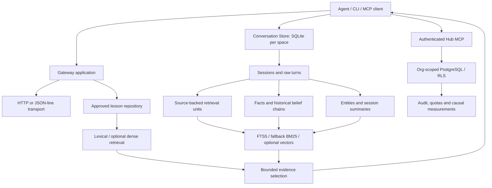

# Memory architecture

CommonTrace has separate local memory and fleet-sharing services. They share
protocol evidence contracts, not a single global database or configuration.

`gateway_transport.py` handles framing/TLS/socket behavior; `gateway.py` owns
routes and authentication. Public gateway factories remain compatible facades.
Conversation `Store` owns SQLite persistence/migrations and source references;
`frontmatter` centralizes Markdown/YAML persistence and locked atomic writes.
`HubConfig`, `GatewayConfig` and `RetrievalConfig` are deliberate deployment/store
boundaries. Retrieval settings are shared by all retrievers for a store.

Raw evidence stays authoritative. Facts link to turns; historical facts remain
accessible after supersession. Scheduled changes must not become current early.
Graph/vector caches are accelerators with source-identity checks and exact
fallbacks. Similarity alone does not establish evidence sufficiency or truth.

Caches retain bounded generations. Corpus cache misses share builds; source
fingerprints still compare exactly. File edits, replacement, process forks and
failed builds must not leave stale results or inherited locked state. Cache
budgets bound retained objects, not all active requests or database native RAM.

Hub tools authorize scope and person capability, then execute org-scoped
transactions. Batch tools reuse single-item handlers sequentially, with ordered
outcomes and independent commits. They do not share an AsyncSession across
concurrent tasks. An ambiguous write response requires idempotency before retry.

For protocol details see [PROTOCOL.md](../protocol/PROTOCOL.md); for measured
constraints and source revisions see [performance.md](performance.md).
